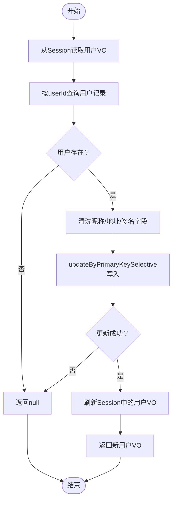

# 用户服务（NewBeeMallUserService）

<cite>
**本文引用的文件**
- [NewBeeMallUserService.java](file://src/main/java/ltd/newbee/mall/service/NewBeeMallUserService.java)
- [NewBeeMallUserServiceImpl.java](file://src/main/java/ltd/newbee/mall/service/impl/NewBeeMallUserServiceImpl.java)
- [MallUserMapper.java](file://src/main/java/ltd/newbee/mall/dao/MallUserMapper.java)
- [MallUserMapper.xml](file://src/main/resources/mapper/MallUserMapper.xml)
- [MallUser.java](file://src/main/java/ltd/newbee/mall/entity/MallUser.java)
- [MD5Util.java](file://src/main/java/ltd/newbee/mall/util/MD5Util.java)
- [PersonalController.java](file://src/main/java/ltd/newbee/mall/controller/mall/PersonalController.java)
- [NewBeeMallLoginInterceptor.java](file://src/main/java/ltd/newbee/mall/interceptor/NewBeeMallLoginInterceptor.java)
- [NeeBeeMallWebMvcConfigurer.java](file://src/main/java/ltd/newbee/mall/config/NeeBeeMallWebMvcConfigurer.java)
- [Constants.java](file://src/main/java/ltd/newbee/mall/common/Constants.java)
- [ServiceResultEnum.java](file://src/main/java/ltd/newbee/mall/common/ServiceResultEnum.java)
- [BeanUtil.java](file://src/main/java/ltd/newbee/mall/util/BeanUtil.java)
</cite>

## 目录
1. [简介](#简介)
2. [项目结构](#项目结构)
3. [核心组件](#核心组件)
4. [架构总览](#架构总览)
5. [详细组件分析](#详细组件分析)
6. [依赖关系分析](#依赖关系分析)
7. [性能考量](#性能考量)
8. [故障排查指南](#故障排查指南)
9. [结论](#结论)

## 简介
本文件系统性梳理 NewBeeMallUserService 的用户管理能力，覆盖用户注册、登录认证、信息更新等核心流程；深入解析密码加密存储机制（基于 MD5Util 的加盐哈希策略）、登录凭证校验流程；说明服务层通过 MallUserMapper 完成用户数据持久化与用户名唯一性校验；阐述用户服务与前台控制器 PersonalController 的交互方式，以及在拦截器 NewBeeMallLoginInterceptor 中用于会话验证的应用场景，确保系统安全。

## 项目结构
围绕用户模块的关键文件组织如下：
- 接口与实现：service.NewBeeMallUserService 与其实现 service.impl.NewBeeMallUserServiceImpl
- 数据访问：dao.MallUserMapper 与 MyBatis 映射文件 resources/mapper/MallUserMapper.xml
- 实体模型：entity.MallUser
- 工具与常量：util.MD5Util、common.Constants、common.ServiceResultEnum、util.BeanUtil
- 控制器与拦截器：controller.mall.PersonalController、interceptor.NewBeeMallLoginInterceptor、config.NeeBeeMallWebMvcConfigurer

图表来源
- [PersonalController.java](file://src/main/java/ltd/newbee/mall/controller/mall/PersonalController.java#L1-L137)
- [NewBeeMallUserServiceImpl.java](file://src/main/java/ltd/newbee/mall/service/impl/NewBeeMallUserServiceImpl.java#L1-L108)
- [MallUserMapper.java](file://src/main/java/ltd/newbee/mall/dao/MallUserMapper.java#L1-L39)
- [MallUserMapper.xml](file://src/main/resources/mapper/MallUserMapper.xml#L1-L184)
- [MallUser.java](file://src/main/java/ltd/newbee/mall/entity/MallUser.java#L1-L125)
- [MD5Util.java](file://src/main/java/ltd/newbee/mall/util/MD5Util.java#L1-L49)
- [Constants.java](file://src/main/java/ltd/newbee/mall/common/Constants.java#L1-L48)
- [ServiceResultEnum.java](file://src/main/java/ltd/newbee/mall/common/ServiceResultEnum.java#L1-L91)
- [BeanUtil.java](file://src/main/java/ltd/newbee/mall/util/BeanUtil.java#L1-L94)
- [NewBeeMallLoginInterceptor.java](file://src/main/java/ltd/newbee/mall/interceptor/NewBeeMallLoginInterceptor.java#L1-L49)
- [NeeBeeMallWebMvcConfigurer.java](file://src/main/java/ltd/newbee/mall/config/NeeBeeMallWebMvcConfigurer.java#L1-L67)

章节来源
- [NewBeeMallUserService.java](file://src/main/java/ltd/newbee/mall/service/NewBeeMallUserService.java#L1-L63)
- [NewBeeMallUserServiceImpl.java](file://src/main/java/ltd/newbee/mall/service/impl/NewBeeMallUserServiceImpl.java#L1-L108)
- [MallUserMapper.java](file://src/main/java/ltd/newbee/mall/dao/MallUserMapper.java#L1-L39)
- [MallUserMapper.xml](file://src/main/resources/mapper/MallUserMapper.xml#L1-L184)
- [MallUser.java](file://src/main/java/ltd/newbee/mall/entity/MallUser.java#L1-L125)
- [MD5Util.java](file://src/main/java/ltd/newbee/mall/util/MD5Util.java#L1-L49)
- [PersonalController.java](file://src/main/java/ltd/newbee/mall/controller/mall/PersonalController.java#L1-L137)
- [NewBeeMallLoginInterceptor.java](file://src/main/java/ltd/newbee/mall/interceptor/NewBeeMallLoginInterceptor.java#L1-L49)
- [NeeBeeMallWebMvcConfigurer.java](file://src/main/java/ltd/newbee/mall/config/NeeBeeMallWebMvcConfigurer.java#L1-L67)
- [Constants.java](file://src/main/java/ltd/newbee/mall/common/Constants.java#L1-L48)
- [ServiceResultEnum.java](file://src/main/java/ltd/newbee/mall/common/ServiceResultEnum.java#L1-L91)
- [BeanUtil.java](file://src/main/java/ltd/newbee/mall/util/BeanUtil.java#L1-L94)

## 核心组件
- 用户服务接口 NewBeeMallUserService：定义后台分页、注册、登录、信息更新、批量锁定等方法契约。
- 用户服务实现 NewBeeMallUserServiceImpl：实现具体业务逻辑，包括用户名唯一性校验、密码 MD5 加密、登录会话写入、信息更新与持久化。
- 数据访问接口 MallUserMapper 与映射文件 MallUserMapper.xml：提供按登录名查询、按登录名+密码查询、插入、更新、分页查询、批量锁定等 SQL 映射。
- 实体 MallUser：用户表对应的领域模型，包含登录名、密码 MD5、昵称、地址、锁定标志等字段。
- 工具与常量：MD5Util 提供 MD5 编码；Constants 定义会话键与验证码键；ServiceResultEnum 统一返回结果；BeanUtil 提供对象拷贝。
- 控制器 PersonalController：接收前端请求，调用用户服务，处理验证码校验与登录/注册响应。
- 拦截器 NewBeeMallLoginInterceptor：在访问个人中心、订单、支付等页面前进行会话验证。
- Web 配置 NeeBeeMallWebMvcConfigurer：注册拦截器并配置拦截路径。

章节来源
- [NewBeeMallUserService.java](file://src/main/java/ltd/newbee/mall/service/NewBeeMallUserService.java#L18-L63)
- [NewBeeMallUserServiceImpl.java](file://src/main/java/ltd/newbee/mall/service/impl/NewBeeMallUserServiceImpl.java#L25-L108)
- [MallUserMapper.java](file://src/main/java/ltd/newbee/mall/dao/MallUserMapper.java#L17-L39)
- [MallUserMapper.xml](file://src/main/resources/mapper/MallUserMapper.xml#L42-L184)
- [MallUser.java](file://src/main/java/ltd/newbee/mall/entity/MallUser.java#L15-L125)
- [MD5Util.java](file://src/main/java/ltd/newbee/mall/util/MD5Util.java#L1-L49)
- [PersonalController.java](file://src/main/java/ltd/newbee/mall/controller/mall/PersonalController.java#L41-L137)
- [NewBeeMallLoginInterceptor.java](file://src/main/java/ltd/newbee/mall/interceptor/NewBeeMallLoginInterceptor.java#L27-L49)
- [NeeBeeMallWebMvcConfigurer.java](file://src/main/java/ltd/newbee/mall/config/NeeBeeMallWebMvcConfigurer.java#L31-L60)
- [Constants.java](file://src/main/java/ltd/newbee/mall/common/Constants.java#L36-L39)
- [ServiceResultEnum.java](file://src/main/java/ltd/newbee/mall/common/ServiceResultEnum.java#L17-L91)
- [BeanUtil.java](file://src/main/java/ltd/newbee/mall/util/BeanUtil.java#L14-L20)

## 架构总览
用户模块采用经典的三层架构：控制层负责请求接入与响应封装；服务层承载业务规则与数据持久化协调；数据访问层屏蔽数据库细节。登录与注册流程贯穿工具、服务与数据层，拦截器在控制层之外对会话进行统一校验。

图表来源
- [PersonalController.java](file://src/main/java/ltd/newbee/mall/controller/mall/PersonalController.java#L62-L91)
- [NewBeeMallUserServiceImpl.java](file://src/main/java/ltd/newbee/mall/service/impl/NewBeeMallUserServiceImpl.java#L55-L74)
- [MallUserMapper.java](file://src/main/java/ltd/newbee/mall/dao/MallUserMapper.java#L26-L29)
- [MallUserMapper.xml](file://src/main/resources/mapper/MallUserMapper.xml#L54-L59)
- [MD5Util.java](file://src/main/java/ltd/newbee/mall/util/MD5Util.java#L30-L44)
- [Constants.java](file://src/main/java/ltd/newbee/mall/common/Constants.java#L36-L39)

## 详细组件分析

### 用户注册流程（用户名唯一性校验与密码加密）
- 唯一性校验：服务层先通过 MallUserMapper.selectByLoginName 检查是否存在相同登录名，若存在则返回“用户名已存在”。
- 密码加密：使用 MD5Util 对明文密码进行 MD5 编码，得到 passwordMd5。
- 持久化：构造 MallUser 对象，填充登录名、昵称、passwordMd5，调用 MallUserMapper.insertSelective 写入数据库。
- 返回值：成功返回“success”，否则返回“database error”。

图表来源
- [NewBeeMallUserServiceImpl.java](file://src/main/java/ltd/newbee/mall/service/impl/NewBeeMallUserServiceImpl.java#L39-L53)
- [MallUserMapper.java](file://src/main/java/ltd/newbee/mall/dao/MallUserMapper.java#L26-L29)
- [MallUserMapper.xml](file://src/main/resources/mapper/MallUserMapper.xml#L115-L134)
- [MD5Util.java](file://src/main/java/ltd/newbee/mall/util/MD5Util.java#L30-L44)
- [ServiceResultEnum.java](file://src/main/java/ltd/newbee/mall/common/ServiceResultEnum.java#L26-L26)

章节来源
- [NewBeeMallUserServiceImpl.java](file://src/main/java/ltd/newbee/mall/service/impl/NewBeeMallUserServiceImpl.java#L39-L53)
- [MallUserMapper.java](file://src/main/java/ltd/newbee/mall/dao/MallUserMapper.java#L26-L29)
- [MallUserMapper.xml](file://src/main/resources/mapper/MallUserMapper.xml#L115-L134)
- [MD5Util.java](file://src/main/java/ltd/newbee/mall/util/MD5Util.java#L30-L44)
- [ServiceResultEnum.java](file://src/main/java/ltd/newbee/mall/common/ServiceResultEnum.java#L26-L26)

### 登录认证流程（凭证校验与会话写入）
- 参数校验：控制器 PersonalController 在 /login 接口处校验登录名、密码、验证码非空，并验证图形验证码。
- 凭证校验：服务层调用 MallUserMapper.selectByLoginNameAndPasswd 进行用户名+密码匹配。
- 锁定检查：若用户被锁定（lockedFlag==1），返回“用户已被禁止登录”。
- 会话写入：将用户 VO 写入 HttpSession（键为 Constants.MALL_USER_SESSION_KEY），用于后续拦截器校验。
- 成功/失败：成功返回“success”，失败返回对应错误码。

图表来源
- [PersonalController.java](file://src/main/java/ltd/newbee/mall/controller/mall/PersonalController.java#L62-L91)
- [NewBeeMallUserServiceImpl.java](file://src/main/java/ltd/newbee/mall/service/impl/NewBeeMallUserServiceImpl.java#L55-L74)
- [MallUserMapper.java](file://src/main/java/ltd/newbee/mall/dao/MallUserMapper.java#L26-L29)
- [MallUserMapper.xml](file://src/main/resources/mapper/MallUserMapper.xml#L54-L59)
- [Constants.java](file://src/main/java/ltd/newbee/mall/common/Constants.java#L36-L39)
- [ServiceResultEnum.java](file://src/main/java/ltd/newbee/mall/common/ServiceResultEnum.java#L50-L52)

章节来源
- [PersonalController.java](file://src/main/java/ltd/newbee/mall/controller/mall/PersonalController.java#L62-L91)
- [NewBeeMallUserServiceImpl.java](file://src/main/java/ltd/newbee/mall/service/impl/NewBeeMallUserServiceImpl.java#L55-L74)
- [MallUserMapper.java](file://src/main/java/ltd/newbee/mall/dao/MallUserMapper.java#L26-L29)
- [MallUserMapper.xml](file://src/main/resources/mapper/MallUserMapper.xml#L54-L59)
- [Constants.java](file://src/main/java/ltd/newbee/mall/common/Constants.java#L36-L39)
- [ServiceResultEnum.java](file://src/main/java/ltd/newbee/mall/common/ServiceResultEnum.java#L50-L52)

### 信息更新流程（会话读取与持久化）
- 会话读取：从 HttpSession 获取当前用户 VO。
- 数据库读取：根据 userId 查询最新用户记录。
- 字段清洗与更新：对昵称、地址、签名等字段进行字符串清洗后更新。
- 会话刷新：更新成功后重新写入会话，保证前端展示一致。
- 返回值：返回更新后的用户 VO 或空。

图表来源
- [NewBeeMallUserServiceImpl.java](file://src/main/java/ltd/newbee/mall/service/impl/NewBeeMallUserServiceImpl.java#L76-L98)
- [MallUserMapper.java](file://src/main/java/ltd/newbee/mall/dao/MallUserMapper.java#L24-L31)
- [MallUserMapper.xml](file://src/main/resources/mapper/MallUserMapper.xml#L135-L164)
- [BeanUtil.java](file://src/main/java/ltd/newbee/mall/util/BeanUtil.java#L14-L20)

章节来源
- [NewBeeMallUserServiceImpl.java](file://src/main/java/ltd/newbee/mall/service/impl/NewBeeMallUserServiceImpl.java#L76-L98)
- [MallUserMapper.java](file://src/main/java/ltd/newbee/mall/dao/MallUserMapper.java#L24-L31)
- [MallUserMapper.xml](file://src/main/resources/mapper/MallUserMapper.xml#L135-L164)
- [BeanUtil.java](file://src/main/java/ltd/newbee/mall/util/BeanUtil.java#L14-L20)

### 密码加密存储机制（MD5Util）
- MD5Util 提供 MD5Encode 方法，对输入字符串按指定字符集进行 MD5 编码，返回十六进制小写字符串。
- 用户注册时，服务层对明文密码调用 MD5Util.MD5Encode，得到 passwordMd5 存入数据库。
- 登录时，控制器对明文密码同样进行 MD5 编码后传递给服务层，服务层再与数据库中 passwordMd5 匹配。

章节来源
- [MD5Util.java](file://src/main/java/ltd/newbee/mall/util/MD5Util.java#L30-L44)
- [NewBeeMallUserServiceImpl.java](file://src/main/java/ltd/newbee/mall/service/impl/NewBeeMallUserServiceImpl.java#L47-L47)
- [PersonalController.java](file://src/main/java/ltd/newbee/mall/controller/mall/PersonalController.java#L82-L82)

### 服务层与数据访问层协作
- 用户名唯一性：MallUserMapper.selectByLoginName + MallUserMapper.xml 的 login_name 条件查询。
- 登录匹配：MallUserMapper.selectByLoginNameAndPasswd + MallUserMapper.xml 的 login_name+password_md5 条件查询。
- 注册写入：MallUserMapper.insertSelective + MallUserMapper.xml 的动态插入。
- 更新写入：MallUserMapper.updateByPrimaryKeySelective + MallUserMapper.xml 的动态更新。
- 批量锁定：MallUserMapper.lockUserBatch + MallUserMapper.xml 的批量更新。

章节来源
- [MallUserMapper.java](file://src/main/java/ltd/newbee/mall/dao/MallUserMapper.java#L24-L39)
- [MallUserMapper.xml](file://src/main/resources/mapper/MallUserMapper.xml#L42-L184)
- [NewBeeMallUserServiceImpl.java](file://src/main/java/ltd/newbee/mall/service/impl/NewBeeMallUserServiceImpl.java#L39-L106)

### 控制器与服务层交互
- 登录：PersonalController.login 接收登录名、验证码、密码，校验验证码后调用服务层 login，成功后清理验证码并返回成功。
- 注册：PersonalController.register 接收登录名、验证码、密码，校验验证码后调用服务层 register，成功后清理验证码并返回成功。
- 信息更新：PersonalController.updateInfo 接收用户信息，调用服务层 updateUserInfo 并返回结果。

章节来源
- [PersonalController.java](file://src/main/java/ltd/newbee/mall/controller/mall/PersonalController.java#L62-L135)
- [NewBeeMallUserServiceImpl.java](file://src/main/java/ltd/newbee/mall/service/impl/NewBeeMallUserServiceImpl.java#L55-L98)

### 拦截器与会话验证
- NewBeeMallLoginInterceptor.preHandle 在请求到达目标控制器前检查 Session 是否包含 Constants.MALL_USER_SESSION_KEY，缺失则重定向至登录页。
- NeeBeeMallWebMvcConfigurer.addInterceptors 注册拦截器并配置拦截路径（如个人中心、订单、支付等），排除登录/注册/登出等公开路径。

图表来源
- [NewBeeMallLoginInterceptor.java](file://src/main/java/ltd/newbee/mall/interceptor/NewBeeMallLoginInterceptor.java#L30-L38)
- [NeeBeeMallWebMvcConfigurer.java](file://src/main/java/ltd/newbee/mall/config/NeeBeeMallWebMvcConfigurer.java#L31-L60)
- [Constants.java](file://src/main/java/ltd/newbee/mall/common/Constants.java#L36-L39)

章节来源
- [NewBeeMallLoginInterceptor.java](file://src/main/java/ltd/newbee/mall/interceptor/NewBeeMallLoginInterceptor.java#L30-L38)
- [NeeBeeMallWebMvcConfigurer.java](file://src/main/java/ltd/newbee/mall/config/NeeBeeMallWebMvcConfigurer.java#L31-L60)
- [Constants.java](file://src/main/java/ltd/newbee/mall/common/Constants.java#L36-L39)

## 依赖关系分析
- 控制层依赖服务层：PersonalController 注入 NewBeeMallUserService。
- 服务层依赖数据访问层：NewBeeMallUserServiceImpl 注入 MallUserMapper。
- 服务层依赖工具与常量：MD5Util、Constants、ServiceResultEnum、BeanUtil。
- 拦截器依赖常量：NewBeeMallLoginInterceptor 使用 Constants.MALL_USER_SESSION_KEY。
- Web 配置依赖拦截器：NeeBeeMallWebMvcConfigurer 注册拦截器并配置路径。

图表来源
- [PersonalController.java](file://src/main/java/ltd/newbee/mall/controller/mall/PersonalController.java#L1-L137)
- [NewBeeMallUserService.java](file://src/main/java/ltd/newbee/mall/service/NewBeeMallUserService.java#L18-L63)
- [NewBeeMallUserServiceImpl.java](file://src/main/java/ltd/newbee/mall/service/impl/NewBeeMallUserServiceImpl.java#L25-L108)
- [MallUserMapper.java](file://src/main/java/ltd/newbee/mall/dao/MallUserMapper.java#L17-L39)
- [MD5Util.java](file://src/main/java/ltd/newbee/mall/util/MD5Util.java#L1-L49)
- [Constants.java](file://src/main/java/ltd/newbee/mall/common/Constants.java#L36-L39)
- [ServiceResultEnum.java](file://src/main/java/ltd/newbee/mall/common/ServiceResultEnum.java#L17-L91)
- [BeanUtil.java](file://src/main/java/ltd/newbee/mall/util/BeanUtil.java#L14-L20)
- [NewBeeMallLoginInterceptor.java](file://src/main/java/ltd/newbee/mall/interceptor/NewBeeMallLoginInterceptor.java#L27-L49)
- [NeeBeeMallWebMvcConfigurer.java](file://src/main/java/ltd/newbee/mall/config/NeeBeeMallWebMvcConfigurer.java#L31-L60)

章节来源
- [NewBeeMallUserService.java](file://src/main/java/ltd/newbee/mall/service/NewBeeMallUserService.java#L18-L63)
- [NewBeeMallUserServiceImpl.java](file://src/main/java/ltd/newbee/mall/service/impl/NewBeeMallUserServiceImpl.java#L25-L108)
- [MallUserMapper.java](file://src/main/java/ltd/newbee/mall/dao/MallUserMapper.java#L17-L39)
- [PersonalController.java](file://src/main/java/ltd/newbee/mall/controller/mall/PersonalController.java#L62-L135)
- [NewBeeMallLoginInterceptor.java](file://src/main/java/ltd/newbee/mall/interceptor/NewBeeMallLoginInterceptor.java#L30-L38)
- [NeeBeeMallWebMvcConfigurer.java](file://src/main/java/ltd/newbee/mall/config/NeeBeeMallWebMvcConfigurer.java#L31-L60)
- [Constants.java](file://src/main/java/ltd/newbee/mall/common/Constants.java#L36-L39)
- [ServiceResultEnum.java](file://src/main/java/ltd/newbee/mall/common/ServiceResultEnum.java#L17-L91)
- [BeanUtil.java](file://src/main/java/ltd/newbee/mall/util/BeanUtil.java#L14-L20)

## 性能考量
- 登录查询：selectByLoginNameAndPasswd 仅使用用户名与密码字段，建议在 login_name 与 password_md5 上建立联合索引以提升匹配效率。
- 注册写入：insertSelective 为动态插入，避免冗余字段写入，减少不必要的列更新开销。
- 会话存储：用户 VO 仅存于 Session，避免频繁数据库查询；注意合理设置 Session 超时时间。
- 字符串清洗：对昵称、地址、签名等字段进行清洗，减少脏数据带来的后续处理成本。
- 批量锁定：lockUserBatch 使用 IN 子句批量更新，减少多次往返数据库的网络开销。

章节来源
- [MallUserMapper.xml](file://src/main/resources/mapper/MallUserMapper.xml#L54-L59)
- [MallUserMapper.xml](file://src/main/resources/mapper/MallUserMapper.xml#L177-L183)
- [NewBeeMallUserServiceImpl.java](file://src/main/java/ltd/newbee/mall/service/impl/NewBeeMallUserServiceImpl.java#L47-L47)

## 故障排查指南
- 登录失败
  - 检查验证码是否正确：PersonalController.login 会在验证码不通过时返回“验证码错误”。
  - 检查用户名与密码是否匹配：服务层 login 返回“登录失败”通常表示用户名或密码不正确。
  - 检查用户是否被锁定：服务层 login 返回“用户已被禁止登录”表示 lockedFlag==1。
- 注册失败
  - 检查用户名是否重复：服务层 register 返回“用户名已存在”。
  - 检查数据库写入：若返回“database error”，检查数据库连接与权限。
- 会话失效
  - 访问受保护页面被重定向到登录页：拦截器检测不到 Session 中的用户键，需重新登录。
- 信息更新失败
  - 检查 Session 中用户是否存在：服务层 updateUserInfo 会先从 Session 读取用户，再从数据库加载最新记录，最后更新并刷新 Session。

章节来源
- [PersonalController.java](file://src/main/java/ltd/newbee/mall/controller/mall/PersonalController.java#L62-L135)
- [NewBeeMallUserServiceImpl.java](file://src/main/java/ltd/newbee/mall/service/impl/NewBeeMallUserServiceImpl.java#L55-L98)
- [ServiceResultEnum.java](file://src/main/java/ltd/newbee/mall/common/ServiceResultEnum.java#L30-L52)
- [NewBeeMallLoginInterceptor.java](file://src/main/java/ltd/newbee/mall/interceptor/NewBeeMallLoginInterceptor.java#L30-L38)

## 结论
NewBeeMallUserService 通过清晰的接口设计与实现，提供了完整的用户生命周期管理能力。密码采用 MD5 加密存储，登录流程严格校验凭证与锁定状态，并通过拦截器保障会话安全。服务层与数据访问层职责明确，配合工具类与常量配置，形成稳定可维护的用户模块架构。建议在生产环境中进一步强化安全措施（如引入更安全的密码哈希算法与 HTTPS），并持续优化数据库索引与会话策略以提升性能与安全性。