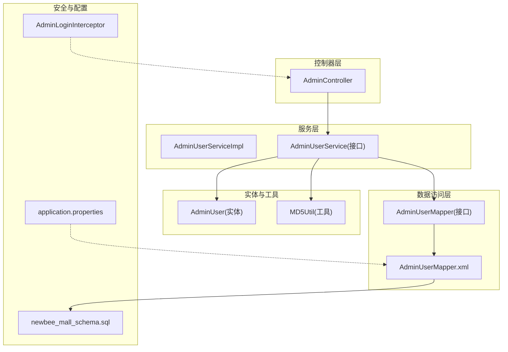
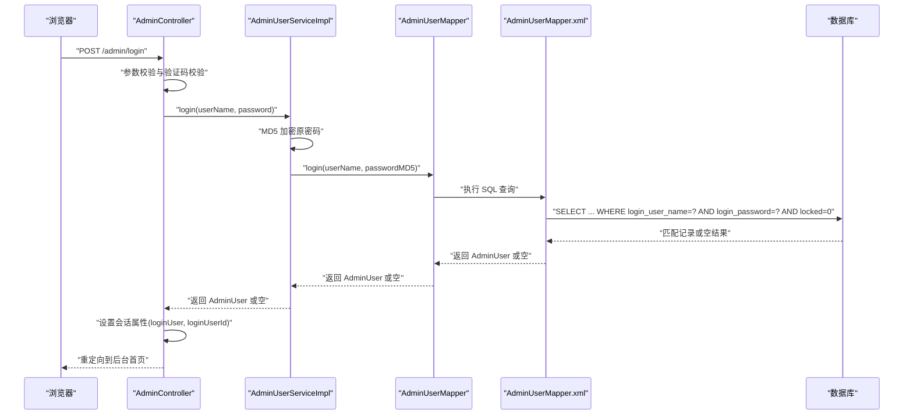
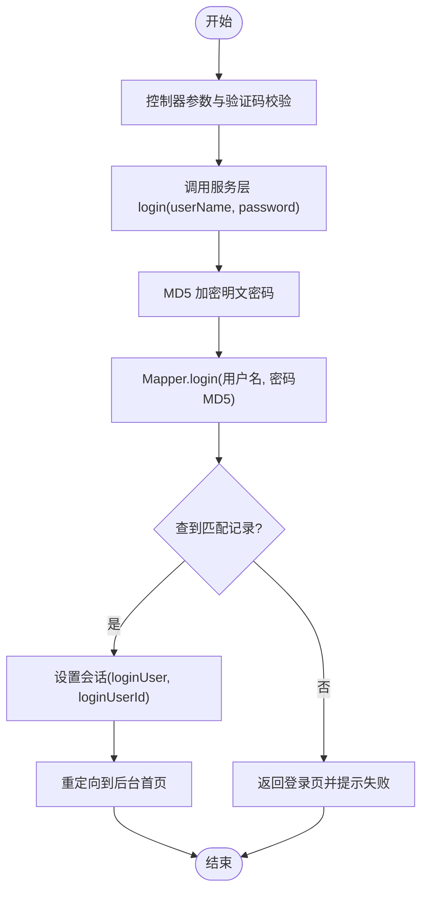
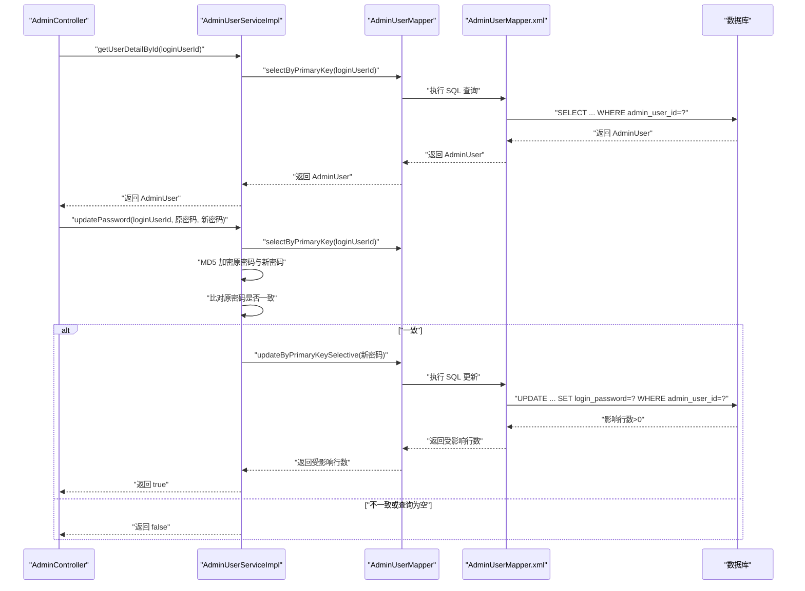
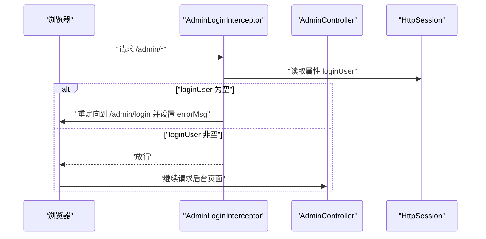
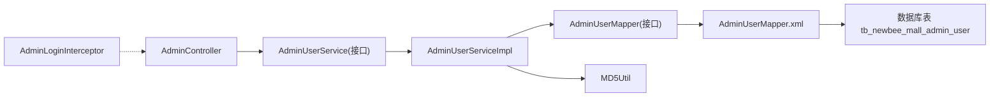

# 管理员服务（AdminUserService）

<cite>
**本文引用的文件列表**
- [AdminUserService.java](file://src/main/java/ltd/newbee/mall/service/AdminUserService.java)
- [AdminUserServiceImpl.java](file://src/main/java/ltd/newbee/mall/service/impl/AdminUserServiceImpl.java)
- [AdminUserMapper.java](file://src/main/java/ltd/newbee/mall/dao/AdminUserMapper.java)
- [AdminUserMapper.xml](file://src/main/resources/mapper/AdminUserMapper.xml)
- [AdminUser.java](file://src/main/java/ltd/newbee/mall/entity/AdminUser.java)
- [AdminController.java](file://src/main/java/ltd/newbee/mall/controller/admin/AdminController.java)
- [AdminLoginInterceptor.java](file://src/main/java/ltd/newbee/mall/interceptor/AdminLoginInterceptor.java)
- [MD5Util.java](file://src/main/java/ltd/newbee/mall/util/MD5Util.java)
- [application.properties](file://src/main/resources/application.properties)
- [newbee_mall_schema.sql](file://src/main/resources/newbee_mall_schema.sql)
</cite>

## 目录
1. [简介](#简介)
2. [项目结构](#项目结构)
3. [核心组件](#核心组件)
4. [架构总览](#架构总览)
5. [详细组件分析](#详细组件分析)
6. [依赖关系分析](#依赖关系分析)
7. [性能考量](#性能考量)
8. [故障排查指南](#故障排查指南)
9. [结论](#结论)

## 简介
本文件系统性阐述 AdminUserService 在后台权限管理中的核心职责与实现细节，覆盖管理员登录验证、信息查询、密码修改、名称信息更新等关键功能；深入解析登录流程中密码的加密比对逻辑，说明服务层如何通过 AdminUserMapper 完成管理员数据的持久化操作；解释服务层对管理员用户名唯一性的校验机制（基于数据库约束）及新增管理员时的默认密码策略；并阐明该服务与 AdminController 的协作关系，以及其在 AdminLoginInterceptor 拦截器中用于会话鉴权的关键作用，从而保障后台系统的安全性。

## 项目结构
围绕后台权限管理的相关模块组织如下：
- 控制层：AdminController 负责处理管理员登录、登出、个人资料查看与修改等请求。
- 服务层：AdminUserService 接口与 AdminUserServiceImpl 实现负责业务逻辑编排与数据访问协调。
- 数据访问层：AdminUserMapper 接口与 AdminUserMapper.xml 提供数据库读写能力。
- 实体模型：AdminUser 表示管理员实体。
- 安全拦截：AdminLoginInterceptor 在进入后台页面前进行会话鉴权。
- 工具与配置：MD5Util 提供密码摘要工具；application.properties 配置 MyBatis 映射文件位置；newbee_mall_schema.sql 定义表结构与初始数据。

图表来源
- [AdminController.java](file://src/main/java/ltd/newbee/mall/controller/admin/AdminController.java#L1-L140)
- [AdminUserService.java](file://src/main/java/ltd/newbee/mall/service/AdminUserService.java#L1-L46)
- [AdminUserServiceImpl.java](file://src/main/java/ltd/newbee/mall/service/impl/AdminUserServiceImpl.java#L1-L72)
- [AdminUserMapper.java](file://src/main/java/ltd/newbee/mall/dao/AdminUserMapper.java#L1-L33)
- [AdminUserMapper.xml](file://src/main/resources/mapper/AdminUserMapper.xml#L1-L97)
- [AdminUser.java](file://src/main/java/ltd/newbee/mall/entity/AdminUser.java#L1-L76)
- [AdminLoginInterceptor.java](file://src/main/java/ltd/newbee/mall/interceptor/AdminLoginInterceptor.java#L1-L51)
- [application.properties](file://src/main/resources/application.properties#L1-L22)
- [newbee_mall_schema.sql](file://src/main/resources/newbee_mall_schema.sql#L1-L34)

章节来源
- [AdminController.java](file://src/main/java/ltd/newbee/mall/controller/admin/AdminController.java#L1-L140)
- [AdminUserService.java](file://src/main/java/ltd/newbee/mall/service/AdminUserService.java#L1-L46)
- [AdminUserServiceImpl.java](file://src/main/java/ltd/newbee/mall/service/impl/AdminUserServiceImpl.java#L1-L72)
- [AdminUserMapper.java](file://src/main/java/ltd/newbee/mall/dao/AdminUserMapper.java#L1-L33)
- [AdminUserMapper.xml](file://src/main/resources/mapper/AdminUserMapper.xml#L1-L97)
- [AdminUser.java](file://src/main/java/ltd/newbee/mall/entity/AdminUser.java#L1-L76)
- [AdminLoginInterceptor.java](file://src/main/java/ltd/newbee/mall/interceptor/AdminLoginInterceptor.java#L1-L51)
- [application.properties](file://src/main/resources/application.properties#L1-L22)
- [newbee_mall_schema.sql](file://src/main/resources/newbee_mall_schema.sql#L1-L34)

## 核心组件
- AdminUserService 接口：定义登录、查询用户详情、修改密码、修改名称等对外契约。
- AdminUserServiceImpl 实现：封装登录密码加密比对、用户信息查询与更新、调用 AdminUserMapper 完成持久化。
- AdminUserMapper 接口与 XML 映射：提供登录、按主键查询、插入、选择性更新、全量更新等数据库操作。
- AdminUser 实体：承载管理员字段（登录名、密码、昵称、锁定状态等）。
- AdminController 控制器：接收请求、参数校验、调用服务层、维护会话状态。
- AdminLoginInterceptor 拦截器：统一校验后台请求会话有效性。
- MD5Util 工具：提供 MD5 加密算法，用于登录与密码更新的摘要计算。
- application.properties：MyBatis 映射文件路径配置。
- newbee_mall_schema.sql：数据库表结构与初始数据，包含管理员表的字段与约束。

章节来源
- [AdminUserService.java](file://src/main/java/ltd/newbee/mall/service/AdminUserService.java#L1-L46)
- [AdminUserServiceImpl.java](file://src/main/java/ltd/newbee/mall/service/impl/AdminUserServiceImpl.java#L1-L72)
- [AdminUserMapper.java](file://src/main/java/ltd/newbee/mall/dao/AdminUserMapper.java#L1-L33)
- [AdminUserMapper.xml](file://src/main/resources/mapper/AdminUserMapper.xml#L1-L97)
- [AdminUser.java](file://src/main/java/ltd/newbee/mall/entity/AdminUser.java#L1-L76)
- [AdminController.java](file://src/main/java/ltd/newbee/mall/controller/admin/AdminController.java#L1-L140)
- [AdminLoginInterceptor.java](file://src/main/java/ltd/newbee/mall/interceptor/AdminLoginInterceptor.java#L1-L51)
- [MD5Util.java](file://src/main/java/ltd/newbee/mall/util/MD5Util.java#L1-L49)
- [application.properties](file://src/main/resources/application.properties#L1-L22)
- [newbee_mall_schema.sql](file://src/main/resources/newbee_mall_schema.sql#L1-L34)

## 架构总览
下图展示从浏览器到数据库的完整调用链路，体现 AdminUserService 在后台权限体系中的关键作用。

图表来源
- [AdminController.java](file://src/main/java/ltd/newbee/mall/controller/admin/AdminController.java#L54-L83)
- [AdminUserServiceImpl.java](file://src/main/java/ltd/newbee/mall/service/impl/AdminUserServiceImpl.java#L25-L30)
- [AdminUserMapper.java](file://src/main/java/ltd/newbee/mall/dao/AdminUserMapper.java#L19-L33)
- [AdminUserMapper.xml](file://src/main/resources/mapper/AdminUserMapper.xml#L15-L20)
- [MD5Util.java](file://src/main/java/ltd/newbee/mall/util/MD5Util.java#L30-L44)

## 详细组件分析

### 登录流程与密码加密比对
- 控制器层：AdminController 对登录请求进行参数与验证码校验，随后调用 AdminUserService.login。
- 服务层：AdminUserServiceImpl.login 将明文密码经 MD5Util 加密后，调用 AdminUserMapper.login 进行数据库查询。
- 数据访问层：AdminUserMapper.xml 中的 login 查询条件包含用户名、加密后的密码与未锁定状态，确保仅允许未被锁定的管理员登录。
- 结果处理：若返回非空用户，则控制器设置会话属性并重定向；否则返回登录页并提示失败。

图表来源
- [AdminController.java](file://src/main/java/ltd/newbee/mall/controller/admin/AdminController.java#L54-L83)
- [AdminUserServiceImpl.java](file://src/main/java/ltd/newbee/mall/service/impl/AdminUserServiceImpl.java#L25-L30)
- [AdminUserMapper.xml](file://src/main/resources/mapper/AdminUserMapper.xml#L15-L20)
- [MD5Util.java](file://src/main/java/ltd/newbee/mall/util/MD5Util.java#L30-L44)

章节来源
- [AdminController.java](file://src/main/java/ltd/newbee/mall/controller/admin/AdminController.java#L54-L83)
- [AdminUserServiceImpl.java](file://src/main/java/ltd/newbee/mall/service/impl/AdminUserServiceImpl.java#L25-L30)
- [AdminUserMapper.xml](file://src/main/resources/mapper/AdminUserMapper.xml#L15-L20)
- [MD5Util.java](file://src/main/java/ltd/newbee/mall/util/MD5Util.java#L30-L44)

### 用户信息查询与修改
- 查询详情：AdminUserServiceImpl.getUserDetailById 通过 AdminUserMapper.selectByPrimaryKey 获取管理员信息，供“我的资料”页面使用。
- 修改密码：AdminUserServiceImpl.updatePassword 先按主键查询用户，再对原密码与新密码分别进行 MD5 加密，比对原密码正确后再更新新密码并持久化。
- 修改名称：AdminUserServiceImpl.updateName 同样先查询用户，再更新登录名与昵称并持久化。

图表来源
- [AdminController.java](file://src/main/java/ltd/newbee/mall/controller/admin/AdminController.java#L85-L115)
- [AdminUserServiceImpl.java](file://src/main/java/ltd/newbee/mall/service/impl/AdminUserServiceImpl.java#L31-L71)
- [AdminUserMapper.java](file://src/main/java/ltd/newbee/mall/dao/AdminUserMapper.java#L28-L33)
- [AdminUserMapper.xml](file://src/main/resources/mapper/AdminUserMapper.xml#L22-L27)
- [AdminUserMapper.xml](file://src/main/resources/mapper/AdminUserMapper.xml#L71-L88)

章节来源
- [AdminController.java](file://src/main/java/ltd/newbee/mall/controller/admin/AdminController.java#L85-L115)
- [AdminUserServiceImpl.java](file://src/main/java/ltd/newbee/mall/service/impl/AdminUserServiceImpl.java#L31-L71)
- [AdminUserMapper.java](file://src/main/java/ltd/newbee/mall/dao/AdminUserMapper.java#L28-L33)
- [AdminUserMapper.xml](file://src/main/resources/mapper/AdminUserMapper.xml#L22-L27)
- [AdminUserMapper.xml](file://src/main/resources/mapper/AdminUserMapper.xml#L71-L88)

### 新增管理员与默认密码策略
- 数据库层面：newbee_mall_schema.sql 定义了管理员表结构，包含登录名、登录密码、昵称与锁定字段。
- 默认密码策略：代码中未发现显式新增管理员的实现逻辑，但 AdminUserMapper.xml 提供了 insert 与 insertSelective 的 SQL 映射，可支持插入新管理员记录。结合现有登录与修改密码逻辑，可推断默认密码通常以明文传入后经 MD5 加密存储（登录与修改密码均采用 MD5Util）。
- 唯一性校验：数据库表结构未见 login_user_name 的唯一索引，但 AdminUserMapper.xml 的 login 查询条件包含用户名与密码与未锁定状态，且 AdminUserServiceImpl.login 返回非空才视为登录成功，间接体现了用户名在未锁定状态下应唯一的要求。若需强约束，可在数据库层增加唯一索引以避免并发重复注册风险。

章节来源
- [newbee_mall_schema.sql](file://src/main/resources/newbee_mall_schema.sql#L14-L23)
- [AdminUserMapper.xml](file://src/main/resources/mapper/AdminUserMapper.xml#L28-L70)
- [AdminUserServiceImpl.java](file://src/main/java/ltd/newbee/mall/service/impl/AdminUserServiceImpl.java#L25-L30)

### 服务与控制器协作关系
- AdminController 作为入口，负责参数校验、验证码校验、会话设置与页面跳转。
- AdminUserService 作为业务编排中心，负责调用 AdminUserMapper 执行数据库操作，并在登录与密码修改场景中使用 MD5Util 进行加密。
- 控制器与服务之间通过接口解耦，便于扩展与测试。

章节来源
- [AdminController.java](file://src/main/java/ltd/newbee/mall/controller/admin/AdminController.java#L54-L115)
- [AdminUserService.java](file://src/main/java/ltd/newbee/mall/service/AdminUserService.java#L15-L45)
- [AdminUserServiceImpl.java](file://src/main/java/ltd/newbee/mall/service/impl/AdminUserServiceImpl.java#L25-L71)

### 会话鉴权与拦截器作用
- AdminLoginInterceptor 在后台路径访问前检查会话中是否存在登录用户标识，若不存在则重定向到登录页并设置错误提示。
- 该拦截器配合 AdminController 设置的会话属性（如 loginUserId、loginUser），共同构成后台会话鉴权闭环，防止未登录用户直接访问后台资源。

图表来源
- [AdminLoginInterceptor.java](file://src/main/java/ltd/newbee/mall/interceptor/AdminLoginInterceptor.java#L29-L40)
- [AdminController.java](file://src/main/java/ltd/newbee/mall/controller/admin/AdminController.java#L72-L83)

章节来源
- [AdminLoginInterceptor.java](file://src/main/java/ltd/newbee/mall/interceptor/AdminLoginInterceptor.java#L29-L40)
- [AdminController.java](file://src/main/java/ltd/newbee/mall/controller/admin/AdminController.java#L72-L83)

## 依赖关系分析
- 组件耦合度：AdminUserServiceImpl 依赖 AdminUserMapper 与 MD5Util；AdminController 依赖 AdminUserService；AdminLoginInterceptor 与控制器无直接依赖，但通过会话属性协同工作。
- 外部依赖：MyBatis 映射文件由 application.properties 指定加载路径，AdminUserMapper.xml 与数据库表结构一一对应。
- 潜在循环依赖：当前结构为单向依赖（控制器 -> 服务 -> 映射），未发现循环依赖迹象。

图表来源
- [AdminController.java](file://src/main/java/ltd/newbee/mall/controller/admin/AdminController.java#L1-L140)
- [AdminUserService.java](file://src/main/java/ltd/newbee/mall/service/AdminUserService.java#L1-L46)
- [AdminUserServiceImpl.java](file://src/main/java/ltd/newbee/mall/service/impl/AdminUserServiceImpl.java#L1-L72)
- [AdminUserMapper.java](file://src/main/java/ltd/newbee/mall/dao/AdminUserMapper.java#L1-L33)
- [AdminUserMapper.xml](file://src/main/resources/mapper/AdminUserMapper.xml#L1-L97)
- [AdminLoginInterceptor.java](file://src/main/java/ltd/newbee/mall/interceptor/AdminLoginInterceptor.java#L1-L51)
- [application.properties](file://src/main/resources/application.properties#L21-L22)
- [newbee_mall_schema.sql](file://src/main/resources/newbee_mall_schema.sql#L14-L23)

章节来源
- [application.properties](file://src/main/resources/application.properties#L21-L22)
- [AdminUserMapper.xml](file://src/main/resources/mapper/AdminUserMapper.xml#L1-L97)
- [newbee_mall_schema.sql](file://src/main/resources/newbee_mall_schema.sql#L14-L23)

## 性能考量
- 登录查询：login 查询包含用户名、密码与未锁定状态的条件，建议在 login_user_name 上建立索引以提升查询效率。
- 密码加密：MD5 加密在服务层集中处理，避免重复加密逻辑，但需注意 MD5 的安全性问题，建议在后续版本升级为更安全的哈希算法。
- 会话管理：控制器设置会话属性并在修改密码成功后清理会话，有助于减少会话污染与安全风险。
- 数据访问：updateByPrimaryKeySelective 仅更新非空字段，减少不必要的写操作，有利于性能与一致性。

## 故障排查指南
- 登录失败
  - 检查控制器参数与验证码校验是否通过。
  - 确认数据库中是否存在未锁定的管理员记录且密码一致。
  - 核对 MD5 加密是否正确应用。
- 修改密码失败
  - 确认原密码与新密码均已通过 MD5 加密。
  - 检查数据库更新语句是否执行成功（受影响行数 > 0）。
- 会话无效
  - 检查 AdminLoginInterceptor 是否正确重定向到登录页。
  - 确认控制器在登录成功后设置了必要的会话属性。
- 数据库连接与映射
  - 核对 application.properties 中 MyBatis 映射文件路径配置。
  - 确认 AdminUserMapper.xml 与数据库表结构一致。

章节来源
- [AdminController.java](file://src/main/java/ltd/newbee/mall/controller/admin/AdminController.java#L54-L115)
- [AdminUserServiceImpl.java](file://src/main/java/ltd/newbee/mall/service/impl/AdminUserServiceImpl.java#L36-L71)
- [AdminUserMapper.xml](file://src/main/resources/mapper/AdminUserMapper.xml#L15-L20)
- [AdminLoginInterceptor.java](file://src/main/java/ltd/newbee/mall/interceptor/AdminLoginInterceptor.java#L29-L40)
- [application.properties](file://src/main/resources/application.properties#L21-L22)

## 结论
AdminUserService 在后台权限管理中承担核心职责：登录验证（含密码加密比对）、用户信息查询与更新、与 AdminUserMapper 的数据持久化协作。通过 AdminController 的参数校验与会话设置，以及 AdminLoginInterceptor 的统一鉴权，形成完整的后台安全体系。当前实现以 MD5 为基础的密码处理与数据库层面的用户名唯一性约束存在改进空间，建议在后续版本中引入更强的哈希算法与数据库唯一索引，以进一步提升安全性与稳定性。