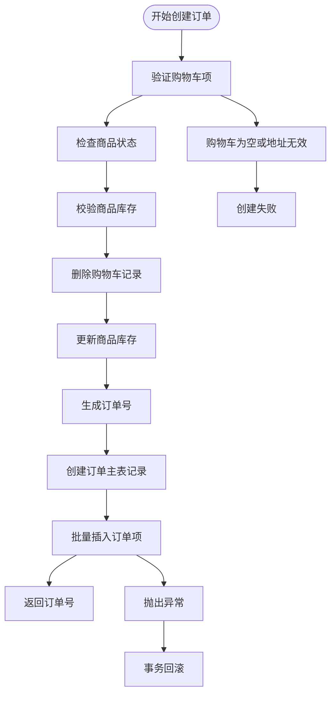
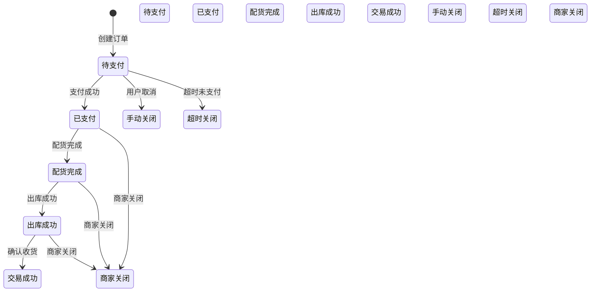
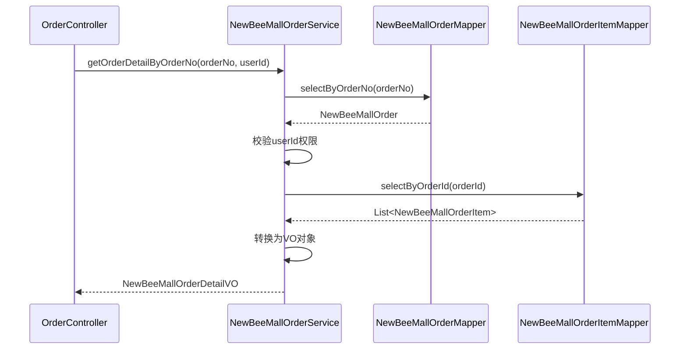
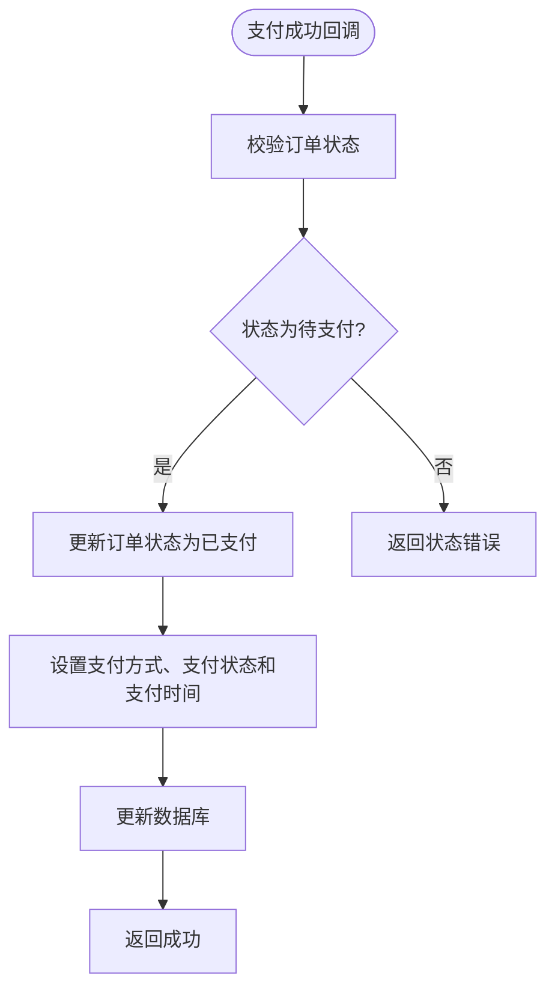

# 订单服务（NewBeeMallOrderService）

<cite>
**本文档引用的文件**
- [NewBeeMallOrderService.java](file://src/main/java/ltd/newbee/mall/service/NewBeeMallOrderService.java)
- [NewBeeMallOrderServiceImpl.java](file://src/main/java/ltd/newbee/mall/service/impl/NewBeeMallOrderServiceImpl.java)
- [NewBeeMallOrderStatusEnum.java](file://src/main/java/ltd/newbee/mall/common/NewBeeMallOrderStatusEnum.java)
- [NewBeeMallOrder.java](file://src/main/java/ltd/newbee/mall/entity/NewBeeMallOrder.java)
- [NewBeeMallOrderItem.java](file://src/main/java/ltd/newbee/mall/entity/NewBeeMallOrderItem.java)
- [NewBeeMallOrderMapper.java](file://src/main/java/ltd/newbee/mall/dao/NewBeeMallOrderMapper.java)
- [NewBeeMallOrderItemMapper.java](file://src/main/java/ltd/newbee/mall/dao/NewBeeMallOrderItemMapper.java)
- [NewBeeMallShoppingCartItemMapper.java](file://src/main/java/ltd/newbee/mall/dao/NewBeeMallShoppingCartItemMapper.java)
- [NewBeeMallOrderMapper.xml](file://src/main/resources/mapper/NewBeeMallOrderMapper.xml)
- [NewBeeMallOrderItemMapper.xml](file://src/main/resources/mapper/NewBeeMallOrderItemMapper.xml)
- [NewBeeMallOrderDetailVO.java](file://src/main/java/ltd/newbee/mall/controller/vo/NewBeeMallOrderDetailVO.java)
- [NewBeeMallOrderItemVO.java](file://src/main/java/ltd/newbee/mall/controller/vo/NewBeeMallOrderItemVO.java)
- [NewBeeMallShoppingCartItemVO.java](file://src/main/java/ltd/newbee/mall/controller/vo/NewBeeMallShoppingCartItemVO.java)
- [Constants.java](file://src/main/java/ltd/newbee/mall/common/Constants.java)
- [NumberUtil.java](file://src/main/java/ltd/newbee/mall/util/NumberUtil.java)
</cite>

## 目录
1. [简介](#简介)
2. [核心业务流程](#核心业务流程)
3. [订单创建流程](#订单创建流程)
4. [订单状态机与状态流转](#订单状态机与状态流转)
5. [订单查询与详情获取](#订单查询与详情获取)
6. [支付处理流程](#支付处理流程)
7. [订单取消与关闭](#订单取消与关闭)
8. [复合事务与数据一致性](#复合事务与数据一致性)
9. [异常处理与校验机制](#异常处理与校验机制)
10. [结论](#结论)

## 简介

NewBeeMallOrderService 是 NewBeeMall 电商平台的核心服务之一，负责处理订单的全生命周期管理。该服务提供了订单创建、状态更新、查询、支付处理、取消与关闭等关键功能，确保了订单数据的完整性、一致性和业务逻辑的正确性。本服务通过与多个数据访问对象（DAO）协同工作，实现了复杂的业务流程，特别是在订单创建过程中，通过 `@Transactional` 注解保证了跨多个数据库操作的原子性。

**本节不分析具体源文件，因此不提供来源**

## 核心业务流程

NewBeeMallOrderService 的核心业务流程围绕订单的创建、状态更新、查询和支付处理展开。服务通过定义清晰的接口方法，如 `saveOrder`、`getOrderDetailByOrderNo`、`paySuccess` 和 `cancelOrder`，为上层控制器提供了统一的访问入口。这些方法不仅处理了业务逻辑，还包含了必要的校验和异常处理，确保了系统的健壮性。

**本节不分析具体源文件，因此不提供来源**

## 订单创建流程

订单创建是 NewBeeMallOrderService 的核心功能之一，其实现位于 `NewBeeMallOrderServiceImpl` 类的 `saveOrder` 方法中。该流程是一个典型的复合事务，涉及多个数据访问操作，必须保证其原子性。

**图示来源**
- [NewBeeMallOrderServiceImpl.java](file://src/main/java/ltd/newbee/mall/service/impl/NewBeeMallOrderServiceImpl.java#L186-L262)

**本节来源**
- [NewBeeMallOrderServiceImpl.java](file://src/main/java/ltd/newbee/mall/service/impl/NewBeeMallOrderServiceImpl.java#L186-L262)
- [NewBeeMallOrderMapper.java](file://src/main/java/ltd/newbee/mall/dao/NewBeeMallOrderMapper.java#L22)
- [NewBeeMallOrderItemMapper.java](file://src/main/java/ltd/newbee/mall/dao/NewBeeMallOrderItemMapper.java#L47)
- [NewBeeMallShoppingCartItemMapper.java](file://src/main/java/ltd/newbee/mall/dao/NewBeeMallShoppingCartItemMapper.java#L35)

### 详细步骤分析

1.  **输入验证**：方法首先接收 `NewBeeMallUserVO` 用户对象和 `List<NewBeeMallShoppingCartItemVO>` 购物车项列表作为输入。
2.  **商品状态检查**：通过 `NewBeeMallGoodsMapper` 查询购物车中所有商品的详细信息，并检查是否有商品已下架（`SELL_STATUS_UP`）。若有，则抛出异常。
3.  **库存校验**：遍历购物车项，检查每项商品的购买数量是否超过其当前库存。若超过，则抛出异常。
4.  **购物车清理与库存扣减**：在确认商品状态和库存无误后，首先调用 `NewBeeMallShoppingCartItemMapper.deleteBatch` 删除购物车中的相关记录，然后调用 `NewBeeMallGoodsMapper.updateStockNum` 批量扣减商品库存。
5.  **订单主表创建**：使用 `NumberUtil.genOrderNo()` 生成唯一的订单号，并构建 `NewBeeMallOrder` 对象，设置用户ID、收货地址、总价等信息，最后通过 `NewBeeMallOrderMapper.insertSelective` 将其插入到订单主表中。
6.  **订单项创建**：为购物车中的每一项商品创建一个 `NewBeeMallOrderItem` 对象，设置其关联的订单ID，并通过 `NewBeeMallOrderItemMapper.insertBatch` 批量插入到订单项表中。

整个流程被 `@Transactional` 注解包裹，确保了上述所有数据库操作要么全部成功，要么在任何一步失败时全部回滚，从而保证了数据的一致性。

## 订单状态机与状态流转

NewBeeMallOrderService 通过 `NewBeeMallOrderStatusEnum` 枚举类实现了一个清晰的订单状态机，定义了订单从创建到完成或关闭的完整生命周期。

**图示来源**
- [NewBeeMallOrderStatusEnum.java](file://src/main/java/ltd/newbee/mall/common/NewBeeMallOrderStatusEnum.java#L18-L28)

**本节来源**
- [NewBeeMallOrderStatusEnum.java](file://src/main/java/ltd/newbee/mall/common/NewBeeMallOrderStatusEnum.java#L18-L64)
- [NewBeeMallOrderServiceImpl.java](file://src/main/java/ltd/newbee/mall/service/impl/NewBeeMallOrderServiceImpl.java#L327-L349)

### 状态流转规则

服务层在执行状态变更操作前，会进行严格的合法性校验：
- **仅待支付订单可取消**：`cancelOrder` 方法会检查订单状态，只有当订单处于“待支付”（`ORDER_PRE_PAY`）状态时，才允许用户手动取消。已支付、已关闭或已完成的订单无法取消。
- **状态递进**：订单状态通常只能向前流转（如待支付 -> 已支付），不能逆向流转。例如，已支付的订单不能变回待支付状态。
- **关闭条件**：订单可以在“待支付”、“已支付”、“配货完成”和“出库成功”状态下被关闭（由用户、超时或商家触发），但一旦进入“交易成功”或“已关闭”状态，则不能再进行关闭操作。

这种状态机设计有效防止了非法的状态变更，保证了业务流程的严谨性。

## 订单查询与详情获取

服务提供了多种订单查询功能，包括分页查询所有订单、查询用户个人订单列表以及获取单个订单的详细信息。

**图示来源**
- [NewBeeMallOrderServiceImpl.java](file://src/main/java/ltd/newbee/mall/service/impl/NewBeeMallOrderServiceImpl.java#L266-L286)
- [NewBeeMallOrderMapper.java](file://src/main/java/ltd/newbee/mall/dao/NewBeeMallOrderMapper.java#L26)
- [NewBeeMallOrderItemMapper.java](file://src/main/java/ltd/newbee/mall/dao/NewBeeMallOrderItemMapper.java#L31)

**本节来源**
- [NewBeeMallOrderServiceImpl.java](file://src/main/java/ltd/newbee/mall/service/impl/NewBeeMallOrderServiceImpl.java#L266-L323)
- [NewBeeMallOrderDetailVO.java](file://src/main/java/ltd/newbee/mall/controller/vo/NewBeeMallOrderDetailVO.java)
- [NewBeeMallOrderItemVO.java](file://src/main/java/ltd/newbee/mall/controller/vo/NewBeeMallOrderItemVO.java)

### 详情获取流程

`getOrderDetailByOrderNo` 方法是获取订单详情的核心：
1.  **查询主表**：根据订单号 `orderNo` 从 `tb_newbee_mall_order` 表中查询订单主记录。
2.  **权限校验**：验证请求的 `userId` 是否与订单的 `userId` 匹配，防止越权访问。
3.  **查询订单项**：根据主表返回的 `orderId`，从 `tb_newbee_mall_order_item` 表中查询所有相关的订单项。
4.  **数据转换与封装**：将查询到的 `NewBeeMallOrder` 和 `List<NewBeeMallOrderItem>` 对象通过 `BeanUtil.copyList` 等工具类转换为对应的 VO（View Object）对象 `NewBeeMallOrderDetailVO` 和 `List<NewBeeMallOrderItemVO>`，并设置状态码的中文描述。
5.  **返回结果**：将封装好的 `NewBeeMallOrderDetailVO` 返回给调用方。

## 支付处理流程

支付处理流程由 `paySuccess` 方法实现，用于在用户完成支付后更新订单状态。

**图示来源**
- [NewBeeMallOrderServiceImpl.java](file://src/main/java/ltd/newbee/mall/service/impl/NewBeeMallOrderServiceImpl.java#L375-L394)

**本节来源**
- [NewBeeMallOrderServiceImpl.java](file://src/main/java/ltd/newbee/mall/service/impl/NewBeeMallOrderServiceImpl.java#L375-L394)
- [NewBeeMallOrderStatusEnum.java](file://src/main/java/ltd/newbee/mall/common/NewBeeMallOrderStatusEnum.java#L22)
- [PayStatusEnum.java](file://src/main/java/ltd/newbee/mall/common/PayStatusEnum.java)

### 流程说明

1.  **状态校验**：方法首先根据订单号查询订单，并检查其当前状态是否为“待支付”（`ORDER_PRE_PAY`）。如果不是，则返回“订单状态错误”的提示，防止重复支付或对已支付订单进行支付操作。
2.  **状态更新**：如果校验通过，则将订单的 `orderStatus` 更新为“已支付”（`ORDER_PAID`），`payStatus` 更新为“支付成功”（`PAY_SUCCESS`），并设置 `payType`、`payTime` 和 `updateTime`。
3.  **持久化**：调用 `NewBeeMallOrderMapper.updateByPrimaryKeySelective` 将更新后的订单信息写入数据库。

## 订单取消与关闭

订单的取消与关闭是两个相关但不同的操作。`cancelOrder` 通常指用户主动取消待支付订单，而 `closeOrder` 是一个更通用的关闭操作，可能由用户、系统超时或管理员触发。

**本节来源**
- [NewBeeMallOrderServiceImpl.java](file://src/main/java/ltd/newbee/mall/service/impl/NewBeeMallOrderServiceImpl.java#L327-L349)
- [NewBeeMallOrderServiceImpl.java](file://src/main/java/ltd/newbee/mall/service/impl/NewBeeMallOrderServiceImpl.java#L148-L183)

### 取消订单 (cancelOrder)

- **触发条件**：用户在订单详情页点击“取消订单”。
- **校验逻辑**：必须是当前用户的订单，且订单状态必须是“待支付”。
- **执行操作**：调用 `newBeeMallOrderMapper.closeOrder` 将订单状态更新为“手动关闭”（`ORDER_CLOSED_BY_MALLUSER`），并调用 `recoverStockNum` 方法恢复商品库存。

### 关闭订单 (closeOrder)

- **触发条件**：管理员在后台批量关闭订单。
- **校验逻辑**：检查订单是否未删除且状态允许关闭（不能是已关闭或已完成的订单）。
- **执行操作**：批量更新订单状态为“商家关闭”（`ORDER_CLOSED_BY_JUDGE`），并恢复相关商品的库存。

## 复合事务与数据一致性

`@Transactional` 注解在 `NewBeeMallOrderServiceImpl` 中扮演着至关重要的角色，是保证数据一致性的核心机制。

**本节来源**
- [NewBeeMallOrderServiceImpl.java](file://src/main/java/ltd/newbee/mall/service/impl/NewBeeMallOrderServiceImpl.java#L59)
- [NewBeeMallOrderServiceImpl.java](file://src/main/java/ltd/newbee/mall/service/impl/NewBeeMallOrderServiceImpl.java#L186)
- [NewBeeMallOrderServiceImpl.java](file://src/main/java/ltd/newbee/mall/service/impl/NewBeeMallOrderServiceImpl.java#L326)

### 关键作用

1.  **原子性**：在 `saveOrder` 方法中，从删除购物车、扣减库存、创建订单主表到创建订单项，这一系列操作被包裹在一个数据库事务中。如果其中任何一步失败（例如，库存不足或数据库连接中断），整个事务将被回滚，所有已执行的数据库操作都会被撤销，确保了数据不会处于不一致的中间状态。
2.  **隔离性**：事务保证了在订单创建过程中，其他并发操作无法看到未提交的数据，防止了脏读、不可重复读等问题。
3.  **一致性**：通过事务的约束，服务层能够确保业务规则的最终一致性。例如，订单项的总金额必须等于订单主表的总价，库存扣减的数量必须与订单项中的数量一致。

## 异常处理与校验机制

服务层通过 `NewBeeMallException` 类和 `ServiceResultEnum` 枚举实现了统一的异常处理和结果返回机制。

**本节来源**
- [NewBeeMallOrderServiceImpl.java](file://src/main/java/ltd/newbee/mall/service/impl/NewBeeMallOrderServiceImpl.java#L197)
- [NewBeeMallOrderServiceImpl.java](file://src/main/java/ltd/newbee/mall/service/impl/NewBeeMallOrderServiceImpl.java#L208)
- [NewBeeMallException.java](file://src/main/java/ltd/newbee/mall/common/NewBeeMallException.java)
- [ServiceResultEnum.java](file://src/main/java/ltd/newbee/mall/common/ServiceResultEnum.java)

### 主要校验点

- **商品状态校验**：在创建订单时，检查商品是否已下架。
- **库存校验**：确保购买数量不超过可用库存。
- **用户权限校验**：确保用户只能操作自己的订单。
- **订单状态校验**：在执行支付、取消、确认收货等操作前，验证订单是否处于允许该操作的状态。
- **输入数据校验**：检查收货地址等必填字段是否为空。

当校验失败时，服务会调用 `NewBeeMallException.fail()` 抛出一个带有明确错误信息的运行时异常，该异常会被全局异常处理器捕获并转换为标准的错误响应返回给前端。

## 结论

NewBeeMallOrderService 通过精心设计的接口、清晰的状态机、严格的校验逻辑和 `@Transactional` 注解保障的复合事务，实现了对订单全生命周期的高效、可靠管理。其核心的订单创建流程将多个DAO操作协调为一个原子性事务，确保了数据的强一致性。同时，服务层对业务规则的严格校验有效防止了非法操作，保证了系统的健壮性和用户体验。该服务的设计体现了良好的分层架构和面向对象思想，是电商平台订单管理模块的优秀实践。

**本节不分析具体源文件，因此不提供来源**