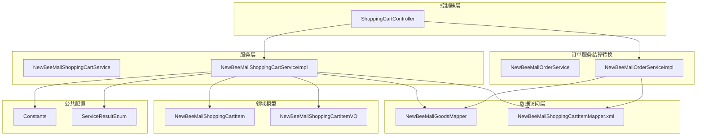
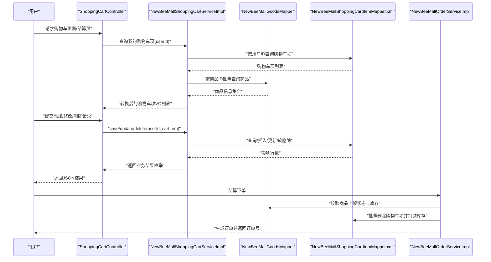
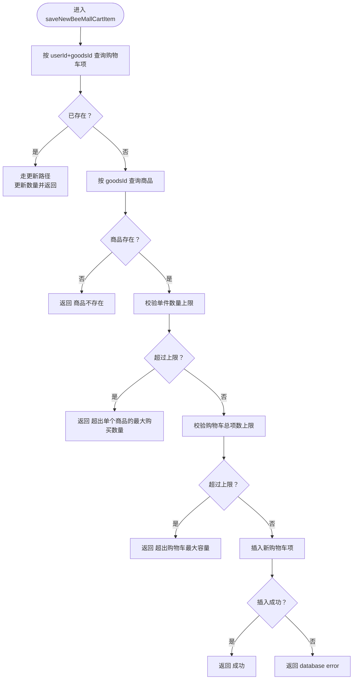
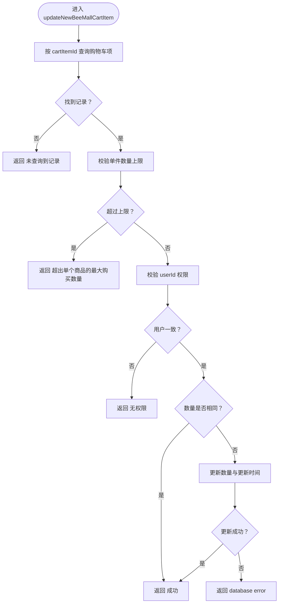
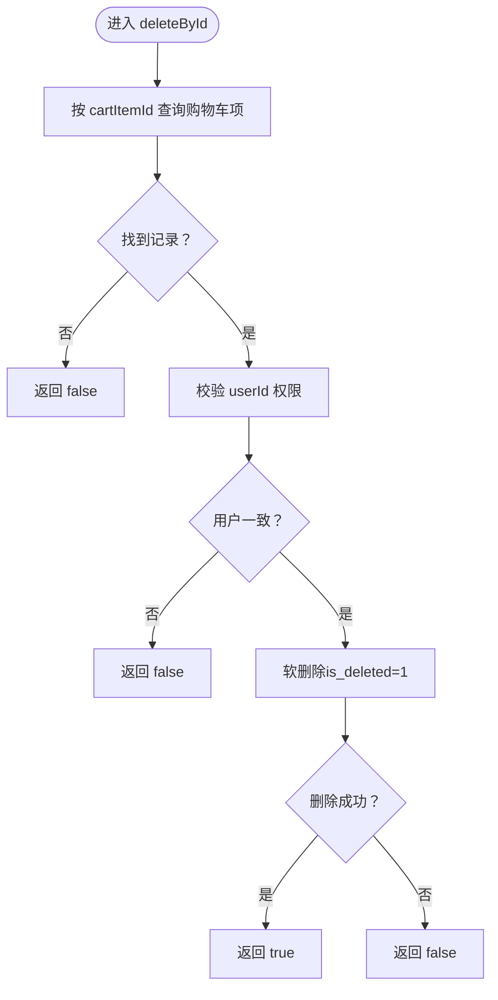
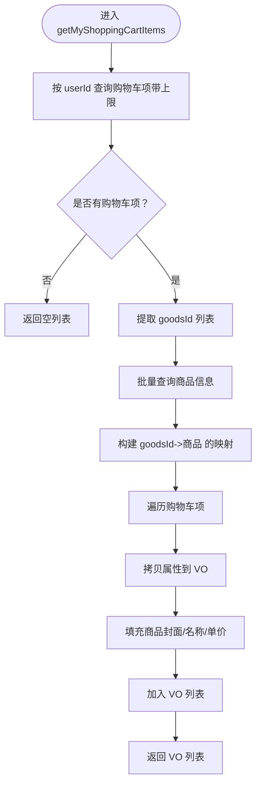
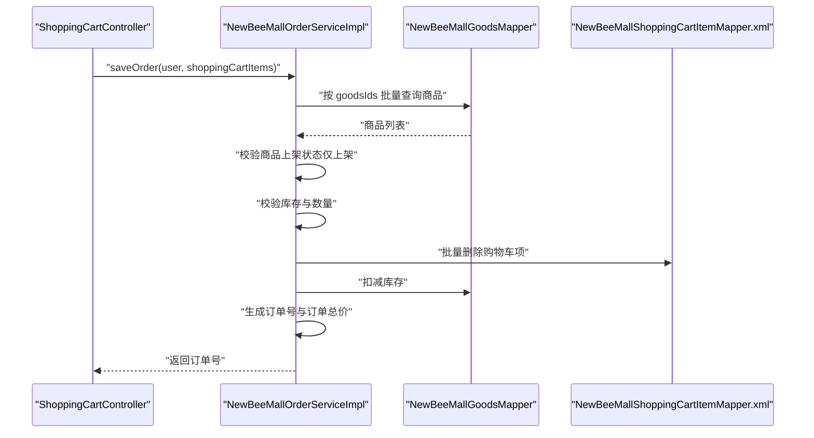
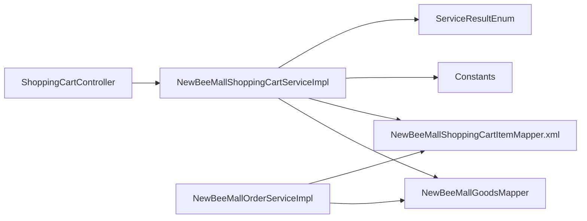

# 购物车服务（NewBeeMallShoppingCartService）

<cite>
**本文引用的文件**
- [NewBeeMallShoppingCartService.java](file://src/main/java/ltd/newbee/mall/service/NewBeeMallShoppingCartService.java)
- [NewBeeMallShoppingCartServiceImpl.java](file://src/main/java/ltd/newbee/mall/service/impl/NewBeeMallShoppingCartServiceImpl.java)
- [NewBeeMallGoodsMapper.java](file://src/main/java/ltd/newbee/mall/dao/NewBeeMallGoodsMapper.java)
- [NewBeeMallShoppingCartItem.java](file://src/main/java/ltd/newbee/mall/entity/NewBeeMallShoppingCartItem.java)
- [ShoppingCartController.java](file://src/main/java/ltd/newbee/mall/controller/mall/ShoppingCartController.java)
- [Constants.java](file://src/main/java/ltd/newbee/mall/common/Constants.java)
- [ServiceResultEnum.java](file://src/main/java/ltd/newbee/mall/common/ServiceResultEnum.java)
- [NewBeeMallShoppingCartItemMapper.xml](file://src/main/resources/mapper/NewBeeMallShoppingCartItemMapper.xml)
- [NewBeeMallGoodsMapper.xml](file://src/main/resources/mapper/NewBeeMallGoodsMapper.xml)
- [NewBeeMallOrderService.java](file://src/main/java/ltd/newbee/mall/service/NewBeeMallOrderService.java)
- [NewBeeMallOrderServiceImpl.java](file://src/main/java/ltd/newbee/mall/service/impl/NewBeeMallOrderServiceImpl.java)
- [NewBeeMallShoppingCartItemVO.java](file://src/main/java/ltd/newbee/mall/controller/vo/NewBeeMallShoppingCartItemVO.java)
</cite>

## 目录
1. [简介](#简介)
2. [项目结构](#项目结构)
3. [核心组件](#核心组件)
4. [架构总览](#架构总览)
5. [详细组件分析](#详细组件分析)
6. [依赖分析](#依赖分析)
7. [性能考虑](#性能考虑)
8. [故障排查指南](#故障排查指南)
9. [结论](#结论)
10. [附录](#附录)

## 简介
本文件围绕 NewBeeMallShoppingCartService 在用户购物过程中的职责展开，重点说明以下方面：
- 购物车项的添加、修改、删除与查询流程
- 同一用户对同一商品重复添加时的处理策略（数量叠加或更新）
- 通过 NewBeeMallGoodsMapper 校验商品是否存在且处于上架状态
- 购物车数据与商品数据的关联关系
- 结算阶段如何将购物车项转换为订单项的业务逻辑
- 服务层对用户会话（通过用户ID）的依赖与用户隔离性
- 高并发场景下的潜在优化点

## 项目结构
购物车相关代码主要分布在如下层次：
- 控制器层：ShoppingCartController 提供购物车页面、新增、修改、删除、结算入口
- 服务层：NewBeeMallShoppingCartService 接口与实现负责购物车业务逻辑
- 数据访问层：NewBeeMallGoodsMapper、NewBeeMallShoppingCartItemMapper 提供商品与购物车项的持久化能力
- 实体与VO：NewBeeMallShoppingCartItem、NewBeeMallShoppingCartItemVO 描述购物车数据模型
- 公共常量与结果枚举：Constants、ServiceResultEnum 定义限制与返回语义

图表来源
- [ShoppingCartController.java](file://src/main/java/ltd/newbee/mall/controller/mall/ShoppingCartController.java#L1-L130)
- [NewBeeMallShoppingCartService.java](file://src/main/java/ltd/newbee/mall/service/NewBeeMallShoppingCartService.java#L1-L60)
- [NewBeeMallShoppingCartServiceImpl.java](file://src/main/java/ltd/newbee/mall/service/impl/NewBeeMallShoppingCartServiceImpl.java#L1-L143)
- [NewBeeMallGoodsMapper.java](file://src/main/java/ltd/newbee/mall/dao/NewBeeMallGoodsMapper.java#L1-L53)
- [NewBeeMallShoppingCartItemMapper.xml](file://src/main/resources/mapper/NewBeeMallShoppingCartItemMapper.xml#L1-L144)
- [NewBeeMallGoodsMapper.xml](file://src/main/resources/mapper/NewBeeMallGoodsMapper.xml#L1-L391)
- [NewBeeMallOrderService.java](file://src/main/java/ltd/newbee/mall/service/NewBeeMallOrderService.java#L1-L118)
- [NewBeeMallOrderServiceImpl.java](file://src/main/java/ltd/newbee/mall/service/impl/NewBeeMallOrderServiceImpl.java#L1-L429)

章节来源
- [ShoppingCartController.java](file://src/main/java/ltd/newbee/mall/controller/mall/ShoppingCartController.java#L1-L130)
- [NewBeeMallShoppingCartService.java](file://src/main/java/ltd/newbee/mall/service/NewBeeMallShoppingCartService.java#L1-L60)
- [NewBeeMallShoppingCartServiceImpl.java](file://src/main/java/ltd/newbee/mall/service/impl/NewBeeMallShoppingCartServiceImpl.java#L1-L143)

## 核心组件
- NewBeeMallShoppingCartService 接口定义了购物车的增删改查与查询我的购物车项等能力
- NewBeeMallShoppingCartServiceImpl 实现了具体业务逻辑，包括：
  - 添加购物车项：重复添加时更新数量而非新增
  - 修改购物车项：校验数量上限、用户权限与数量变化
  - 删除购物车项：基于主键与用户ID的权限校验
  - 查询我的购物车项：批量加载商品信息并转换为视图对象
- NewBeeMallGoodsMapper 提供商品查询与批量查询能力
- NewBeeMallShoppingCartItemMapper.xml 提供购物车项的查询、计数、插入、更新、软删除等SQL映射
- Constants 定义购物车容量与单件上限、会话键等常量
- ServiceResultEnum 定义统一的业务返回语义

章节来源
- [NewBeeMallShoppingCartService.java](file://src/main/java/ltd/newbee/mall/service/NewBeeMallShoppingCartService.java#L1-L60)
- [NewBeeMallShoppingCartServiceImpl.java](file://src/main/java/ltd/newbee/mall/service/impl/NewBeeMallShoppingCartServiceImpl.java#L1-L143)
- [NewBeeMallGoodsMapper.java](file://src/main/java/ltd/newbee/mall/dao/NewBeeMallGoodsMapper.java#L1-L53)
- [NewBeeMallShoppingCartItemMapper.xml](file://src/main/resources/mapper/NewBeeMallShoppingCartItemMapper.xml#L1-L144)
- [Constants.java](file://src/main/java/ltd/newbee/mall/common/Constants.java#L1-L48)
- [ServiceResultEnum.java](file://src/main/java/ltd/newbee/mall/common/ServiceResultEnum.java#L1-L91)

## 架构总览
购物车服务在整体电商系统中的位置如下：

图表来源
- [ShoppingCartController.java](file://src/main/java/ltd/newbee/mall/controller/mall/ShoppingCartController.java#L1-L130)
- [NewBeeMallShoppingCartServiceImpl.java](file://src/main/java/ltd/newbee/mall/service/impl/NewBeeMallShoppingCartServiceImpl.java#L1-L143)
- [NewBeeMallOrderServiceImpl.java](file://src/main/java/ltd/newbee/mall/service/impl/NewBeeMallOrderServiceImpl.java#L185-L263)
- [NewBeeMallGoodsMapper.java](file://src/main/java/ltd/newbee/mall/dao/NewBeeMallGoodsMapper.java#L1-L53)
- [NewBeeMallShoppingCartItemMapper.xml](file://src/main/resources/mapper/NewBeeMallShoppingCartItemMapper.xml#L1-L144)

## 详细组件分析

### 新增购物车项（saveNewBeeMallCartItem）
- 重复添加逻辑：先按“用户ID+商品ID”查询是否存在购物车项，若存在则直接更新数量并走修改流程，不新增记录
- 商品校验：通过商品主键查询商品，若不存在则返回“商品不存在”
- 数量与总量限制：分别校验单件上限与购物车总项数上限，超限返回相应错误
- 新增持久化：满足条件后执行插入，返回成功或数据库错误

图表来源
- [NewBeeMallShoppingCartServiceImpl.java](file://src/main/java/ltd/newbee/mall/service/impl/NewBeeMallShoppingCartServiceImpl.java#L37-L64)
- [NewBeeMallShoppingCartItemMapper.xml](file://src/main/resources/mapper/NewBeeMallShoppingCartItemMapper.xml#L22-L28)
- [NewBeeMallGoodsMapper.java](file://src/main/java/ltd/newbee/mall/dao/NewBeeMallGoodsMapper.java#L25-L25)
- [Constants.java](file://src/main/java/ltd/newbee/mall/common/Constants.java#L32-L34)
- [ServiceResultEnum.java](file://src/main/java/ltd/newbee/mall/common/ServiceResultEnum.java#L46-L48)

章节来源
- [NewBeeMallShoppingCartServiceImpl.java](file://src/main/java/ltd/newbee/mall/service/impl/NewBeeMallShoppingCartServiceImpl.java#L37-L64)
- [NewBeeMallShoppingCartItemMapper.xml](file://src/main/resources/mapper/NewBeeMallShoppingCartItemMapper.xml#L22-L28)
- [NewBeeMallGoodsMapper.java](file://src/main/java/ltd/newbee/mall/dao/NewBeeMallGoodsMapper.java#L25-L25)
- [Constants.java](file://src/main/java/ltd/newbee/mall/common/Constants.java#L32-L34)
- [ServiceResultEnum.java](file://src/main/java/ltd/newbee/mall/common/ServiceResultEnum.java#L46-L48)

### 修改购物车项（updateNewBeeMallCartItem）
- 存在性校验：按主键查询购物车项，不存在返回“未查询到记录”
- 数量上限校验：超过单件上限返回错误
- 用户权限校验：请求中的 userId 必须与记录中的 userId 一致，否则返回“无权限”
- 数量未变化：若数量相同，直接返回成功，避免不必要的写入
- 更新持久化：更新数量与更新时间，返回成功或数据库错误

图表来源
- [NewBeeMallShoppingCartServiceImpl.java](file://src/main/java/ltd/newbee/mall/service/impl/NewBeeMallShoppingCartServiceImpl.java#L66-L91)
- [NewBeeMallShoppingCartItemMapper.xml](file://src/main/resources/mapper/NewBeeMallShoppingCartItemMapper.xml#L134-L143)
- [ServiceResultEnum.java](file://src/main/java/ltd/newbee/mall/common/ServiceResultEnum.java#L22-L23)

章节来源
- [NewBeeMallShoppingCartServiceImpl.java](file://src/main/java/ltd/newbee/mall/service/impl/NewBeeMallShoppingCartServiceImpl.java#L66-L91)
- [NewBeeMallShoppingCartItemMapper.xml](file://src/main/resources/mapper/NewBeeMallShoppingCartItemMapper.xml#L134-L143)
- [ServiceResultEnum.java](file://src/main/java/ltd/newbee/mall/common/ServiceResultEnum.java#L22-L23)

### 删除购物车项（deleteById）
- 存在性校验：按主键查询购物车项，不存在返回 false
- 用户权限校验：请求中的 userId 必须与记录中的 userId 一致，否则返回 false
- 软删除：将 is_deleted 设为 1 并更新，返回删除结果

图表来源
- [NewBeeMallShoppingCartServiceImpl.java](file://src/main/java/ltd/newbee/mall/service/impl/NewBeeMallShoppingCartServiceImpl.java#L98-L109)
- [NewBeeMallShoppingCartItemMapper.xml](file://src/main/resources/mapper/NewBeeMallShoppingCartItemMapper.xml#L42-L45)

章节来源
- [NewBeeMallShoppingCartServiceImpl.java](file://src/main/java/ltd/newbee/mall/service/impl/NewBeeMallShoppingCartServiceImpl.java#L98-L109)
- [NewBeeMallShoppingCartItemMapper.xml](file://src/main/resources/mapper/NewBeeMallShoppingCartItemMapper.xml#L42-L45)

### 查询我的购物车项（getMyShoppingCartItems）
- 加载购物车项：按用户ID查询购物车项列表（带上限）
- 批量查询商品：从购物车项提取商品ID，批量查询商品信息
- 数据转换：将实体转换为 VO，填充商品封面、名称（截断）、单价等
- 性能优化：使用 Map 缓存商品信息，避免重复查询

图表来源
- [NewBeeMallShoppingCartServiceImpl.java](file://src/main/java/ltd/newbee/mall/service/impl/NewBeeMallShoppingCartServiceImpl.java#L111-L141)
- [NewBeeMallShoppingCartItemMapper.xml](file://src/main/resources/mapper/NewBeeMallShoppingCartItemMapper.xml#L29-L35)
- [NewBeeMallGoodsMapper.java](file://src/main/java/ltd/newbee/mall/dao/NewBeeMallGoodsMapper.java#L39-L39)
- [NewBeeMallShoppingCartItemVO.java](file://src/main/java/ltd/newbee/mall/controller/vo/NewBeeMallShoppingCartItemVO.java#L1-L78)

章节来源
- [NewBeeMallShoppingCartServiceImpl.java](file://src/main/java/ltd/newbee/mall/service/impl/NewBeeMallShoppingCartServiceImpl.java#L111-L141)
- [NewBeeMallShoppingCartItemMapper.xml](file://src/main/resources/mapper/NewBeeMallShoppingCartItemMapper.xml#L29-L35)
- [NewBeeMallGoodsMapper.java](file://src/main/java/ltd/newbee/mall/dao/NewBeeMallGoodsMapper.java#L39-L39)
- [NewBeeMallShoppingCartItemVO.java](file://src/main/java/ltd/newbee/mall/controller/vo/NewBeeMallShoppingCartItemVO.java#L1-L78)

### 控制器与服务交互（用户会话依赖）
- 控制器从会话中读取用户信息，将 userId 注入到购物车项中再调用服务
- 服务层在修改与删除时再次校验 userId，确保用户隔离性
- 结算页同样依赖会话中的用户ID加载购物车项

章节来源
- [ShoppingCartController.java](file://src/main/java/ltd/newbee/mall/controller/mall/ShoppingCartController.java#L36-L128)
- [Constants.java](file://src/main/java/ltd/newbee/mall/common/Constants.java#L38-L38)

### 购物车与商品的数据关联
- 购物车项实体包含 goodsId 字段，作为与商品表的外键关联
- 查询购物车项时仅存储必要字段；展示时通过批量查询商品信息补充封面、名称、单价等
- 结算时订单服务会再次校验商品上架状态与库存，确保下单一致性

章节来源
- [NewBeeMallShoppingCartItem.java](file://src/main/java/ltd/newbee/mall/entity/NewBeeMallShoppingCartItem.java#L1-L100)
- [NewBeeMallShoppingCartItemMapper.xml](file://src/main/resources/mapper/NewBeeMallShoppingCartItemMapper.xml#L1-L144)
- [NewBeeMallGoodsMapper.xml](file://src/main/resources/mapper/NewBeeMallGoodsMapper.xml#L153-L166)
- [NewBeeMallOrderServiceImpl.java](file://src/main/java/ltd/newbee/mall/service/impl/NewBeeMallOrderServiceImpl.java#L185-L263)

### 结算阶段：购物车项转换为订单项
- 订单服务在保存订单前，会：
  - 通过商品ID批量查询商品，校验商品上架状态（仅允许上架商品）
  - 校验购物车项数量与商品库存，防止超卖
  - 批量删除购物车项并扣减库存
  - 生成订单号与订单总价，创建订单与订单项快照
- 这保证了购物车数据与最终订单的一致性与可追溯性

图表来源
- [NewBeeMallOrderServiceImpl.java](file://src/main/java/ltd/newbee/mall/service/impl/NewBeeMallOrderServiceImpl.java#L185-L263)
- [NewBeeMallGoodsMapper.java](file://src/main/java/ltd/newbee/mall/dao/NewBeeMallGoodsMapper.java#L39-L39)
- [NewBeeMallGoodsMapper.xml](file://src/main/resources/mapper/NewBeeMallGoodsMapper.xml#L59-L70)
- [NewBeeMallShoppingCartItemMapper.xml](file://src/main/resources/mapper/NewBeeMallShoppingCartItemMapper.xml#L46-L52)

章节来源
- [NewBeeMallOrderServiceImpl.java](file://src/main/java/ltd/newbee/mall/service/impl/NewBeeMallOrderServiceImpl.java#L185-L263)
- [NewBeeMallOrderService.java](file://src/main/java/ltd/newbee/mall/service/NewBeeMallOrderService.java#L62-L70)

## 依赖分析
- 服务层依赖：
  - NewBeeMallGoodsMapper：用于商品存在性与批量查询
  - NewBeeMallShoppingCartItemMapper.xml：用于购物车项的查询、计数、插入、更新、软删除
  - Constants：购物车容量与单件上限、会话键
  - ServiceResultEnum：统一返回语义
- 控制器依赖：
  - 通过会话获取用户ID，注入到服务层
- 订单服务依赖：
  - 在结算阶段再次校验商品状态与库存，确保一致性

图表来源
- [NewBeeMallShoppingCartServiceImpl.java](file://src/main/java/ltd/newbee/mall/service/impl/NewBeeMallShoppingCartServiceImpl.java#L1-L143)
- [NewBeeMallGoodsMapper.java](file://src/main/java/ltd/newbee/mall/dao/NewBeeMallGoodsMapper.java#L1-L53)
- [NewBeeMallShoppingCartItemMapper.xml](file://src/main/resources/mapper/NewBeeMallShoppingCartItemMapper.xml#L1-L144)
- [Constants.java](file://src/main/java/ltd/newbee/mall/common/Constants.java#L1-L48)
- [ServiceResultEnum.java](file://src/main/java/ltd/newbee/mall/common/ServiceResultEnum.java#L1-L91)
- [ShoppingCartController.java](file://src/main/java/ltd/newbee/mall/controller/mall/ShoppingCartController.java#L1-L130)
- [NewBeeMallOrderServiceImpl.java](file://src/main/java/ltd/newbee/mall/service/impl/NewBeeMallOrderServiceImpl.java#L1-L429)

章节来源
- [NewBeeMallShoppingCartServiceImpl.java](file://src/main/java/ltd/newbee/mall/service/impl/NewBeeMallShoppingCartServiceImpl.java#L1-L143)
- [NewBeeMallOrderServiceImpl.java](file://src/main/java/ltd/newbee/mall/service/impl/NewBeeMallOrderServiceImpl.java#L185-L263)

## 性能考虑
- 批量查询优化：查询购物车项后，一次性提取商品ID并批量查询商品，减少N+1查询
- 内存缓存：使用 Map 缓存商品信息，避免重复映射开销
- SQL 层面：
  - 查询购物车项时使用 limit 控制返回数量
  - 软删除使用 is_deleted 字段，避免物理删除带来的索引维护成本
- 并发场景建议：
  - 新增购物车项时，应确保“用户ID+商品ID”的唯一性约束，避免重复记录
  - 在高并发下，建议在数据库层面增加唯一索引或使用乐观锁/悲观锁控制
  - 结算阶段的库存扣减与购物车删除应放在同一事务内，保证原子性
  - 可引入缓存（如Redis）预热热门商品信息，降低数据库压力

章节来源
- [NewBeeMallShoppingCartServiceImpl.java](file://src/main/java/ltd/newbee/mall/service/impl/NewBeeMallShoppingCartServiceImpl.java#L111-L141)
- [NewBeeMallShoppingCartItemMapper.xml](file://src/main/resources/mapper/NewBeeMallShoppingCartItemMapper.xml#L29-L35)
- [NewBeeMallOrderServiceImpl.java](file://src/main/java/ltd/newbee/mall/service/impl/NewBeeMallOrderServiceImpl.java#L185-L263)

## 故障排查指南
- “商品不存在”：确认商品主键有效且存在于商品表
- “超出单个商品的最大购买数量/超出购物车最大容量”：检查 Constants 中的限制值与实际业务需求
- “无权限/未查询到记录”：检查请求中的 userId 是否与购物车项中的 userId 一致
- “数据库错误”：检查插入/更新/删除语句与数据库连接状态
- 结算失败：检查商品上架状态与库存是否充足，确认事务内扣减库存与删除购物车项的顺序

章节来源
- [ServiceResultEnum.java](file://src/main/java/ltd/newbee/mall/common/ServiceResultEnum.java#L22-L23)
- [ServiceResultEnum.java](file://src/main/java/ltd/newbee/mall/common/ServiceResultEnum.java#L46-L48)
- [ServiceResultEnum.java](file://src/main/java/ltd/newbee/mall/common/ServiceResultEnum.java#L74-L76)
- [NewBeeMallOrderServiceImpl.java](file://src/main/java/ltd/newbee/mall/service/impl/NewBeeMallOrderServiceImpl.java#L185-L263)

## 结论
NewBeeMallShoppingCartService 通过明确的增删改查与用户隔离策略，实现了购物车的核心功能。服务层在新增时采用“重复即更新”的策略，结合商品与购物车容量限制，保障用户体验与系统稳定性。在结算阶段，订单服务进一步校验商品状态与库存，确保从购物车到订单的完整一致性。针对高并发场景，建议完善数据库约束与事务控制，并结合缓存与批量查询优化，持续提升性能与可靠性。

## 附录
- 关键接口与方法路径参考：
  - [saveNewBeeMallCartItem](file://src/main/java/ltd/newbee/mall/service/impl/NewBeeMallShoppingCartServiceImpl.java#L37-L64)
  - [updateNewBeeMallCartItem](file://src/main/java/ltd/newbee/mall/service/impl/NewBeeMallShoppingCartServiceImpl.java#L66-L91)
  - [deleteById](file://src/main/java/ltd/newbee/mall/service/impl/NewBeeMallShoppingCartServiceImpl.java#L98-L109)
  - [getMyShoppingCartItems](file://src/main/java/ltd/newbee/mall/service/impl/NewBeeMallShoppingCartServiceImpl.java#L111-L141)
  - [saveOrder（结算）](file://src/main/java/ltd/newbee/mall/service/impl/NewBeeMallOrderServiceImpl.java#L185-L263)