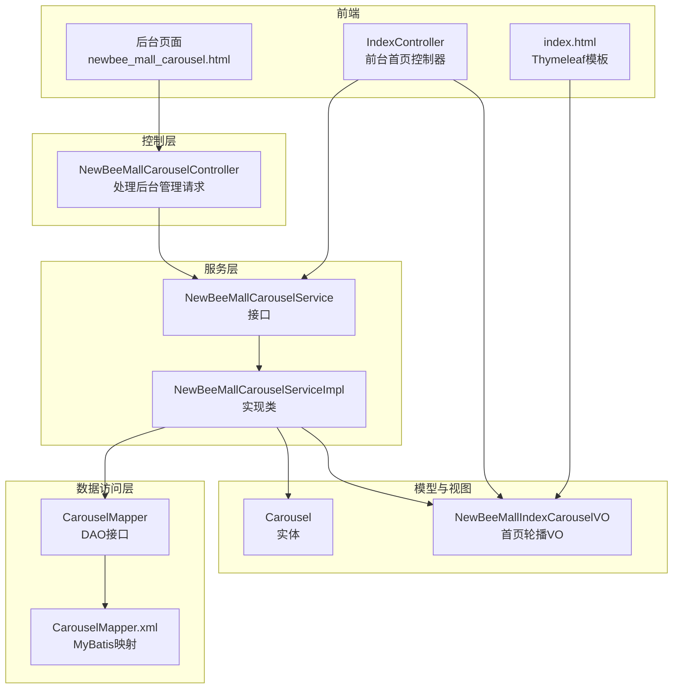
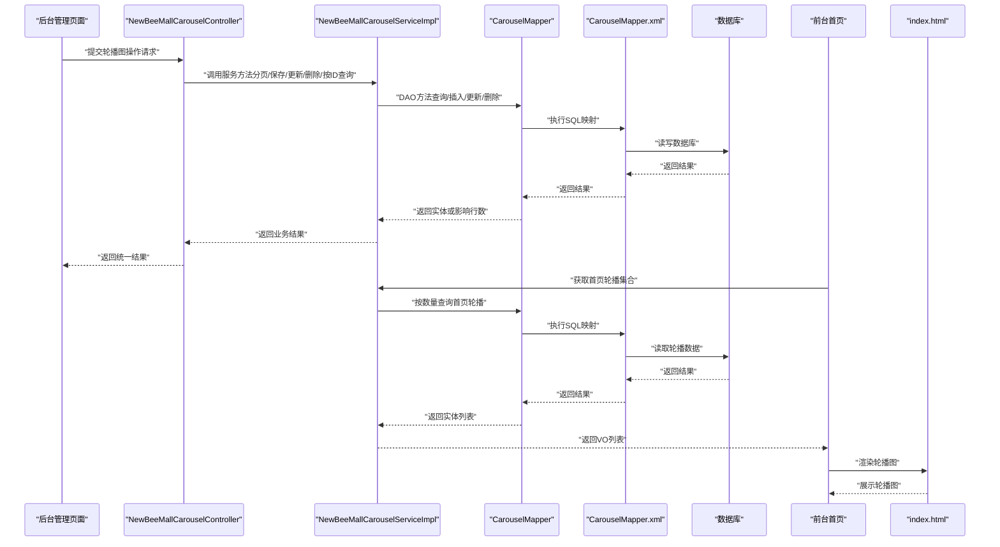
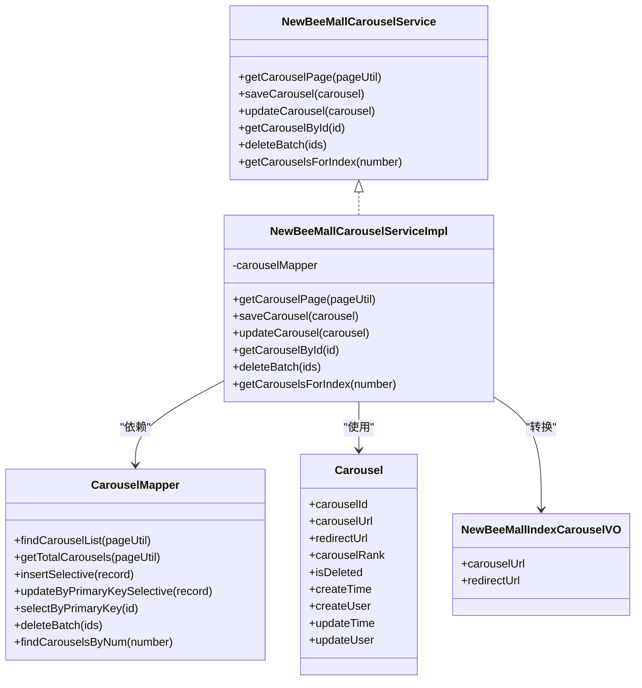
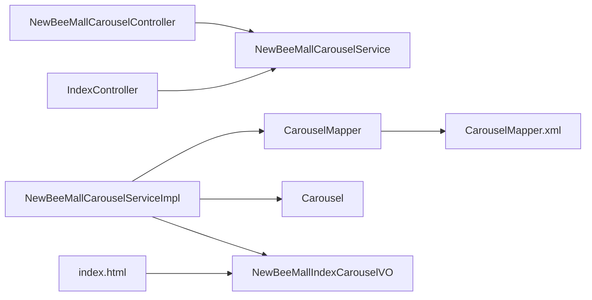

# 轮播图服务（NewBeeMallCarouselService）

<cite>
**本文引用的文件**
- [NewBeeMallCarouselService.java](file://src/main/java/ltd/newbee/mall/service/NewBeeMallCarouselService.java)
- [NewBeeMallCarouselServiceImpl.java](file://src/main/java/ltd/newbee/mall/service/impl/NewBeeMallCarouselServiceImpl.java)
- [CarouselMapper.java](file://src/main/java/ltd/newbee/mall/dao/CarouselMapper.java)
- [CarouselMapper.xml](file://src/main/resources/mapper/CarouselMapper.xml)
- [Carousel.java](file://src/main/java/ltd/newbee/mall/entity/Carousel.java)
- [NewBeeMallCarouselController.java](file://src/main/java/ltd/newbee/mall/controller/admin/NewBeeMallCarouselController.java)
- [NewBeeMallIndexCarouselVO.java](file://src/main/java/ltd/newbee/mall/controller/vo/NewBeeMallIndexCarouselVO.java)
- [IndexController.java](file://src/main/java/ltd/newbee/mall/controller/mall/IndexController.java)
- [Constants.java](file://src/main/java/ltd/newbee/mall/common/Constants.java)
- [PageQueryUtil.java](file://src/main/java/ltd/newbee/mall/util/PageQueryUtil.java)
- [index.html](file://src/main/resources/templates/mall/index.html)
</cite>

## 目录
1. [简介](#简介)
2. [项目结构](#项目结构)
3. [核心组件](#核心组件)
4. [架构总览](#架构总览)
5. [详细组件分析](#详细组件分析)
6. [依赖关系分析](#依赖关系分析)
7. [性能考量](#性能考量)
8. [故障排查指南](#故障排查指南)
9. [结论](#结论)
10. [附录](#附录)

## 简介
本文件围绕 NewBeeMallCarouselService 在后台管理系统中的职责展开，重点说明其如何支撑轮播图的增删改查（CRUD）能力，如何通过 CarouselMapper 与数据库交互实现分页查询、按 ID 查询、新增、排序更新与批量删除；同时分析服务层对轮播图实体字段（跳转链接、图片地址、排序值）的校验逻辑，确保数据有效性，并解释该服务如何为 NewBeeMallCarouselController 提供业务支持，最终服务于前台首页轮播展示，体现前后端数据联动。

## 项目结构
- 控制层：后台管理控制器 NewBeeMallCarouselController 负责接收请求、参数校验与返回结果。
- 服务层：NewBeeMallCarouselService 接口与其实现 NewBeeMallCarouselServiceImpl 提供业务逻辑。
- 数据访问层：CarouselMapper 接口与 MyBatis 映射文件 CarouselMapper.xml 完成数据库操作。
- 实体与视图：Carousel 实体映射数据库表字段；NewBeeMallIndexCarouselVO 作为首页轮播图的传输对象。
- 前端集成：IndexController 调用服务获取首页轮播图集合，模板 index.html 展示轮播图。

图表来源
- [NewBeeMallCarouselController.java](file://src/main/java/ltd/newbee/mall/controller/admin/NewBeeMallCarouselController.java#L1-L126)
- [NewBeeMallCarouselService.java](file://src/main/java/ltd/newbee/mall/service/NewBeeMallCarouselService.java#L1-L43)
- [NewBeeMallCarouselServiceImpl.java](file://src/main/java/ltd/newbee/mall/service/impl/NewBeeMallCarouselServiceImpl.java#L1-L89)
- [CarouselMapper.java](file://src/main/java/ltd/newbee/mall/dao/CarouselMapper.java#L1-L37)
- [CarouselMapper.xml](file://src/main/resources/mapper/CarouselMapper.xml#L1-L171)
- [Carousel.java](file://src/main/java/ltd/newbee/mall/entity/Carousel.java#L1-L126)
- [NewBeeMallIndexCarouselVO.java](file://src/main/java/ltd/newbee/mall/controller/vo/NewBeeMallIndexCarouselVO.java#L1-L38)
- [IndexController.java](file://src/main/java/ltd/newbee/mall/controller/mall/IndexController.java#L1-L58)
- [index.html](file://src/main/resources/templates/mall/index.html#L1-L200)

章节来源
- [NewBeeMallCarouselController.java](file://src/main/java/ltd/newbee/mall/controller/admin/NewBeeMallCarouselController.java#L1-L126)
- [NewBeeMallCarouselService.java](file://src/main/java/ltd/newbee/mall/service/NewBeeMallCarouselService.java#L1-L43)
- [NewBeeMallCarouselServiceImpl.java](file://src/main/java/ltd/newbee/mall/service/impl/NewBeeMallCarouselServiceImpl.java#L1-L89)
- [CarouselMapper.java](file://src/main/java/ltd/newbee/mall/dao/CarouselMapper.java#L1-L37)
- [CarouselMapper.xml](file://src/main/resources/mapper/CarouselMapper.xml#L1-L171)
- [Carousel.java](file://src/main/java/ltd/newbee/mall/entity/Carousel.java#L1-L126)
- [NewBeeMallIndexCarouselVO.java](file://src/main/java/ltd/newbee/mall/controller/vo/NewBeeMallIndexCarouselVO.java#L1-L38)
- [IndexController.java](file://src/main/java/ltd/newbee/mall/controller/mall/IndexController.java#L1-L58)
- [index.html](file://src/main/resources/templates/mall/index.html#L1-L200)

## 核心组件
- 接口与实现
  - NewBeeMallCarouselService：定义后台分页查询、保存、更新、按 ID 查询、批量删除、首页轮播查询等方法。
  - NewBeeMallCarouselServiceImpl：实现上述方法，内部注入 CarouselMapper 并进行必要的业务判断与结果封装。
- DAO 与映射
  - CarouselMapper：定义基础 CRUD、分页查询、总数统计、批量删除、按数量查询首页轮播等方法。
  - CarouselMapper.xml：对应 SQL 实现，包含分页、排序、软删除（is_deleted=1）等逻辑。
- 实体与视图
  - Carousel：持久化实体，包含图片地址、跳转链接、排序值、创建/更新时间等字段。
  - NewBeeMallIndexCarouselVO：仅包含首页展示所需的字段（图片地址、跳转链接），用于前后端解耦。
- 控制器与前端
  - NewBeeMallCarouselController：后台管理接口，负责参数校验与返回统一结果。
  - IndexController：前台首页控制器，调用服务获取首页轮播集合。
  - index.html：Thymeleaf 模板渲染轮播图，支持无数据时的默认展示。

章节来源
- [NewBeeMallCarouselService.java](file://src/main/java/ltd/newbee/mall/service/NewBeeMallCarouselService.java#L1-L43)
- [NewBeeMallCarouselServiceImpl.java](file://src/main/java/ltd/newbee/mall/service/impl/NewBeeMallCarouselServiceImpl.java#L1-L89)
- [CarouselMapper.java](file://src/main/java/ltd/newbee/mall/dao/CarouselMapper.java#L1-L37)
- [CarouselMapper.xml](file://src/main/resources/mapper/CarouselMapper.xml#L1-L171)
- [Carousel.java](file://src/main/java/ltd/newbee/mall/entity/Carousel.java#L1-L126)
- [NewBeeMallIndexCarouselVO.java](file://src/main/java/ltd/newbee/mall/controller/vo/NewBeeMallIndexCarouselVO.java#L1-L38)
- [NewBeeMallCarouselController.java](file://src/main/java/ltd/newbee/mall/controller/admin/NewBeeMallCarouselController.java#L1-L126)
- [IndexController.java](file://src/main/java/ltd/newbee/mall/controller/mall/IndexController.java#L1-L58)
- [index.html](file://src/main/resources/templates/mall/index.html#L1-L200)

## 架构总览
NewBeeMallCarouselService 的职责贯穿“后台管理—服务—数据访问—数据库”链路，并向上游提供给前台首页使用。后台管理通过控制器接收请求，服务层执行业务逻辑并调用 DAO 访问数据库；前台首页由控制器调用服务层获取首页轮播数据，模板渲染展示。

图表来源
- [NewBeeMallCarouselController.java](file://src/main/java/ltd/newbee/mall/controller/admin/NewBeeMallCarouselController.java#L1-L126)
- [NewBeeMallCarouselServiceImpl.java](file://src/main/java/ltd/newbee/mall/service/impl/NewBeeMallCarouselServiceImpl.java#L1-L89)
- [CarouselMapper.java](file://src/main/java/ltd/newbee/mall/dao/CarouselMapper.java#L1-L37)
- [CarouselMapper.xml](file://src/main/resources/mapper/CarouselMapper.xml#L1-L171)
- [IndexController.java](file://src/main/java/ltd/newbee/mall/controller/mall/IndexController.java#L1-L58)
- [index.html](file://src/main/resources/templates/mall/index.html#L1-L200)

## 详细组件分析

### 服务层：NewBeeMallCarouselService 与实现
- 方法职责
  - 后台分页查询：getCarouselPage(PageQueryUtil) 基于 PageQueryUtil 计算分页起始位置，查询轮播列表并统计总数，返回 PageResult。
  - 新增轮播：saveCarousel(Carousel) 执行插入，成功返回成功标识，否则返回数据库错误标识。
  - 更新轮播：updateCarousel(Carousel) 先按主键查询是否存在，不存在则返回不存在标识；存在则更新排序值、跳转链接、图片地址与更新时间，再选择性更新，成功返回成功标识，否则返回数据库错误标识。
  - 按 ID 查询：getCarouselById(Integer) 直接按主键查询。
  - 批量删除：deleteBatch(Integer[]) 对传入 ID 数组执行软删除（设置 is_deleted=1 并更新时间），返回布尔结果。
  - 首页轮播查询：getCarouselsForIndex(int) 按数量查询首页轮播，使用 BeanUtil 将实体列表转换为首页 VO 列表返回。
- 字段校验与数据有效性
  - 控制器侧对新增/更新的关键字段进行前置校验：图片地址非空、排序值非空；更新时要求主键存在；删除时要求数组非空。
  - 服务层对更新场景进行存在性校验（按主键查询为空则返回不存在标识），避免无效更新。
  - 实体层对字符串字段提供 trim 处理，减少前后空格带来的存储问题。
- 与 DAO 的交互
  - 服务层通过 CarouselMapper 的 findCarouselList/getTotalCarousels 实现分页查询与总数统计。
  - 通过 insertSelective/updateByPrimaryKeySelective/selectByPrimaryKey/deleteBatch 等方法完成数据操作。
  - 通过 findCarouselsByNum 实现首页轮播查询，SQL 中按排序降序并限制数量。

图表来源
- [NewBeeMallCarouselService.java](file://src/main/java/ltd/newbee/mall/service/NewBeeMallCarouselService.java#L1-L43)
- [NewBeeMallCarouselServiceImpl.java](file://src/main/java/ltd/newbee/mall/service/impl/NewBeeMallCarouselServiceImpl.java#L1-L89)
- [CarouselMapper.java](file://src/main/java/ltd/newbee/mall/dao/CarouselMapper.java#L1-L37)
- [Carousel.java](file://src/main/java/ltd/newbee/mall/entity/Carousel.java#L1-L126)
- [NewBeeMallIndexCarouselVO.java](file://src/main/java/ltd/newbee/mall/controller/vo/NewBeeMallIndexCarouselVO.java#L1-L38)

章节来源
- [NewBeeMallCarouselServiceImpl.java](file://src/main/java/ltd/newbee/mall/service/impl/NewBeeMallCarouselServiceImpl.java#L1-L89)
- [CarouselMapper.java](file://src/main/java/ltd/newbee/mall/dao/CarouselMapper.java#L1-L37)
- [Carousel.java](file://src/main/java/ltd/newbee/mall/entity/Carousel.java#L1-L126)
- [NewBeeMallIndexCarouselVO.java](file://src/main/java/ltd/newbee/mall/controller/vo/NewBeeMallIndexCarouselVO.java#L1-L38)

### 数据访问层：CarouselMapper 与映射
- 基础 CRUD
  - insertSelective：按非空字段插入。
  - updateByPrimaryKeySelective：按非空字段选择性更新。
  - selectByPrimaryKey：按主键查询。
  - deleteBatch：批量软删除（设置 is_deleted=1 并更新时间）。
- 分页与统计
  - findCarouselList：按分页参数查询轮播列表，按排序降序，支持 limit。
  - getTotalCarousels：统计未删除记录总数。
- 首页轮播
  - findCarouselsByNum：按数量查询首页轮播，按排序降序并限制数量。

章节来源
- [CarouselMapper.java](file://src/main/java/ltd/newbee/mall/dao/CarouselMapper.java#L1-L37)
- [CarouselMapper.xml](file://src/main/resources/mapper/CarouselMapper.xml#L1-L171)

### 控制器：后台管理与前台首页
- 后台管理控制器
  - 列表接口：接收分页参数，构造 PageQueryUtil，调用服务分页查询并返回统一结果。
  - 新增接口：校验图片地址与排序值，调用服务保存。
  - 更新接口：校验主键、图片地址与排序值，调用服务更新。
  - 详情接口：按 ID 查询轮播，返回实体。
  - 删除接口：校验数组非空，调用服务批量删除。
- 前台首页控制器
  - 调用服务获取首页轮播集合（数量由 Constants 中常量决定），并将分类、轮播、热门、新品、推荐商品等数据放入请求域，渲染模板。

章节来源
- [NewBeeMallCarouselController.java](file://src/main/java/ltd/newbee/mall/controller/admin/NewBeeMallCarouselController.java#L1-L126)
- [IndexController.java](file://src/main/java/ltd/newbee/mall/controller/mall/IndexController.java#L1-L58)
- [Constants.java](file://src/main/java/ltd/newbee/mall/common/Constants.java#L1-L48)

### 前后端数据联动与展示
- 前端模板 index.html 使用 Thymeleaf 遍历轮播集合，渲染图片与跳转链接；当集合为空时展示默认轮播图。
- 服务层通过 VO 对象传递轮播图数据，避免直接暴露实体字段，提升安全性与可维护性。

章节来源
- [index.html](file://src/main/resources/templates/mall/index.html#L1-L200)
- [NewBeeMallIndexCarouselVO.java](file://src/main/java/ltd/newbee/mall/controller/vo/NewBeeMallIndexCarouselVO.java#L1-L38)

## 依赖关系分析
- 组件耦合
  - 控制器依赖服务接口，便于替换实现与测试。
  - 服务实现依赖 DAO 接口，DAO 依赖 MyBatis 映射文件。
  - 实体与 VO 与服务层存在转换关系，降低控制器与模板对实体的直接依赖。
- 外部依赖
  - MyBatis 提供 ORM 能力与 SQL 映射。
  - Thymeleaf 提供模板渲染能力。
- 循环依赖
  - 当前结构未发现循环依赖，各层职责清晰。

图表来源
- [NewBeeMallCarouselController.java](file://src/main/java/ltd/newbee/mall/controller/admin/NewBeeMallCarouselController.java#L1-L126)
- [NewBeeMallCarouselServiceImpl.java](file://src/main/java/ltd/newbee/mall/service/impl/NewBeeMallCarouselServiceImpl.java#L1-L89)
- [CarouselMapper.java](file://src/main/java/ltd/newbee/mall/dao/CarouselMapper.java#L1-L37)
- [CarouselMapper.xml](file://src/main/resources/mapper/CarouselMapper.xml#L1-L171)
- [IndexController.java](file://src/main/java/ltd/newbee/mall/controller/mall/IndexController.java#L1-L58)
- [index.html](file://src/main/resources/templates/mall/index.html#L1-L200)

章节来源
- [NewBeeMallCarouselController.java](file://src/main/java/ltd/newbee/mall/controller/admin/NewBeeMallCarouselController.java#L1-L126)
- [NewBeeMallCarouselServiceImpl.java](file://src/main/java/ltd/newbee/mall/service/impl/NewBeeMallCarouselServiceImpl.java#L1-L89)
- [CarouselMapper.java](file://src/main/java/ltd/newbee/mall/dao/CarouselMapper.java#L1-L37)
- [CarouselMapper.xml](file://src/main/resources/mapper/CarouselMapper.xml#L1-L171)
- [IndexController.java](file://src/main/java/ltd/newbee/mall/controller/mall/IndexController.java#L1-L58)
- [index.html](file://src/main/resources/templates/mall/index.html#L1-L200)

## 性能考量
- 分页查询
  - 通过 PageQueryUtil 计算起始偏移量，结合 SQL 的 limit 与排序，避免一次性加载大量数据。
- 排序与索引
  - SQL 对排序字段进行降序排列，建议在数据库层面为排序字段建立索引以提升查询效率。
- 批量删除
  - 使用软删除（is_deleted=1）替代物理删除，减少全表扫描与级联影响。
- 首页轮播
  - 通过限制数量（Constants 中常量）减少前端渲染压力，同时避免频繁网络传输。

[本节为通用性能建议，无需特定文件来源]

## 故障排查指南
- 常见问题定位
  - 新增/更新失败：检查控制器参数校验是否通过；查看服务层返回的业务标识（成功/不存在/数据库错误）。
  - 分页查询为空：确认 PageQueryUtil 参数是否正确；检查 SQL 是否按排序与分页条件执行。
  - 删除失败：确认传入 ID 数组非空；检查软删除 SQL 是否生效。
  - 前台轮播不显示：确认服务层返回的 VO 列表是否为空；检查模板中默认轮播图逻辑。
- 关键路径参考
  - 控制器参数校验与返回：[NewBeeMallCarouselController.java](file://src/main/java/ltd/newbee/mall/controller/admin/NewBeeMallCarouselController.java#L52-L75)
  - 服务层更新流程与返回标识：[NewBeeMallCarouselServiceImpl.java](file://src/main/java/ltd/newbee/mall/service/impl/NewBeeMallCarouselServiceImpl.java#L49-L63)
  - DAO 分页与统计 SQL：[CarouselMapper.xml](file://src/main/resources/mapper/CarouselMapper.xml#L19-L32)
  - 批量软删除 SQL：[CarouselMapper.xml](file://src/main/resources/mapper/CarouselMapper.xml#L164-L170)
  - 首页轮播查询与模板渲染：[IndexController.java](file://src/main/java/ltd/newbee/mall/controller/mall/IndexController.java#L40-L56)，[index.html](file://src/main/resources/templates/mall/index.html#L36-L58)

章节来源
- [NewBeeMallCarouselController.java](file://src/main/java/ltd/newbee/mall/controller/admin/NewBeeMallCarouselController.java#L52-L75)
- [NewBeeMallCarouselServiceImpl.java](file://src/main/java/ltd/newbee/mall/service/impl/NewBeeMallCarouselServiceImpl.java#L49-L63)
- [CarouselMapper.xml](file://src/main/resources/mapper/CarouselMapper.xml#L19-L32)
- [CarouselMapper.xml](file://src/main/resources/mapper/CarouselMapper.xml#L164-L170)
- [IndexController.java](file://src/main/java/ltd/newbee/mall/controller/mall/IndexController.java#L40-L56)
- [index.html](file://src/main/resources/templates/mall/index.html#L36-L58)

## 结论
NewBeeMallCarouselService 通过清晰的分层设计与严格的参数校验，实现了后台管理对轮播图的完整 CRUD 支撑，并通过首页轮播查询服务于前台展示。服务层与 DAO 的职责明确，控制器负责参数校验与结果封装，实体与 VO 解耦前后端数据结构，整体架构具备良好的扩展性与可维护性。

[本节为总结性内容，无需特定文件来源]

## 附录
- 关键字段说明
  - 图片地址：用于展示轮播图的资源路径。
  - 跳转链接：点击轮播图后的跳转地址。
  - 排序值：决定轮播图的展示顺序。
- 常量配置
  - 首页轮播数量由 Constants 中常量决定，可在部署时按需调整。

章节来源
- [Constants.java](file://src/main/java/ltd/newbee/mall/common/Constants.java#L1-L48)
- [Carousel.java](file://src/main/java/ltd/newbee/mall/entity/Carousel.java#L1-L126)
- [NewBeeMallIndexCarouselVO.java](file://src/main/java/ltd/newbee/mall/controller/vo/NewBeeMallIndexCarouselVO.java#L1-L38)