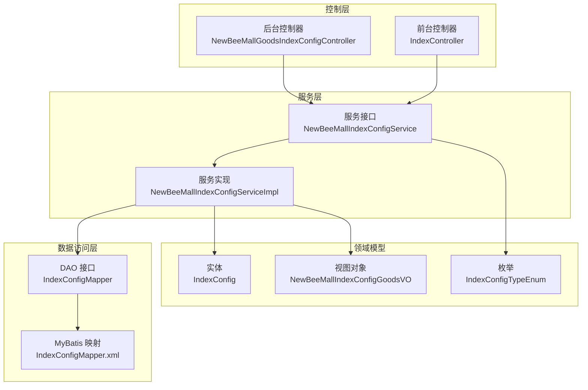
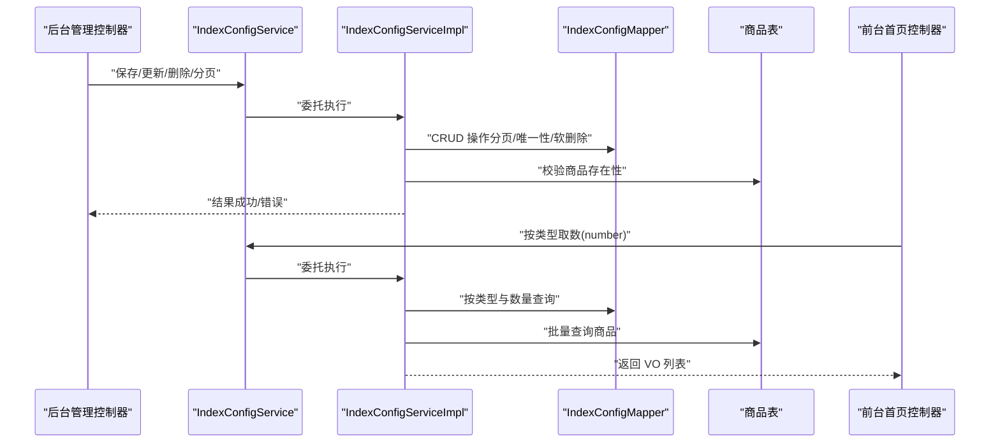
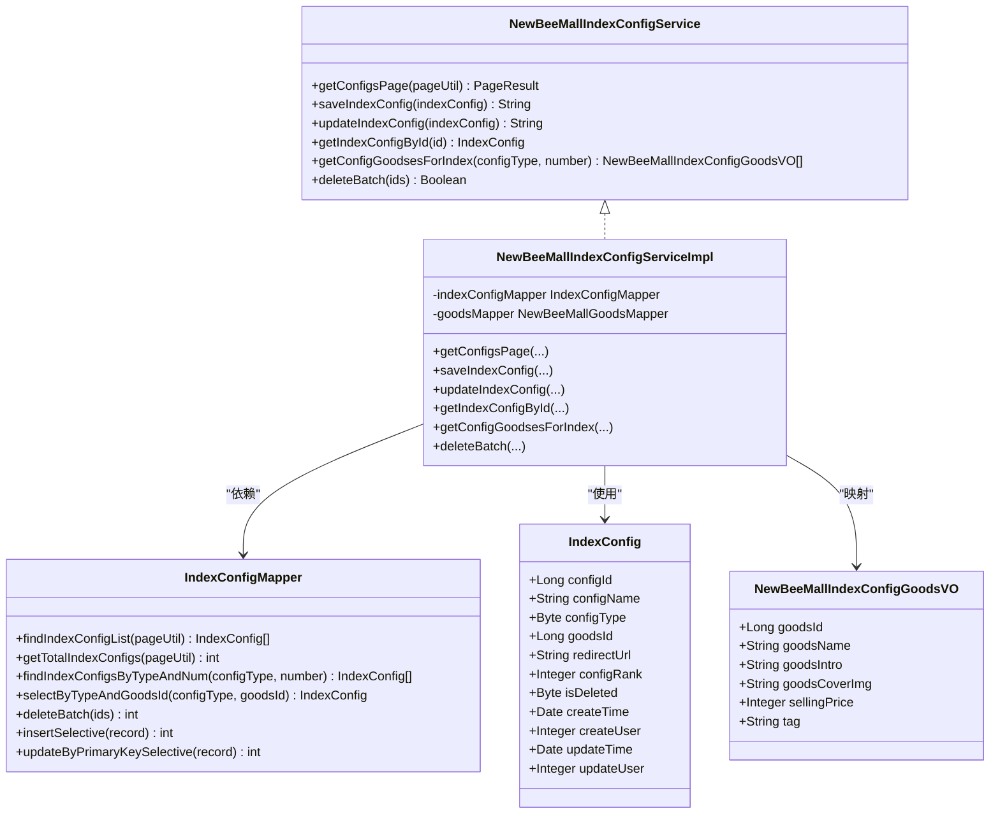
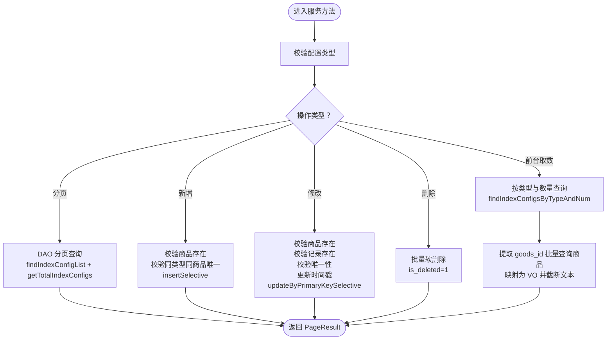
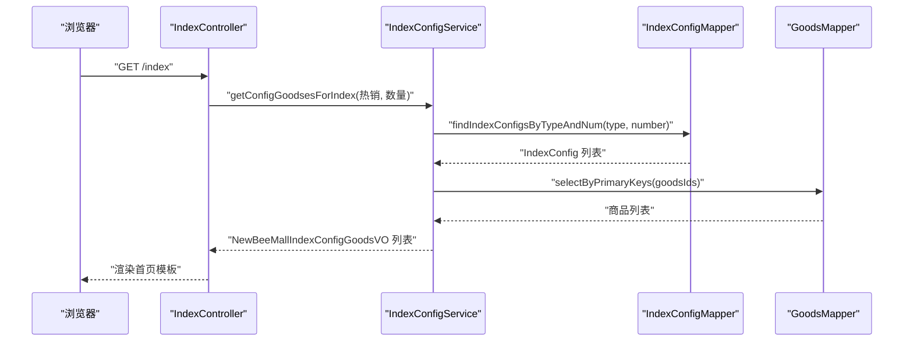
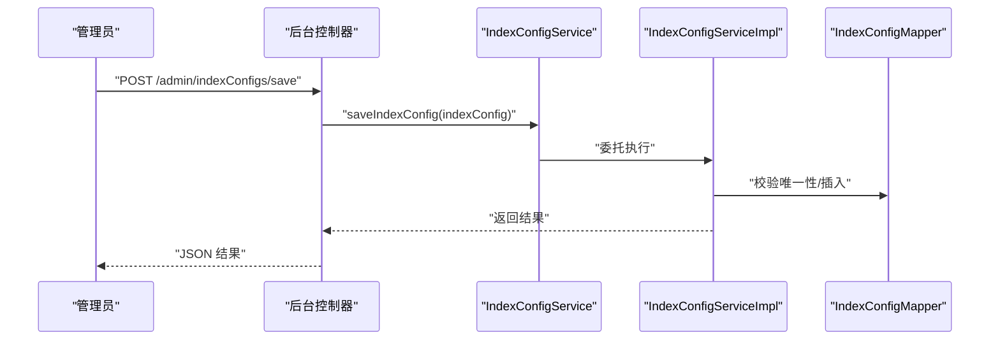
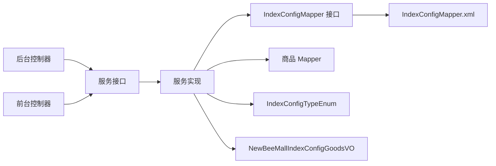

# 首页配置服务（NewBeeMallIndexConfigService）

<cite>
**本文引用的文件**
- [NewBeeMallIndexConfigService.java](file://src/main/java/ltd/newbee/mall/service/NewBeeMallIndexConfigService.java)
- [NewBeeMallIndexConfigServiceImpl.java](file://src/main/java/ltd/newbee/mall/service/impl/NewBeeMallIndexConfigServiceImpl.java)
- [IndexConfigMapper.java](file://src/main/java/ltd/newbee/mall/dao/IndexConfigMapper.java)
- [IndexConfigMapper.xml](file://src/main/resources/mapper/IndexConfigMapper.xml)
- [IndexConfig.java](file://src/main/java/ltd/newbee/mall/entity/IndexConfig.java)
- [IndexConfigTypeEnum.java](file://src/main/java/ltd/newbee/mall/common/IndexConfigTypeEnum.java)
- [NewBeeMallIndexConfigGoodsVO.java](file://src/main/java/ltd/newbee/mall/controller/vo/NewBeeMallIndexConfigGoodsVO.java)
- [NewBeeMallGoodsIndexConfigController.java](file://src/main/java/ltd/newbee/mall/controller/admin/NewBeeMallGoodsIndexConfigController.java)
- [IndexController.java](file://src/main/java/ltd/newbee/mall/controller/mall/IndexController.java)
- [Constants.java](file://src/main/java/ltd/newbee/mall/common/Constants.java)
</cite>

## 目录
1. [简介](#简介)
2. [项目结构](#项目结构)
3. [核心组件](#核心组件)
4. [架构总览](#架构总览)
5. [详细组件分析](#详细组件分析)
6. [依赖关系分析](#依赖关系分析)
7. [性能考量](#性能考量)
8. [故障排查指南](#故障排查指南)
9. [结论](#结论)

## 简介
本文件围绕 NewBeeMallIndexConfigService 的设计与实现进行深入解析，重点说明服务层如何通过 IndexConfigMapper 操作 index_config 表，完成配置项的分页查询、新增、修改与删除；并阐述服务层如何依据配置类型（IndexConfigTypeEnum）筛选并关联对应的商品信息，为前台首页提供动态数据源。同时讨论该服务如何支持运营人员灵活调整首页内容，以提升用户体验与商品曝光率。

## 项目结构
- 服务接口与实现：位于 service 与 service/impl 包中，封装业务逻辑与数据访问。
- 数据访问层：DAO 接口与 MyBatis 映射文件，负责对 tb_newbee_mall_index_config 表的 CRUD。
- 实体与枚举：IndexConfig 实体映射表字段，IndexConfigTypeEnum 定义首页配置类型。
- 控制器：后台管理控制器负责配置项的增删改查；前台首页控制器负责按类型取数渲染页面。
- 视图模型：NewBeeMallIndexConfigGoodsVO 作为首页返回的商品视图对象。

图表来源
- [NewBeeMallGoodsIndexConfigController.java](file://src/main/java/ltd/newbee/mall/controller/admin/NewBeeMallGoodsIndexConfigController.java#L35-L137)
- [IndexController.java](file://src/main/java/ltd/newbee/mall/controller/mall/IndexController.java#L28-L58)
- [NewBeeMallIndexConfigService.java](file://src/main/java/ltd/newbee/mall/service/NewBeeMallIndexConfigService.java#L18-L42)
- [NewBeeMallIndexConfigServiceImpl.java](file://src/main/java/ltd/newbee/mall/service/impl/NewBeeMallIndexConfigServiceImpl.java#L30-L122)
- [IndexConfigMapper.java](file://src/main/java/ltd/newbee/mall/dao/IndexConfigMapper.java#L17-L39)
- [IndexConfigMapper.xml](file://src/main/resources/mapper/IndexConfigMapper.xml#L1-L210)
- [IndexConfig.java](file://src/main/java/ltd/newbee/mall/entity/IndexConfig.java#L1-L148)
- [IndexConfigTypeEnum.java](file://src/main/java/ltd/newbee/mall/common/IndexConfigTypeEnum.java#L11-L61)
- [NewBeeMallIndexConfigGoodsVO.java](file://src/main/java/ltd/newbee/mall/controller/vo/NewBeeMallIndexConfigGoodsVO.java#L11-L78)

章节来源
- [NewBeeMallIndexConfigService.java](file://src/main/java/ltd/newbee/mall/service/NewBeeMallIndexConfigService.java#L18-L42)
- [NewBeeMallIndexConfigServiceImpl.java](file://src/main/java/ltd/newbee/mall/service/impl/NewBeeMallIndexConfigServiceImpl.java#L30-L122)
- [IndexConfigMapper.java](file://src/main/java/ltd/newbee/mall/dao/IndexConfigMapper.java#L17-L39)
- [IndexConfigMapper.xml](file://src/main/resources/mapper/IndexConfigMapper.xml#L1-L210)
- [IndexConfig.java](file://src/main/java/ltd/newbee/mall/entity/IndexConfig.java#L1-L148)
- [IndexConfigTypeEnum.java](file://src/main/java/ltd/newbee/mall/common/IndexConfigTypeEnum.java#L11-L61)
- [NewBeeMallIndexConfigGoodsVO.java](file://src/main/java/ltd/newbee/mall/controller/vo/NewBeeMallIndexConfigGoodsVO.java#L11-L78)
- [NewBeeMallGoodsIndexConfigController.java](file://src/main/java/ltd/newbee/mall/controller/admin/NewBeeMallGoodsIndexConfigController.java#L35-L137)
- [IndexController.java](file://src/main/java/ltd/newbee/mall/controller/mall/IndexController.java#L28-L58)
- [Constants.java](file://src/main/java/ltd/newbee/mall/common/Constants.java#L18-L48)

## 核心组件
- 服务接口 NewBeeMallIndexConfigService：定义后台分页、保存、更新、批量删除、前台按类型取数等方法。
- 服务实现 NewBeeMallIndexConfigServiceImpl：实现分页查询、新增校验、修改校验、批量删除、按类型取数并拼装 VO。
- DAO 接口与映射 IndexConfigMapper/IndexConfigMapper.xml：提供分页查询、总数统计、按类型与数量查询、唯一性校验、软删除、插入/更新等 SQL。
- 实体与枚举 IndexConfig/IndexConfigTypeEnum：映射表字段与配置类型枚举。
- 视图对象 NewBeeMallIndexConfigGoodsVO：前台首页展示所需字段的轻量对象。
- 控制器：后台管理控制器处理请求与响应；前台首页控制器调用服务按类型取数渲染页面。

章节来源
- [NewBeeMallIndexConfigService.java](file://src/main/java/ltd/newbee/mall/service/NewBeeMallIndexConfigService.java#L18-L42)
- [NewBeeMallIndexConfigServiceImpl.java](file://src/main/java/ltd/newbee/mall/service/impl/NewBeeMallIndexConfigServiceImpl.java#L30-L122)
- [IndexConfigMapper.java](file://src/main/java/ltd/newbee/mall/dao/IndexConfigMapper.java#L17-L39)
- [IndexConfigMapper.xml](file://src/main/resources/mapper/IndexConfigMapper.xml#L1-L210)
- [IndexConfig.java](file://src/main/java/ltd/newbee/mall/entity/IndexConfig.java#L1-L148)
- [IndexConfigTypeEnum.java](file://src/main/java/ltd/newbee/mall/common/IndexConfigTypeEnum.java#L11-L61)
- [NewBeeMallIndexConfigGoodsVO.java](file://src/main/java/ltd/newbee/mall/controller/vo/NewBeeMallIndexConfigGoodsVO.java#L11-L78)
- [NewBeeMallGoodsIndexConfigController.java](file://src/main/java/ltd/newbee/mall/controller/admin/NewBeeMallGoodsIndexConfigController.java#L35-L137)
- [IndexController.java](file://src/main/java/ltd/newbee/mall/controller/mall/IndexController.java#L28-L58)

## 架构总览
服务层通过 DAO 层访问 index_config 表，结合商品表数据，为前台首页提供“热销”“新品”“为你推荐”等类型的动态商品集合。后台管理端可对这些配置进行维护，运营人员可灵活调整首页内容，从而提升用户点击率与商品曝光。

图表来源
- [NewBeeMallGoodsIndexConfigController.java](file://src/main/java/ltd/newbee/mall/controller/admin/NewBeeMallGoodsIndexConfigController.java#L54-L134)
- [IndexController.java](file://src/main/java/ltd/newbee/mall/controller/mall/IndexController.java#L40-L56)
- [NewBeeMallIndexConfigService.java](file://src/main/java/ltd/newbee/mall/service/NewBeeMallIndexConfigService.java#L18-L42)
- [NewBeeMallIndexConfigServiceImpl.java](file://src/main/java/ltd/newbee/mall/service/impl/NewBeeMallIndexConfigServiceImpl.java#L39-L121)
- [IndexConfigMapper.xml](file://src/main/resources/mapper/IndexConfigMapper.xml#L22-L76)

## 详细组件分析

### 服务接口与实现（NewBeeMallIndexConfigService/Impl）
- 分页查询：实现通过 DAO 查询列表与总数，并封装为 PageResult。
- 新增校验：校验商品是否存在、同类型同商品是否已存在，再执行插入。
- 修改校验：校验商品存在性、记录存在性、同类型同商品唯一性，再更新时间戳后执行更新。
- 批量删除：采用软删除策略，将 is_deleted 设为 1 并更新时间。
- 前台取数：按配置类型与数量查询 index_config，提取 goods_id，批量查询商品，映射为 VO，并做字符串截断优化。

图表来源
- [NewBeeMallIndexConfigService.java](file://src/main/java/ltd/newbee/mall/service/NewBeeMallIndexConfigService.java#L18-L42)
- [NewBeeMallIndexConfigServiceImpl.java](file://src/main/java/ltd/newbee/mall/service/impl/NewBeeMallIndexConfigServiceImpl.java#L30-L122)
- [IndexConfigMapper.java](file://src/main/java/ltd/newbee/mall/dao/IndexConfigMapper.java#L17-L39)
- [IndexConfig.java](file://src/main/java/ltd/newbee/mall/entity/IndexConfig.java#L1-L148)
- [NewBeeMallIndexConfigGoodsVO.java](file://src/main/java/ltd/newbee/mall/controller/vo/NewBeeMallIndexConfigGoodsVO.java#L11-L78)

章节来源
- [NewBeeMallIndexConfigService.java](file://src/main/java/ltd/newbee/mall/service/NewBeeMallIndexConfigService.java#L18-L42)
- [NewBeeMallIndexConfigServiceImpl.java](file://src/main/java/ltd/newbee/mall/service/impl/NewBeeMallIndexConfigServiceImpl.java#L39-L121)

### 数据访问层（IndexConfigMapper/Xml）
- 分页查询与总数：支持按 config_type 过滤，统一 is_deleted=0，按 config_rank 降序，分页起止与 limit。
- 按类型与数量查询：按 config_type 与 number 限制返回数量，便于前台按需取数。
- 唯一性校验：按 config_type 与 goods_id 查询唯一记录，避免重复配置。
- 软删除：批量更新 is_deleted=1 并更新时间，实现逻辑删除。
- 插入/更新：支持选择性插入与更新，包含时间与用户字段。

图表来源
- [IndexConfigMapper.xml](file://src/main/resources/mapper/IndexConfigMapper.xml#L22-L76)
- [IndexConfigMapper.xml](file://src/main/resources/mapper/IndexConfigMapper.xml#L160-L209)
- [IndexConfigMapper.xml](file://src/main/resources/mapper/IndexConfigMapper.xml#L46-L53)
- [IndexConfigMapper.xml](file://src/main/resources/mapper/IndexConfigMapper.xml#L66-L76)

章节来源
- [IndexConfigMapper.java](file://src/main/java/ltd/newbee/mall/dao/IndexConfigMapper.java#L17-L39)
- [IndexConfigMapper.xml](file://src/main/resources/mapper/IndexConfigMapper.xml#L22-L76)
- [IndexConfigMapper.xml](file://src/main/resources/mapper/IndexConfigMapper.xml#L160-L209)
- [IndexConfigMapper.xml](file://src/main/resources/mapper/IndexConfigMapper.xml#L46-L53)
- [IndexConfigMapper.xml](file://src/main/resources/mapper/IndexConfigMapper.xml#L66-L76)

### 前台首页取数流程（IndexController）
- 前台首页控制器按类型调用服务：
  - 热销商品：IndexConfigTypeEnum.INDEX_GOODS_HOT
  - 新品：IndexConfigTypeEnum.INDEX_GOODS_NEW
  - 推荐：IndexConfigTypeEnum.INDEX_GOODS_RECOMMOND
- 使用 Constants 中的常量控制每类取数数量。
- 将结果注入模板，渲染首页。

图表来源
- [IndexController.java](file://src/main/java/ltd/newbee/mall/controller/mall/IndexController.java#L40-L56)
- [IndexConfigTypeEnum.java](file://src/main/java/ltd/newbee/mall/common/IndexConfigTypeEnum.java#L18-L26)
- [Constants.java](file://src/main/java/ltd/newbee/mall/common/Constants.java#L22-L31)
- [NewBeeMallIndexConfigServiceImpl.java](file://src/main/java/ltd/newbee/mall/service/impl/NewBeeMallIndexConfigServiceImpl.java#L87-L111)
- [IndexConfigMapper.xml](file://src/main/resources/mapper/IndexConfigMapper.xml#L46-L53)

章节来源
- [IndexController.java](file://src/main/java/ltd/newbee/mall/controller/mall/IndexController.java#L40-L56)
- [IndexConfigTypeEnum.java](file://src/main/java/ltd/newbee/mall/common/IndexConfigTypeEnum.java#L18-L26)
- [Constants.java](file://src/main/java/ltd/newbee/mall/common/Constants.java#L22-L31)
- [NewBeeMallIndexConfigServiceImpl.java](file://src/main/java/ltd/newbee/mall/service/impl/NewBeeMallIndexConfigServiceImpl.java#L87-L111)
- [IndexConfigMapper.xml](file://src/main/resources/mapper/IndexConfigMapper.xml#L46-L53)

### 后台管理流程（NewBeeMallGoodsIndexConfigController）
- 列表：接收分页参数，调用服务返回 PageResult。
- 保存：校验参数，调用服务新增。
- 更新：校验参数，调用服务更新。
- 删除：接收 id 数组，调用服务批量软删除。
- 详情：调用服务查询单条记录（当前实现返回空，建议完善）。

图表来源
- [NewBeeMallGoodsIndexConfigController.java](file://src/main/java/ltd/newbee/mall/controller/admin/NewBeeMallGoodsIndexConfigController.java#L54-L105)
- [NewBeeMallIndexConfigServiceImpl.java](file://src/main/java/ltd/newbee/mall/service/impl/NewBeeMallIndexConfigServiceImpl.java#L47-L80)
- [IndexConfigMapper.xml](file://src/main/resources/mapper/IndexConfigMapper.xml#L60-L65)

章节来源
- [NewBeeMallGoodsIndexConfigController.java](file://src/main/java/ltd/newbee/mall/controller/admin/NewBeeMallGoodsIndexConfigController.java#L35-L137)
- [NewBeeMallIndexConfigServiceImpl.java](file://src/main/java/ltd/newbee/mall/service/impl/NewBeeMallIndexConfigServiceImpl.java#L47-L80)
- [IndexConfigMapper.xml](file://src/main/resources/mapper/IndexConfigMapper.xml#L60-L65)

## 依赖关系分析
- 服务层依赖 DAO 接口与商品 Mapper，实现业务规则与数据组装。
- 控制器依赖服务层，负责参数校验与结果包装。
- 枚举与常量为服务层提供类型与数量约束。
- 前台控制器依赖服务层按类型取数，形成稳定的首页数据流。

图表来源
- [NewBeeMallGoodsIndexConfigController.java](file://src/main/java/ltd/newbee/mall/controller/admin/NewBeeMallGoodsIndexConfigController.java#L35-L137)
- [IndexController.java](file://src/main/java/ltd/newbee/mall/controller/mall/IndexController.java#L28-L58)
- [NewBeeMallIndexConfigService.java](file://src/main/java/ltd/newbee/mall/service/NewBeeMallIndexConfigService.java#L18-L42)
- [NewBeeMallIndexConfigServiceImpl.java](file://src/main/java/ltd/newbee/mall/service/impl/NewBeeMallIndexConfigServiceImpl.java#L30-L122)
- [IndexConfigMapper.java](file://src/main/java/ltd/newbee/mall/dao/IndexConfigMapper.java#L17-L39)
- [IndexConfigMapper.xml](file://src/main/resources/mapper/IndexConfigMapper.xml#L1-L210)
- [IndexConfigTypeEnum.java](file://src/main/java/ltd/newbee/mall/common/IndexConfigTypeEnum.java#L11-L61)
- [NewBeeMallIndexConfigGoodsVO.java](file://src/main/java/ltd/newbee/mall/controller/vo/NewBeeMallIndexConfigGoodsVO.java#L11-L78)

章节来源
- [NewBeeMallIndexConfigService.java](file://src/main/java/ltd/newbee/mall/service/NewBeeMallIndexConfigService.java#L18-L42)
- [NewBeeMallIndexConfigServiceImpl.java](file://src/main/java/ltd/newbee/mall/service/impl/NewBeeMallIndexConfigServiceImpl.java#L30-L122)
- [IndexConfigMapper.java](file://src/main/java/ltd/newbee/mall/dao/IndexConfigMapper.java#L17-L39)
- [IndexConfigMapper.xml](file://src/main/resources/mapper/IndexConfigMapper.xml#L1-L210)
- [IndexConfigTypeEnum.java](file://src/main/java/ltd/newbee/mall/common/IndexConfigTypeEnum.java#L11-L61)
- [NewBeeMallIndexConfigGoodsVO.java](file://src/main/java/ltd/newbee/mall/controller/vo/NewBeeMallIndexConfigGoodsVO.java#L11-L78)
- [NewBeeMallGoodsIndexConfigController.java](file://src/main/java/ltd/newbee/mall/controller/admin/NewBeeMallGoodsIndexConfigController.java#L35-L137)
- [IndexController.java](file://src/main/java/ltd/newbee/mall/controller/mall/IndexController.java#L28-L58)

## 性能考量
- 分页查询：DAO 已按 config_rank 降序并支持 limit，避免全表扫描；建议在 config_type 与 is_deleted 上建立复合索引以提升过滤效率。
- 批量查询：前台取数时先按类型与数量从 index_config 查询，再一次性批量查询商品，减少多次往返；建议对 goods_id 建立索引以加速批量查询。
- 文本截断：服务层对商品名称与简介进行截断，降低前端渲染压力；可在数据库侧或缓存层预裁剪以进一步减轻服务端负担。
- 软删除：采用 is_deleted 字段而非物理删除，便于审计与回滚，但需定期清理历史数据或在查询中强制过滤。

## 故障排查指南
- 新增失败：检查商品是否存在、同类型同商品是否已存在、SQL 插入是否成功。
- 更新失败：检查商品是否存在、记录是否存在、同类型同商品唯一性冲突。
- 分页无数据：确认 config_type 是否正确、is_deleted 是否为 0、排序与 limit 是否合理。
- 前台取数为空：确认 index_config 中是否存在对应类型的记录、数量是否足够、商品是否上架。
- 删除无效：确认传入 ids 是否为空、是否执行了软删除逻辑。

章节来源
- [NewBeeMallIndexConfigServiceImpl.java](file://src/main/java/ltd/newbee/mall/service/impl/NewBeeMallIndexConfigServiceImpl.java#L47-L121)
- [IndexConfigMapper.xml](file://src/main/resources/mapper/IndexConfigMapper.xml#L22-L76)
- [IndexConfigMapper.xml](file://src/main/resources/mapper/IndexConfigMapper.xml#L66-L76)

## 结论
NewBeeMallIndexConfigService 通过清晰的服务层职责划分，结合 DAO 的高效查询与软删除策略，实现了首页推荐配置的灵活管理。服务层依据 IndexConfigTypeEnum 对不同类型进行筛选，并与商品表关联生成前台所需的轻量视图对象，使运营人员能够快速调整首页内容，提升用户体验与商品曝光率。建议后续完善详情查询与索引优化，持续提升系统稳定性与性能表现。