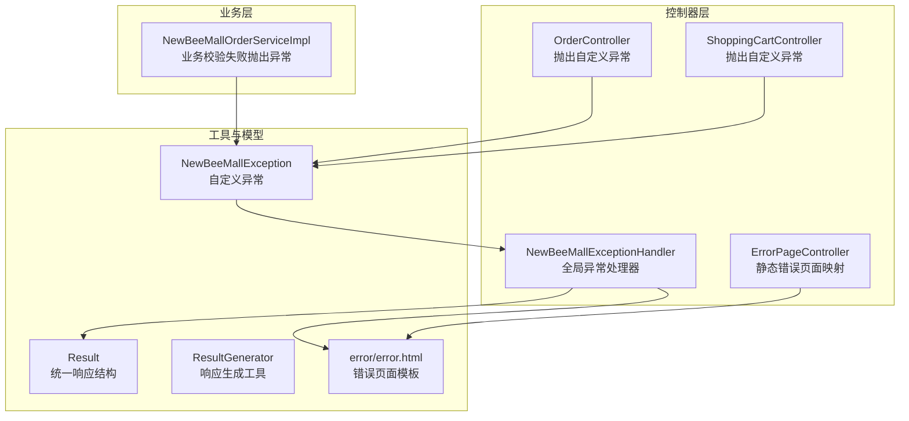
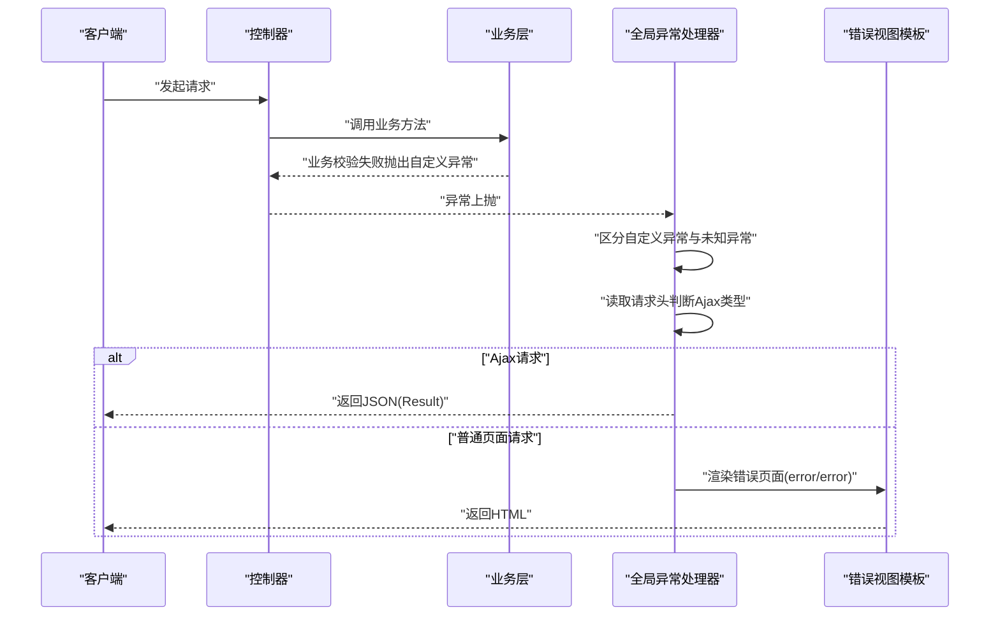
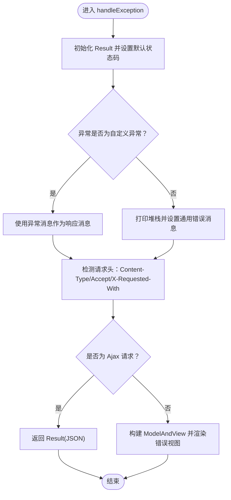
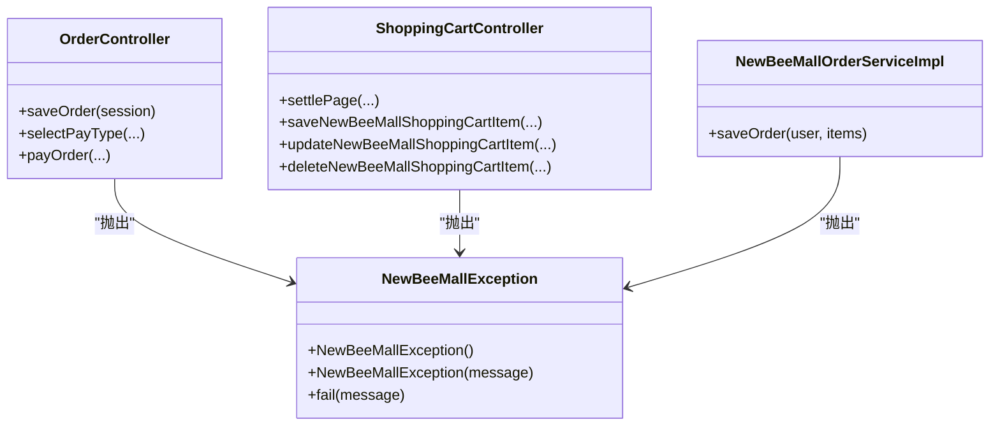
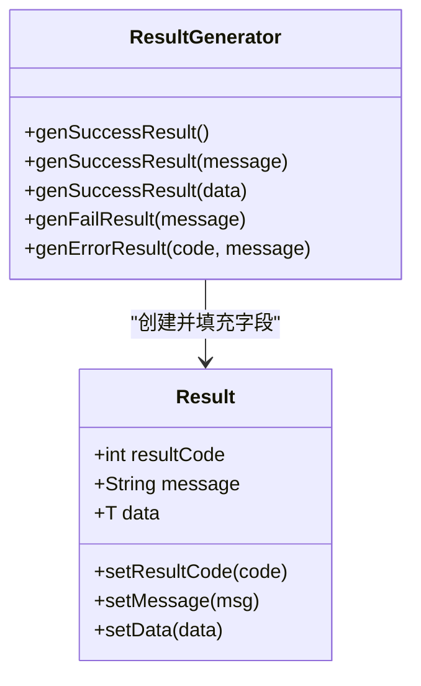
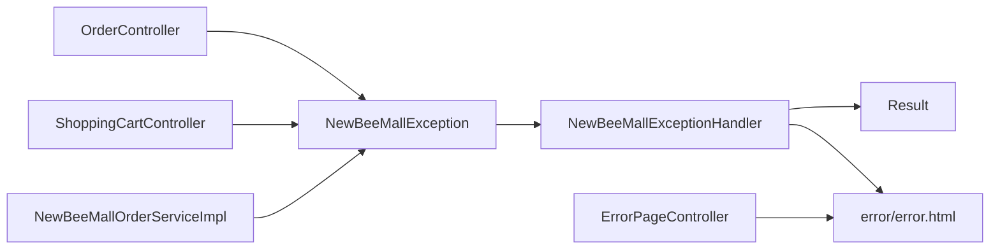

# 全局异常处理机制

<cite>
**本文引用的文件**
- [NewBeeMallExceptionHandler.java](file://src/main/java/ltd/newbee/mall/controller/common/NewBeeMallExceptionHandler.java)
- [NewBeeMallException.java](file://src/main/java/ltd/newbee/mall/common/NewBeeMallException.java)
- [Result.java](file://src/main/java/ltd/newbee/mall/util/Result.java)
- [ResultGenerator.java](file://src/main/java/ltd/newbee/mall/util/ResultGenerator.java)
- [OrderController.java](file://src/main/java/ltd/newbee/mall/controller/mall/OrderController.java)
- [ShoppingCartController.java](file://src/main/java/ltd/newbee/mall/controller/mall/ShoppingCartController.java)
- [NewBeeMallOrderServiceImpl.java](file://src/main/java/ltd/newbee/mall/service/impl/NewBeeMallOrderServiceImpl.java)
- [ErrorPageController.java](file://src/main/java/ltd/newbee/mall/controller/common/ErrorPageController.java)
- [error.html](file://src/main/resources/templates/error/error.html)
</cite>

## 目录
1. [简介](#简介)
2. [项目结构](#项目结构)
3. [核心组件](#核心组件)
4. [架构总览](#架构总览)
5. [详细组件分析](#详细组件分析)
6. [依赖关系分析](#依赖关系分析)
7. [性能与可维护性考量](#性能与可维护性考量)
8. [故障排查指南](#故障排查指南)
9. [结论](#结论)

## 简介
本文件深入解析 newbee-mall 的全局异常处理机制，重点围绕以下目标展开：
- NewBeeMallExceptionHandler 如何通过 @RestControllerAdvice 实现全局异常捕获；
- handleException 方法如何区分 NewBeeMallException 自定义异常与未知异常并分别处理；
- 如何基于请求头（Content-Type、Accept、X-Requested-With）智能判断请求类型，对 Ajax 请求返回 JSON 格式的 Result 对象，对普通页面请求返回错误视图（error/error）并携带异常信息；
- 该机制如何提升用户体验与系统健壮性。

## 项目结构
与全局异常处理直接相关的模块与文件如下：
- 控制器层：统一异常处理器 NewBeeMallExceptionHandler
- 异常类：NewBeeMallException（自定义运行时异常）
- 结果封装：Result 与 ResultGenerator（统一响应结构）
- 控制器示例：OrderController、ShoppingCartController 等在业务逻辑中抛出自定义异常
- 服务层示例：NewBeeMallOrderServiceImpl 在业务校验失败时抛出自定义异常
- 错误页面控制器：ErrorPageController 提供静态错误页面映射
- 错误页面模板：error/error.html 展示异常详情

图表来源
- [NewBeeMallExceptionHandler.java](file://src/main/java/ltd/newbee/mall/controller/common/NewBeeMallExceptionHandler.java#L1-L56)
- [NewBeeMallException.java](file://src/main/java/ltd/newbee/mall/common/NewBeeMallException.java#L1-L30)
- [Result.java](file://src/main/java/ltd/newbee/mall/util/Result.java#L1-L58)
- [ResultGenerator.java](file://src/main/java/ltd/newbee/mall/util/ResultGenerator.java#L1-L59)
- [OrderController.java](file://src/main/java/ltd/newbee/mall/controller/mall/OrderController.java#L60-L159)
- [ShoppingCartController.java](file://src/main/java/ltd/newbee/mall/controller/mall/ShoppingCartController.java#L40-L130)
- [NewBeeMallOrderServiceImpl.java](file://src/main/java/ltd/newbee/mall/service/impl/NewBeeMallOrderServiceImpl.java#L185-L210)
- [ErrorPageController.java](file://src/main/java/ltd/newbee/mall/controller/common/ErrorPageController.java#L1-L49)
- [error.html](file://src/main/resources/templates/error/error.html#L1-L26)

章节来源
- [NewBeeMallExceptionHandler.java](file://src/main/java/ltd/newbee/mall/controller/common/NewBeeMallExceptionHandler.java#L1-L56)
- [NewBeeMallException.java](file://src/main/java/ltd/newbee/mall/common/NewBeeMallException.java#L1-L30)
- [Result.java](file://src/main/java/ltd/newbee/mall/util/Result.java#L1-L58)
- [ResultGenerator.java](file://src/main/java/ltd/newbee/mall/util/ResultGenerator.java#L1-L59)
- [OrderController.java](file://src/main/java/ltd/newbee/mall/controller/mall/OrderController.java#L60-L159)
- [ShoppingCartController.java](file://src/main/java/ltd/newbee/mall/controller/mall/ShoppingCartController.java#L40-L130)
- [NewBeeMallOrderServiceImpl.java](file://src/main/java/ltd/newbee/mall/service/impl/NewBeeMallOrderServiceImpl.java#L185-L210)
- [ErrorPageController.java](file://src/main/java/ltd/newbee/mall/controller/common/ErrorPageController.java#L1-L49)
- [error.html](file://src/main/resources/templates/error/error.html#L1-L26)

## 核心组件
- 全局异常处理器 NewBeeMallExceptionHandler
  - 使用 @RestControllerAdvice 注解，作用于所有控制器，拦截未被捕获的异常；
  - handleException 方法统一处理 Exception.class，区分自定义异常与未知异常，按请求类型返回 JSON 或错误视图。
- 自定义异常 NewBeeMallException
  - 继承 RuntimeException，提供 fail 静态方法快速抛出异常；
  - 业务层与控制器层广泛使用，确保用户可感知的友好错误信息。
- 统一响应结构 Result 与 ResultGenerator
  - Result 封装通用响应字段（状态码、消息、数据）；
  - ResultGenerator 提供成功/失败/错误等常用响应构造方法，便于控制器返回一致格式。
- 错误页面与控制器
  - ErrorPageController 提供 4xx/5xx 的静态错误页面映射；
  - error/error.html 模板用于展示异常详情（消息、URL、堆栈、作者信息等）。

章节来源
- [NewBeeMallExceptionHandler.java](file://src/main/java/ltd/newbee/mall/controller/common/NewBeeMallExceptionHandler.java#L1-L56)
- [NewBeeMallException.java](file://src/main/java/ltd/newbee/mall/common/NewBeeMallException.java#L1-L30)
- [Result.java](file://src/main/java/ltd/newbee/mall/util/Result.java#L1-L58)
- [ResultGenerator.java](file://src/main/java/ltd/newbee/mall/util/ResultGenerator.java#L1-L59)
- [ErrorPageController.java](file://src/main/java/ltd/newbee/mall/controller/common/ErrorPageController.java#L1-L49)
- [error.html](file://src/main/resources/templates/error/error.html#L1-L26)

## 架构总览
全局异常处理的整体流程如下：
- 控制器或业务层抛出异常；
- Spring MVC 将异常交由 @RestControllerAdvice 标注的异常处理器统一处理；
- 处理器根据异常类型设置响应消息；
- 依据请求头判断是否为 Ajax 请求，返回 JSON（Result）或渲染错误视图（error/error）。

图表来源
- [NewBeeMallExceptionHandler.java](file://src/main/java/ltd/newbee/mall/controller/common/NewBeeMallExceptionHandler.java#L25-L53)
- [OrderController.java](file://src/main/java/ltd/newbee/mall/controller/mall/OrderController.java#L67-L83)
- [ShoppingCartController.java](file://src/main/java/ltd/newbee/mall/controller/mall/ShoppingCartController.java#L46-L55)
- [NewBeeMallOrderServiceImpl.java](file://src/main/java/ltd/newbee/mall/service/impl/NewBeeMallOrderServiceImpl.java#L196-L207)
- [error.html](file://src/main/resources/templates/error/error.html#L1-L26)

## 详细组件分析

### 全局异常处理器 NewBeeMallExceptionHandler
- 职责
  - 使用 @RestControllerAdvice 全局拦截异常；
  - handleException 方法：
    - 设置默认状态码为 500；
    - 若异常为 NewBeeMallException，则直接使用其消息；否则记录堆栈并返回“未知异常”；
    - 通过 Content-Type、Accept、X-Requested-With 判断是否为 Ajax 请求：
      - 是 Ajax：返回 Result JSON；
      - 否则：构建 ModelAndView，向模板传递异常信息并返回错误视图。
- 设计要点
  - 统一错误语义：自定义异常直接透传业务消息，未知异常隐藏细节，避免敏感信息泄露；
  - 请求类型识别：兼容多种常见 Ajax 标识，保证前后端交互一致性；
  - 视图友好：错误页面模板包含关键信息，便于定位问题。

图表来源
- [NewBeeMallExceptionHandler.java](file://src/main/java/ltd/newbee/mall/controller/common/NewBeeMallExceptionHandler.java#L25-L53)

章节来源
- [NewBeeMallExceptionHandler.java](file://src/main/java/ltd/newbee/mall/controller/common/NewBeeMallExceptionHandler.java#L25-L53)

### 自定义异常 NewBeeMallException
- 能力
  - 提供 fail 静态方法，便于在业务层与控制器层快速抛出；
  - 继承 RuntimeException，适合在运行期进行业务校验失败时中断流程。
- 使用场景
  - 订单控制器：地址为空、购物车为空、权限不足、订单状态不符等；
  - 购物车控制器：购物项为空、价格异常等；
  - 业务服务：商品已下架、库存不足、价格计算错误等。

图表来源
- [NewBeeMallException.java](file://src/main/java/ltd/newbee/mall/common/NewBeeMallException.java#L1-L30)
- [OrderController.java](file://src/main/java/ltd/newbee/mall/controller/mall/OrderController.java#L67-L124)
- [ShoppingCartController.java](file://src/main/java/ltd/newbee/mall/controller/mall/ShoppingCartController.java#L46-L128)
- [NewBeeMallOrderServiceImpl.java](file://src/main/java/ltd/newbee/mall/service/impl/NewBeeMallOrderServiceImpl.java#L196-L210)

章节来源
- [NewBeeMallException.java](file://src/main/java/ltd/newbee/mall/common/NewBeeMallException.java#L1-L30)
- [OrderController.java](file://src/main/java/ltd/newbee/mall/controller/mall/OrderController.java#L67-L124)
- [ShoppingCartController.java](file://src/main/java/ltd/newbee/mall/controller/mall/ShoppingCartController.java#L46-L128)
- [NewBeeMallOrderServiceImpl.java](file://src/main/java/ltd/newbee/mall/service/impl/NewBeeMallOrderServiceImpl.java#L196-L210)

### 统一响应结构 Result 与 ResultGenerator
- Result
  - 字段：状态码、消息、数据；
  - 用于封装 Ajax 响应体，保持前后端契约一致。
- ResultGenerator
  - 提供成功/失败/错误等常用响应构造方法，减少重复代码。

图表来源
- [Result.java](file://src/main/java/ltd/newbee/mall/util/Result.java#L1-L58)
- [ResultGenerator.java](file://src/main/java/ltd/newbee/mall/util/ResultGenerator.java#L1-L59)

章节来源
- [Result.java](file://src/main/java/ltd/newbee/mall/util/Result.java#L1-L58)
- [ResultGenerator.java](file://src/main/java/ltd/newbee/mall/util/ResultGenerator.java#L1-L59)

### 错误页面与控制器
- ErrorPageController
  - 实现 ErrorViewResolver，针对 400、404、5xx 状态返回对应错误页面视图名；
  - 与全局异常处理器互补：前者处理静态状态码错误，后者处理运行时异常。
- error/error.html
  - 展示异常消息、请求 URL、堆栈跟踪、作者信息等，便于开发调试与用户反馈。

章节来源
- [ErrorPageController.java](file://src/main/java/ltd/newbee/mall/controller/common/ErrorPageController.java#L1-L49)
- [error.html](file://src/main/resources/templates/error/error.html#L1-L26)

## 依赖关系分析
- 控制器层依赖
  - OrderController、ShoppingCartController 在业务校验失败时抛出 NewBeeMallException；
  - 业务层 NewBeeMallOrderServiceImpl 在商品状态、价格、库存等校验失败时抛出 NewBeeMallException。
- 异常处理依赖
  - NewBeeMallExceptionHandler 依赖：
    - NewBeeMallException：区分自定义异常；
    - Result：统一 Ajax 响应；
    - error/error.html：统一错误页面模板。
- 视图解析依赖
  - ErrorPageController 依赖 Thymeleaf 模板 error/error_400、error_404、error_5xx（由模板目录提供）。

图表来源
- [OrderController.java](file://src/main/java/ltd/newbee/mall/controller/mall/OrderController.java#L67-L124)
- [ShoppingCartController.java](file://src/main/java/ltd/newbee/mall/controller/mall/ShoppingCartController.java#L46-L128)
- [NewBeeMallOrderServiceImpl.java](file://src/main/java/ltd/newbee/mall/service/impl/NewBeeMallOrderServiceImpl.java#L196-L210)
- [NewBeeMallExceptionHandler.java](file://src/main/java/ltd/newbee/mall/controller/common/NewBeeMallExceptionHandler.java#L25-L53)
- [ErrorPageController.java](file://src/main/java/ltd/newbee/mall/controller/common/ErrorPageController.java#L1-L49)
- [error.html](file://src/main/resources/templates/error/error.html#L1-L26)

章节来源
- [OrderController.java](file://src/main/java/ltd/newbee/mall/controller/mall/OrderController.java#L67-L124)
- [ShoppingCartController.java](file://src/main/java/ltd/newbee/mall/controller/mall/ShoppingCartController.java#L46-L128)
- [NewBeeMallOrderServiceImpl.java](file://src/main/java/ltd/newbee/mall/service/impl/NewBeeMallOrderServiceImpl.java#L196-L210)
- [NewBeeMallExceptionHandler.java](file://src/main/java/ltd/newbee/mall/controller/common/NewBeeMallExceptionHandler.java#L25-L53)
- [ErrorPageController.java](file://src/main/java/ltd/newbee/mall/controller/common/ErrorPageController.java#L1-L49)
- [error.html](file://src/main/resources/templates/error/error.html#L1-L26)

## 性能与可维护性考量
- 性能
  - 全局异常处理仅在异常发生时触发，对正常路径无额外开销；
  - Ajax 响应为轻量 JSON，避免不必要的视图渲染成本。
- 可维护性
  - 统一异常处理降低重复代码，便于集中优化与扩展；
  - 自定义异常与 Result 契约清晰，便于前后端协作；
  - 错误页面模板标准化，便于统一风格与信息展示。
- 安全性
  - 未知异常不暴露堆栈细节，仅返回通用错误消息，降低信息泄露风险；
  - 自定义异常消息由业务层控制，避免敏感信息外泄。

[本节为通用指导，无需列出具体文件来源]

## 故障排查指南
- 症状：Ajax 请求返回 JSON，但前端未正确处理错误码
  - 排查点：确认请求头是否包含 application/json 或 X-Requested-With 是否为 XMLHttpRequest；
  - 参考：全局异常处理器对请求类型的判断逻辑。
- 症状：页面请求返回错误页面，但未显示异常详情
  - 排查点：检查 error/error.html 中的变量绑定是否完整（消息、URL、堆栈、作者）；
  - 参考：全局异常处理器向视图模型注入的属性。
- 症状：静态错误页面未生效
  - 排查点：确认 ErrorPageController 的状态码映射与模板名称一致；
  - 参考：静态错误页面映射逻辑。
- 症状：业务异常未被统一捕获
  - 排查点：确认控制器或业务层确实抛出了 NewBeeMallException；
  - 参考：控制器与业务层抛出异常的典型位置。

章节来源
- [NewBeeMallExceptionHandler.java](file://src/main/java/ltd/newbee/mall/controller/common/NewBeeMallExceptionHandler.java#L25-L53)
- [ErrorPageController.java](file://src/main/java/ltd/newbee/mall/controller/common/ErrorPageController.java#L1-L49)
- [error.html](file://src/main/resources/templates/error/error.html#L1-L26)
- [OrderController.java](file://src/main/java/ltd/newbee/mall/controller/mall/OrderController.java#L67-L124)
- [ShoppingCartController.java](file://src/main/java/ltd/newbee/mall/controller/mall/ShoppingCartController.java#L46-L128)
- [NewBeeMallOrderServiceImpl.java](file://src/main/java/ltd/newbee/mall/service/impl/NewBeeMallOrderServiceImpl.java#L196-L210)

## 结论
newbee-mall 的全局异常处理机制通过 @RestControllerAdvice 将异常处理集中化，结合自定义异常与统一响应结构，实现了：
- 对自定义异常的友好展示与业务语义传达；
- 对未知异常的安全隐藏与统一兜底；
- 对 Ajax 与页面请求的差异化响应策略；
- 对错误页面的标准化呈现与信息完整性保障。
该机制显著提升了用户体验（前端获得明确错误信息，后端保持安全与可控），同时增强了系统的健壮性与可维护性。