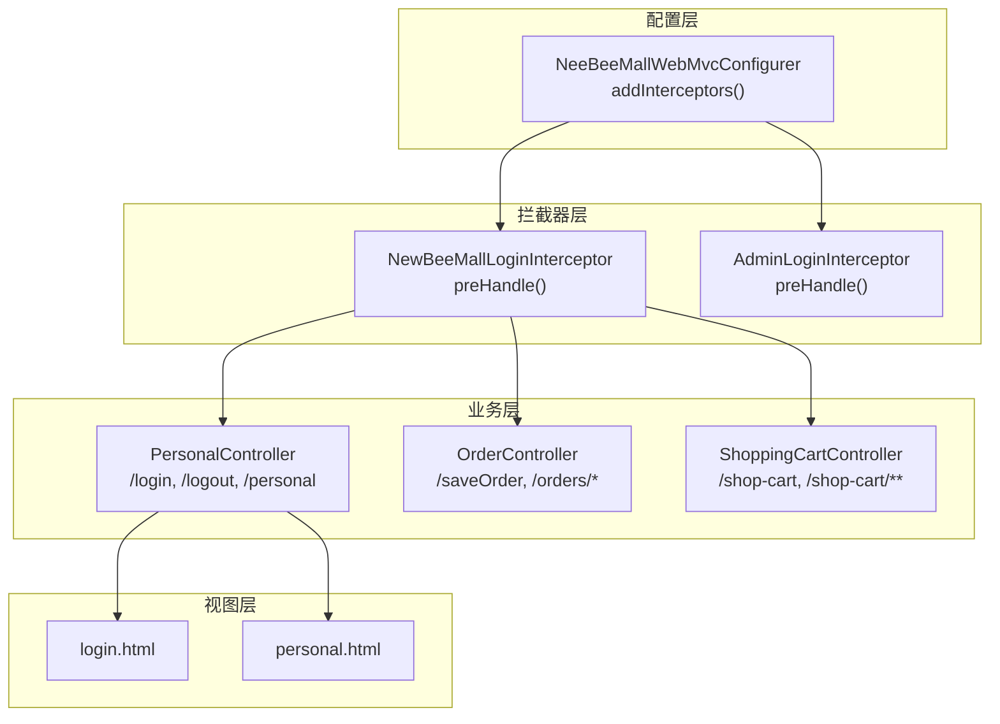
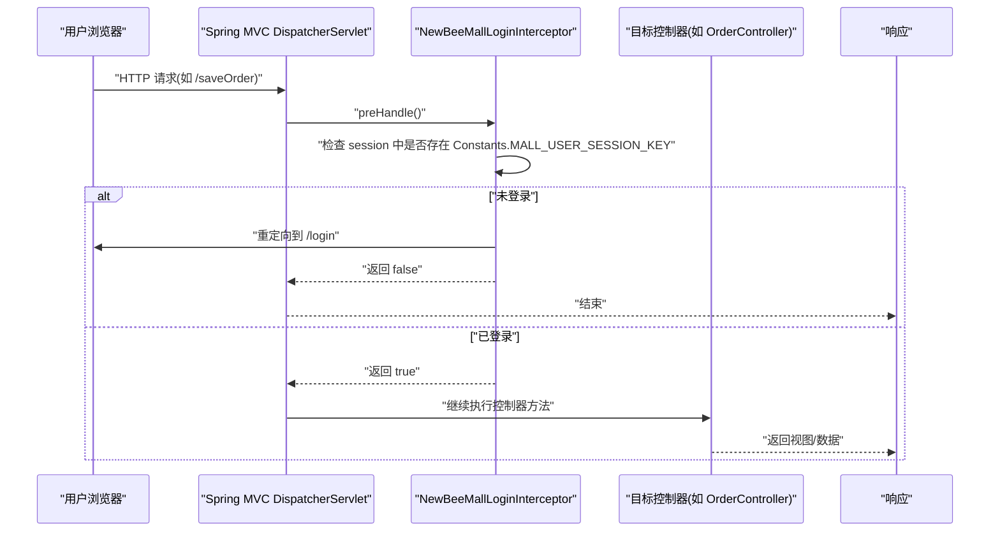
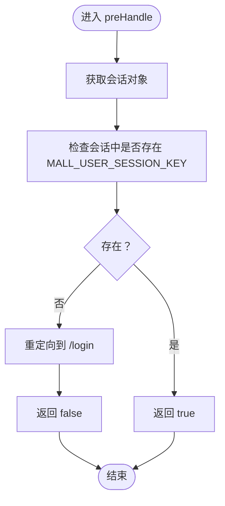
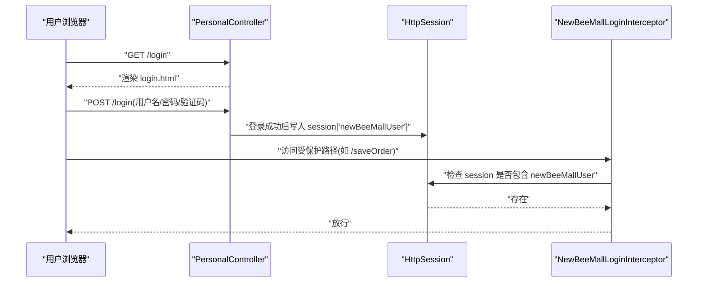
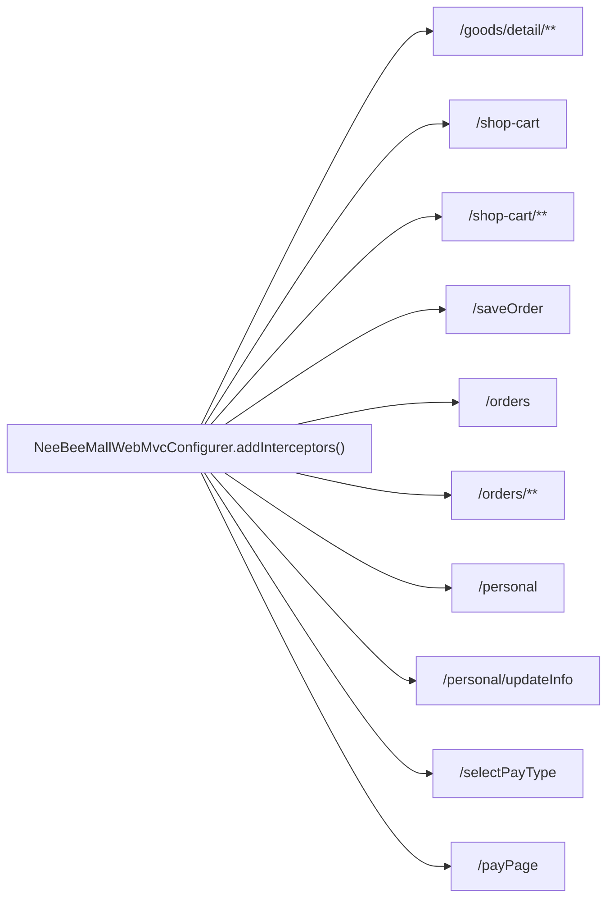
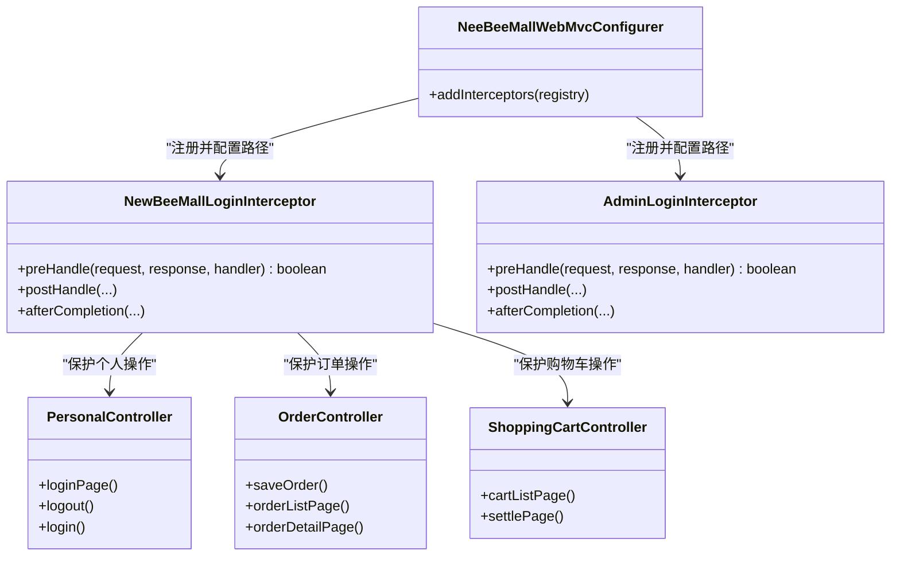
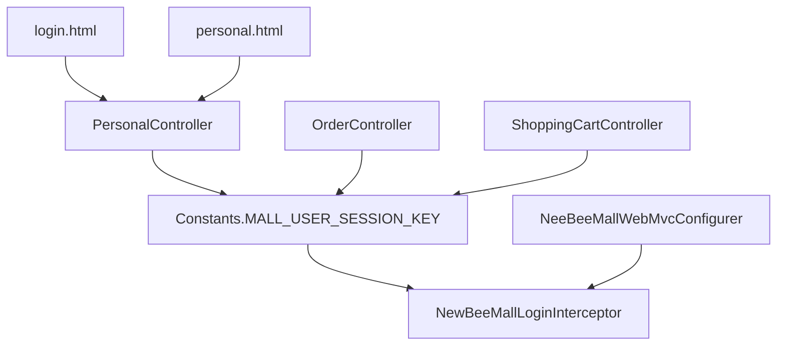

# 前台用户权限拦截器

<cite>
**本文引用的文件**
- [NewBeeMallLoginInterceptor.java](file://src/main/java/ltd/newbee/mall/interceptor/NewBeeMallLoginInterceptor.java)
- [Constants.java](file://src/main/java/ltd/newbee/mall/common/Constants.java)
- [NeeBeeMallWebMvcConfigurer.java](file://src/main/java/ltd/newbee/mall/config/NeeBeeMallWebMvcConfigurer.java)
- [AdminLoginInterceptor.java](file://src/main/java/ltd/newbee/mall/interceptor/AdminLoginInterceptor.java)
- [PersonalController.java](file://src/main/java/ltd/newbee/mall/controller/mall/PersonalController.java)
- [OrderController.java](file://src/main/java/ltd/newbee/mall/controller/mall/OrderController.java)
- [ShoppingCartController.java](file://src/main/java/ltd/newbee/mall/controller/mall/ShoppingCartController.java)
- [login.html](file://src/main/resources/templates/mall/login.html)
- [personal.html](file://src/main/resources/templates/mall/personal.html)
</cite>

## 目录
1. [简介](#简介)
2. [项目结构](#项目结构)
3. [核心组件](#核心组件)
4. [架构总览](#架构总览)
5. [详细组件分析](#详细组件分析)
6. [依赖关系分析](#依赖关系分析)
7. [性能考量](#性能考量)
8. [故障排查指南](#故障排查指南)
9. [结论](#结论)

## 简介
本文件围绕 NewBeeMallLoginInterceptor 前台用户权限拦截器展开，系统性阐述其工作原理与实现细节，重点说明其如何通过检测 session 中是否存在 Constants.MALL_USER_SESSION_KEY 来验证普通用户的登录状态；解释当用户未登录时自动重定向至 /login 页面的处理逻辑；列举其保护的关键路径，如 /goods/detail/**、/shop-cart、/saveOrder 等个人操作接口；并与后台拦截器进行对比，强调其在维护用户会话安全与操作合法性方面的重要作用。

## 项目结构
该拦截器属于 Spring MVC 拦截器体系的一部分，位于拦截器包中，常量定义位于公共模块，拦截器注册与路径映射由 WebMvc 配置类完成。关键交互涉及控制器层对会话键的读取与写入，以及前端模板对登录页的渲染。

图表来源
- [NeeBeeMallWebMvcConfigurer.java](file://src/main/java/ltd/newbee/mall/config/NeeBeeMallWebMvcConfigurer.java#L31-L60)
- [NewBeeMallLoginInterceptor.java](file://src/main/java/ltd/newbee/mall/interceptor/NewBeeMallLoginInterceptor.java#L30-L38)
- [AdminLoginInterceptor.java](file://src/main/java/ltd/newbee/mall/interceptor/AdminLoginInterceptor.java#L29-L40)
- [PersonalController.java](file://src/main/java/ltd/newbee/mall/controller/mall/PersonalController.java#L41-L50)
- [OrderController.java](file://src/main/java/ltd/newbee/mall/controller/mall/OrderController.java#L67-L83)
- [ShoppingCartController.java](file://src/main/java/ltd/newbee/mall/controller/mall/ShoppingCartController.java#L36-L61)
- [login.html](file://src/main/resources/templates/mall/login.html#L1-L111)
- [personal.html](file://src/main/resources/templates/mall/personal.html#L1-L157)

章节来源
- [NeeBeeMallWebMvcConfigurer.java](file://src/main/java/ltd/newbee/mall/config/NeeBeeMallWebMvcConfigurer.java#L31-L60)

## 核心组件
- NewBeeMallLoginInterceptor：基于 HandlerInterceptor 的前置拦截器，负责校验普通用户登录状态，未登录则重定向到 /login。
- Constants：集中管理常量，其中 MALL_USER_SESSION_KEY 为会话中存储用户对象的键名。
- NeeBeeMallWebMvcConfigurer：注册拦截器并配置路径匹配规则，明确排除后台路径与公开页面路径，同时精确匹配前台个人操作路径。
- PersonalController：提供 /login、/logout、/personal 等页面访问与登录提交入口，登录成功后会在会话中写入用户对象。
- OrderController：提供 /saveOrder、/orders/* 等订单相关页面与接口，内部从会话读取用户信息。
- ShoppingCartController：提供 /shop-cart、/shop-cart/** 等购物车相关页面与接口，内部从会话读取用户信息。

章节来源
- [NewBeeMallLoginInterceptor.java](file://src/main/java/ltd/newbee/mall/interceptor/NewBeeMallLoginInterceptor.java#L27-L38)
- [Constants.java](file://src/main/java/ltd/newbee/mall/common/Constants.java#L36-L41)
- [NeeBeeMallWebMvcConfigurer.java](file://src/main/java/ltd/newbee/mall/config/NeeBeeMallWebMvcConfigurer.java#L31-L60)
- [PersonalController.java](file://src/main/java/ltd/newbee/mall/controller/mall/PersonalController.java#L41-L50)
- [OrderController.java](file://src/main/java/ltd/newbee/mall/controller/mall/OrderController.java#L67-L83)
- [ShoppingCartController.java](file://src/main/java/ltd/newbee/mall/controller/mall/ShoppingCartController.java#L36-L61)

## 架构总览
拦截器在请求进入控制器之前执行，通过检查会话键来决定是否放行或重定向。WebMvc 配置类将拦截器应用于前台路径，排除后台路径与公开页面，确保拦截范围精准。

图表来源
- [NewBeeMallLoginInterceptor.java](file://src/main/java/ltd/newbee/mall/interceptor/NewBeeMallLoginInterceptor.java#L30-L38)
- [NeeBeeMallWebMvcConfigurer.java](file://src/main/java/ltd/newbee/mall/config/NeeBeeMallWebMvcConfigurer.java#L45-L60)
- [OrderController.java](file://src/main/java/ltd/newbee/mall/controller/mall/OrderController.java#L67-L83)

## 详细组件分析

### NewBeeMallLoginInterceptor 工作原理
- 登录状态判定：在 preHandle 中读取当前请求的会话对象，检查是否存在 Constants.MALL_USER_SESSION_KEY。
- 放行与重定向：若不存在，则调用响应对象进行重定向到 /login；若存在，则放行后续控制器处理。
- 生命周期钩子：postHandle 与 afterCompletion 为空实现，不参与业务处理。

图表来源
- [NewBeeMallLoginInterceptor.java](file://src/main/java/ltd/newbee/mall/interceptor/NewBeeMallLoginInterceptor.java#L30-L38)
- [Constants.java](file://src/main/java/ltd/newbee/mall/common/Constants.java#L36-L41)

章节来源
- [NewBeeMallLoginInterceptor.java](file://src/main/java/ltd/newbee/mall/interceptor/NewBeeMallLoginInterceptor.java#L30-L38)

### 会话键与登录流程
- 写入会话：登录成功后，控制器在会话中写入用户对象，键名为 Constants.MALL_USER_SESSION_KEY。
- 清理会话：退出登录时，控制器移除会话中的用户对象键，使拦截器判定为未登录。
- 视图使用：前端模板通过 session.newBeeMallUser 访问用户信息。

图表来源
- [PersonalController.java](file://src/main/java/ltd/newbee/mall/controller/mall/PersonalController.java#L62-L91)
- [PersonalController.java](file://src/main/java/ltd/newbee/mall/controller/mall/PersonalController.java#L41-L45)
- [login.html](file://src/main/resources/templates/mall/login.html#L86-L109)
- [NewBeeMallLoginInterceptor.java](file://src/main/java/ltd/newbee/mall/interceptor/NewBeeMallLoginInterceptor.java#L30-L38)
- [Constants.java](file://src/main/java/ltd/newbee/mall/common/Constants.java#L36-L41)

章节来源
- [PersonalController.java](file://src/main/java/ltd/newbee/mall/controller/mall/PersonalController.java#L41-L50)
- [PersonalController.java](file://src/main/java/ltd/newbee/mall/controller/mall/PersonalController.java#L62-L91)
- [login.html](file://src/main/resources/templates/mall/login.html#L86-L109)
- [personal.html](file://src/main/resources/templates/mall/personal.html#L20-L36)

### 保护的关键路径
WebMvc 配置类明确将拦截器应用于以下前台路径，这些路径均涉及个人操作或敏感数据：
- 商品详情：/goods/detail/**
- 购物车：/shop-cart、/shop-cart/**
- 下单与订单：/saveOrder、/orders、/orders/**
- 个人中心：/personal、/personal/updateInfo
- 支付相关：/selectPayType、/payPage

图表来源
- [NeeBeeMallWebMvcConfigurer.java](file://src/main/java/ltd/newbee/mall/config/NeeBeeMallWebMvcConfigurer.java#L45-L60)

章节来源
- [NeeBeeMallWebMvcConfigurer.java](file://src/main/java/ltd/newbee/mall/config/NeeBeeMallWebMvcConfigurer.java#L45-L60)

### 与后台拦截器的对比
- 拦截范围：
  - 前台拦截器：针对 /admin/** 排除在外，仅拦截前台个人操作路径。
  - 后台拦截器：针对 /admin/** 生效，排除后台登录页与静态资源。
- 登录键名：
  - 前台：使用 Constants.MALL_USER_SESSION_KEY。
  - 后台：使用 loginUser。
- 行为差异：
  - 前台：未登录直接重定向到 /login。
  - 后台：未登录写入错误信息并重定向到 /admin/login。
- 控制器配合：
  - 前台：PersonalController 提供 /login、/logout、/personal；OrderController、ShoppingCartController 从会话读取用户信息。
  - 后台：AdminLoginInterceptor 仅做拦截，后台控制器负责具体业务。

图表来源
- [NeeBeeMallWebMvcConfigurer.java](file://src/main/java/ltd/newbee/mall/config/NeeBeeMallWebMvcConfigurer.java#L31-L60)
- [NewBeeMallLoginInterceptor.java](file://src/main/java/ltd/newbee/mall/interceptor/NewBeeMallLoginInterceptor.java#L27-L38)
- [AdminLoginInterceptor.java](file://src/main/java/ltd/newbee/mall/interceptor/AdminLoginInterceptor.java#L26-L51)
- [PersonalController.java](file://src/main/java/ltd/newbee/mall/controller/mall/PersonalController.java#L41-L50)
- [OrderController.java](file://src/main/java/ltd/newbee/mall/controller/mall/OrderController.java#L67-L83)
- [ShoppingCartController.java](file://src/main/java/ltd/newbee/mall/controller/mall/ShoppingCartController.java#L36-L61)

章节来源
- [AdminLoginInterceptor.java](file://src/main/java/ltd/newbee/mall/interceptor/AdminLoginInterceptor.java#L29-L40)
- [NeeBeeMallWebMvcConfigurer.java](file://src/main/java/ltd/newbee/mall/config/NeeBeeMallWebMvcConfigurer.java#L31-L60)

## 依赖关系分析
- 拦截器依赖：
  - Constants.MALL_USER_SESSION_KEY：作为会话键名，决定拦截器的判定依据。
  - WebMvc 配置：决定拦截器的生效路径与排除路径。
- 控制器依赖：
  - 会话键：控制器在登录成功时写入用户对象，在退出时移除。
  - 模板：前端模板通过 session.newBeeMallUser 读取用户信息。
- 关键耦合点：
  - 登录成功后写入会话键与拦截器判定逻辑强关联。
  - WebMvc 配置决定拦截范围，直接影响用户体验与安全性。

图表来源
- [Constants.java](file://src/main/java/ltd/newbee/mall/common/Constants.java#L36-L41)
- [NeeBeeMallWebMvcConfigurer.java](file://src/main/java/ltd/newbee/mall/config/NeeBeeMallWebMvcConfigurer.java#L31-L60)
- [PersonalController.java](file://src/main/java/ltd/newbee/mall/controller/mall/PersonalController.java#L41-L50)
- [OrderController.java](file://src/main/java/ltd/newbee/mall/controller/mall/OrderController.java#L67-L83)
- [ShoppingCartController.java](file://src/main/java/ltd/newbee/mall/controller/mall/ShoppingCartController.java#L36-L61)
- [login.html](file://src/main/resources/templates/mall/login.html#L1-L111)
- [personal.html](file://src/main/resources/templates/mall/personal.html#L1-L157)

章节来源
- [Constants.java](file://src/main/java/ltd/newbee/mall/common/Constants.java#L36-L41)
- [NeeBeeMallWebMvcConfigurer.java](file://src/main/java/ltd/newbee/mall/config/NeeBeeMallWebMvcConfigurer.java#L31-L60)
- [PersonalController.java](file://src/main/java/ltd/newbee/mall/controller/mall/PersonalController.java#L41-L50)
- [OrderController.java](file://src/main/java/ltd/newbee/mall/controller/mall/OrderController.java#L67-L83)
- [ShoppingCartController.java](file://src/main/java/ltd/newbee/mall/controller/mall/ShoppingCartController.java#L36-L61)

## 性能考量
- 拦截器开销：preHandle 仅进行一次会话键检查与一次重定向判断，开销极低。
- 路径匹配：WebMvc 配置精确匹配前台路径，避免对后台路径产生额外开销。
- 缓存友好：拦截器不引入额外缓存，遵循 Spring MVC 默认行为。
- 建议：保持拦截器职责单一，避免在 preHandle 中执行复杂逻辑，确保高并发下的稳定性。

## 故障排查指南
- 症状：访问受保护路径被重定向到 /login，但已登录
  - 排查要点：确认登录成功后会话中确实存在 Constants.MALL_USER_SESSION_KEY；检查控制器是否正确写入用户对象。
  - 参考路径：
    - [PersonalController.java](file://src/main/java/ltd/newbee/mall/controller/mall/PersonalController.java#L62-L91)
    - [Constants.java](file://src/main/java/ltd/newbee/mall/common/Constants.java#L36-L41)
- 症状：退出登录后仍可访问受保护路径
  - 排查要点：确认退出登录时移除了会话键；检查拦截器是否正确读取会话。
  - 参考路径：
    - [PersonalController.java](file://src/main/java/ltd/newbee/mall/controller/mall/PersonalController.java#L41-L45)
    - [NewBeeMallLoginInterceptor.java](file://src/main/java/ltd/newbee/mall/interceptor/NewBeeMallLoginInterceptor.java#L30-L38)
- 症状：拦截范围不正确
  - 排查要点：核对 WebMvc 配置中的 addPathPatterns 与 excludePathPatterns，确保前台路径覆盖完整且排除后台路径。
  - 参考路径：
    - [NeeBeeMallWebMvcConfigurer.java](file://src/main/java/ltd/newbee/mall/config/NeeBeeMallWebMvcConfigurer.java#L45-L60)

章节来源
- [PersonalController.java](file://src/main/java/ltd/newbee/mall/controller/mall/PersonalController.java#L41-L50)
- [PersonalController.java](file://src/main/java/ltd/newbee/mall/controller/mall/PersonalController.java#L62-L91)
- [NewBeeMallLoginInterceptor.java](file://src/main/java/ltd/newbee/mall/interceptor/NewBeeMallLoginInterceptor.java#L30-L38)
- [NeeBeeMallWebMvcConfigurer.java](file://src/main/java/ltd/newbee/mall/config/NeeBeeMallWebMvcConfigurer.java#L45-L60)

## 结论
NewBeeMallLoginInterceptor 通过简单而高效的会话键检查，实现了对前台个人操作接口的统一登录保护。其与 WebMvc 配置协同，精准限定拦截范围，避免对后台与公开页面造成干扰。结合控制器对会话键的写入与清理，以及前端模板对会话数据的使用，形成了完整的用户会话安全闭环。与后台拦截器相比，前台拦截器更专注于用户态校验与路径保护，二者分工明确，共同保障系统的整体安全性与可用性。