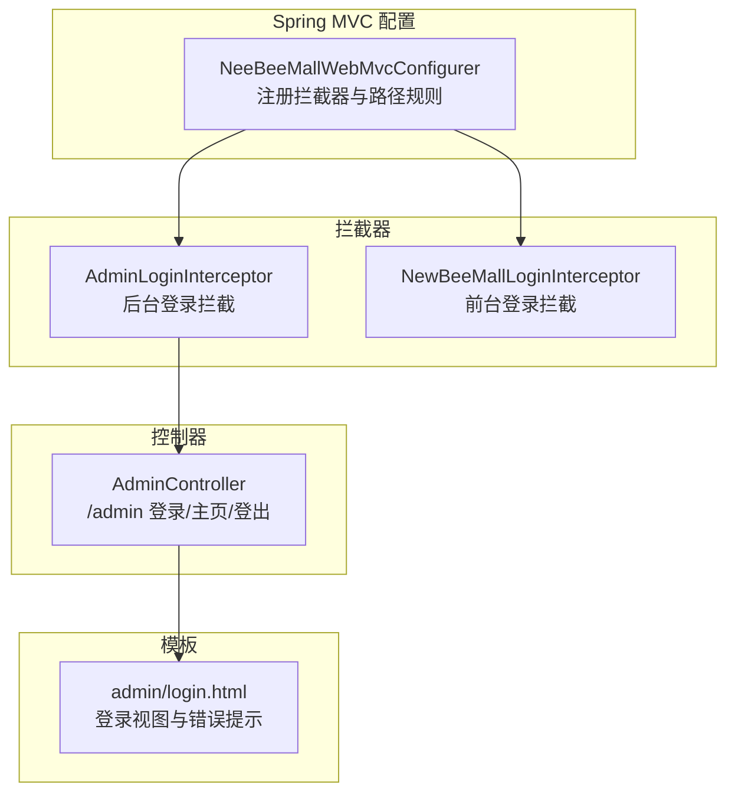
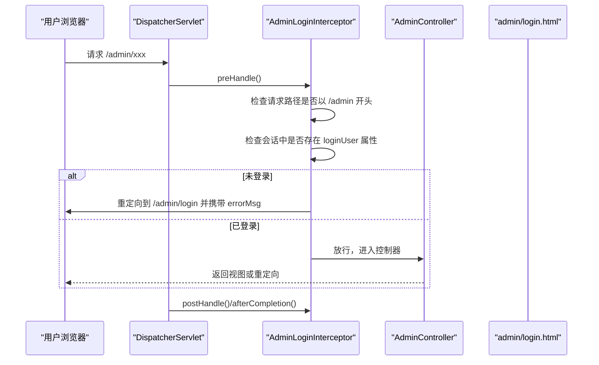
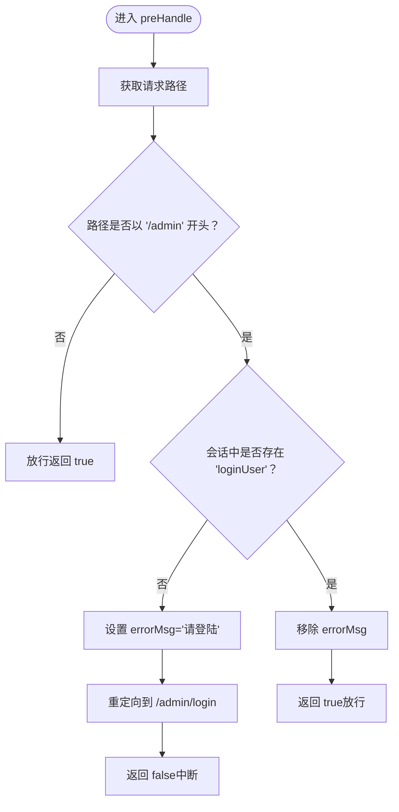
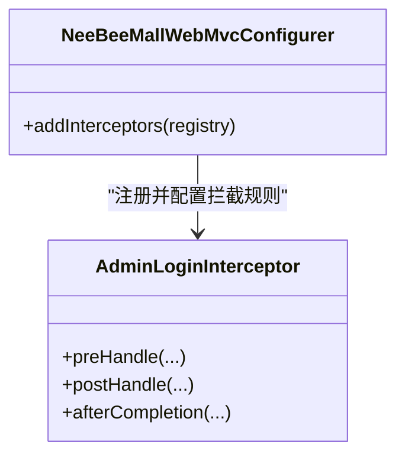
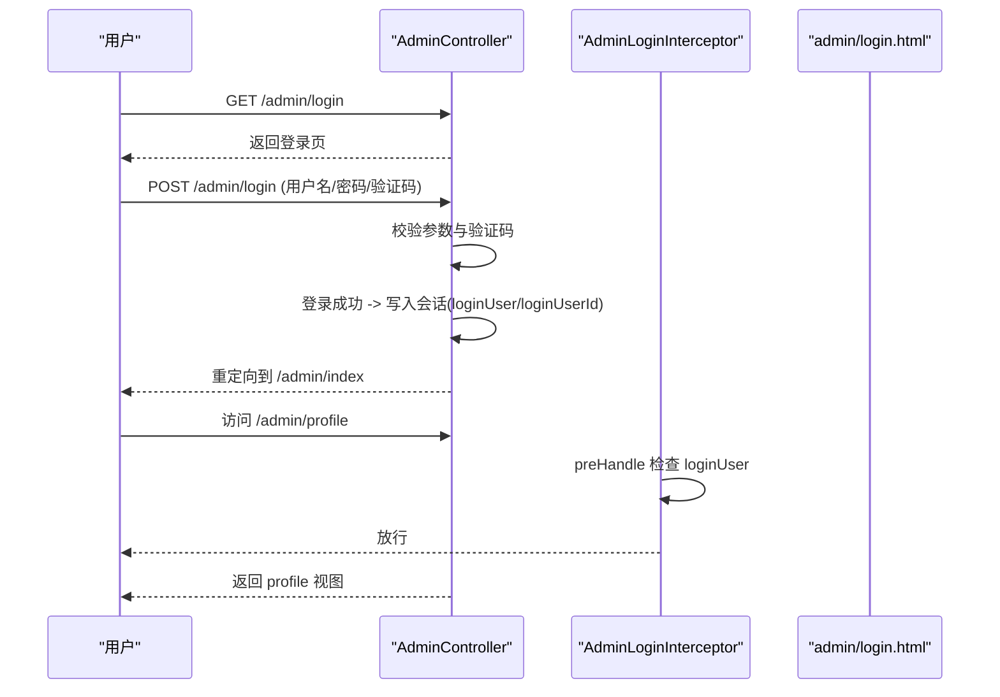
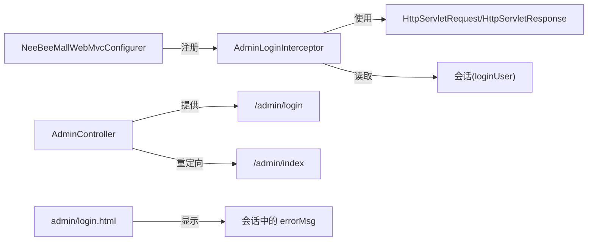

# 后台管理员权限拦截器

<cite>
**本文引用的文件**
- [AdminLoginInterceptor.java](file://src/main/java/ltd/newbee/mall/interceptor/AdminLoginInterceptor.java)
- [NeeBeeMallWebMvcConfigurer.java](file://src/main/java/ltd/newbee/mall/config/NeeBeeMallWebMvcConfigurer.java)
- [AdminController.java](file://src/main/java/ltd/newbee/mall/controller/admin/AdminController.java)
- [login.html](file://src/main/resources/templates/admin/login.html)
- [NewBeeMallLoginInterceptor.java](file://src/main/java/ltd/newbee/mall/interceptor/NewBeeMallLoginInterceptor.java)
</cite>

## 目录
1. [简介](#简介)
2. [项目结构](#项目结构)
3. [核心组件](#核心组件)
4. [架构总览](#架构总览)
5. [详细组件分析](#详细组件分析)
6. [依赖关系分析](#依赖关系分析)
7. [性能考量](#性能考量)
8. [故障排查指南](#故障排查指南)
9. [结论](#结论)

## 简介
本文件聚焦于后台管理员权限拦截器 AdminLoginInterceptor 的实现机制与运行流程，重点阐述其 preHandle 方法如何通过检查请求路径是否以“/admin”开头以及会话中是否存在“loginUser”属性来判定管理员登录状态；当未登录时，拦截器如何设置错误信息并重定向到后台登录页面；同时解释 postHandle 与 afterCompletion 的空实现设计意图，并总结该拦截器在保障后台管理模块安全方面的作用及拦截效果。

## 项目结构
后台管理相关的拦截器注册与拦截范围由 WebMvc 配置类集中管理，拦截器对以“/admin”为前缀的所有请求进行统一登录校验，并排除登录页、静态资源等无需登录即可访问的路径。

图表来源
- [NeeBeeMallWebMvcConfigurer.java](file://src/main/java/ltd/newbee/mall/config/NeeBeeMallWebMvcConfigurer.java#L31-L40)
- [AdminLoginInterceptor.java](file://src/main/java/ltd/newbee/mall/interceptor/AdminLoginInterceptor.java#L27-L50)
- [AdminController.java](file://src/main/java/ltd/newbee/mall/controller/admin/AdminController.java#L37-L83)
- [login.html](file://src/main/resources/templates/admin/login.html#L44-L47)

章节来源
- [NeeBeeMallWebMvcConfigurer.java](file://src/main/java/ltd/newbee/mall/config/NeeBeeMallWebMvcConfigurer.java#L31-L40)

## 核心组件
- AdminLoginInterceptor：实现 HandlerInterceptor 接口，负责后台管理模块的登录拦截逻辑。
- NeeBeeMallWebMvcConfigurer：注册拦截器并配置拦截路径模式与排除路径。
- AdminController：提供后台登录、主页、登出等页面与业务处理。
- admin/login.html：后台登录页面，展示会话中的错误信息。

章节来源
- [AdminLoginInterceptor.java](file://src/main/java/ltd/newbee/mall/interceptor/AdminLoginInterceptor.java#L27-L50)
- [NeeBeeMallWebMvcConfigurer.java](file://src/main/java/ltd/newbee/mall/config/NeeBeeMallWebMvcConfigurer.java#L31-L40)
- [AdminController.java](file://src/main/java/ltd/newbee/mall/controller/admin/AdminController.java#L37-L83)
- [login.html](file://src/main/resources/templates/admin/login.html#L44-L47)

## 架构总览
拦截器在 Spring MVC 的拦截链中按顺序执行，先经过 preHandle 进行登录校验，再进入目标控制器方法，最后在 postHandle 和 afterCompletion 中进行清理或收尾工作。后台管理模块的请求被统一拦截，除登录页与静态资源外，其余“/admin/**”均需登录。

图表来源
- [AdminLoginInterceptor.java](file://src/main/java/ltd/newbee/mall/interceptor/AdminLoginInterceptor.java#L29-L39)
- [NeeBeeMallWebMvcConfigurer.java](file://src/main/java/ltd/newbee/mall/config/NeeBeeMallWebMvcConfigurer.java#L33-L37)
- [AdminController.java](file://src/main/java/ltd/newbee/mall/controller/admin/AdminController.java#L37-L83)
- [login.html](file://src/main/resources/templates/admin/login.html#L44-L47)

## 详细组件分析

### AdminLoginInterceptor 实现机制
- preHandle 校验逻辑
  - 获取当前请求的 Servlet 路径。
  - 判断路径是否以“/admin”开头且会话中不存在“loginUser”属性。
  - 若不满足登录条件，则向会话写入错误信息并重定向到后台登录页，返回 false 中断后续处理。
  - 若满足登录条件，则移除会话中的错误信息并返回 true 放行。
- postHandle 与 afterCompletion
  - 当前实现为空，不参与请求处理流程的后半段，仅作为接口占位，便于未来扩展。

图表来源
- [AdminLoginInterceptor.java](file://src/main/java/ltd/newbee/mall/interceptor/AdminLoginInterceptor.java#L29-L39)

章节来源
- [AdminLoginInterceptor.java](file://src/main/java/ltd/newbee/mall/interceptor/AdminLoginInterceptor.java#L29-L39)

### 拦截器注册与排除规则
- 注册方式：在 WebMvc 配置类中通过 InterceptorRegistry 注册 AdminLoginInterceptor。
- 拦截范围：addPathPatterns("/admin/**") 对后台管理模块全部请求生效。
- 排除规则：
  - 排除登录页：/admin/login
  - 排除静态资源：/admin/dist/**、/admin/plugins/**
- 设计意图：确保登录页与静态资源可直接访问，避免拦截器影响用户体验与功能加载。

图表来源
- [NeeBeeMallWebMvcConfigurer.java](file://src/main/java/ltd/newbee/mall/config/NeeBeeMallWebMvcConfigurer.java#L31-L40)
- [AdminLoginInterceptor.java](file://src/main/java/ltd/newbee/mall/interceptor/AdminLoginInterceptor.java#L27-L50)

章节来源
- [NeeBeeMallWebMvcConfigurer.java](file://src/main/java/ltd/newbee/mall/config/NeeBeeMallWebMvcConfigurer.java#L31-L40)

### 登录流程与拦截效果
- 登录入口：/admin/login 页面由 AdminController 提供 GET 映射。
- 登录提交：POST /admin/login 执行登录校验，成功后在会话中写入“loginUser”等信息并重定向到后台主页。
- 未登录访问：任何 /admin/** 请求在拦截阶段被阻断，设置错误信息并重定向到 /admin/login，登录页通过 Thymeleaf 读取会话中的 errorMsg 展示提示。
- 登出：/admin/logout 清理会话并返回登录页，再次访问后台将触发拦截。

图表来源
- [AdminController.java](file://src/main/java/ltd/newbee/mall/controller/admin/AdminController.java#L37-L83)
- [AdminLoginInterceptor.java](file://src/main/java/ltd/newbee/mall/interceptor/AdminLoginInterceptor.java#L29-L39)
- [login.html](file://src/main/resources/templates/admin/login.html#L44-L47)

章节来源
- [AdminController.java](file://src/main/java/ltd/newbee/mall/controller/admin/AdminController.java#L37-L83)
- [login.html](file://src/main/resources/templates/admin/login.html#L44-L47)

### 与其他拦截器的关系
- 前台登录拦截器 NewBeeMallLoginInterceptor 负责商城前台模块的登录校验，路径排除与后台不同，避免与后台拦截器冲突。
- AdminLoginInterceptor 仅对后台模块生效，前台模块不受其影响。

章节来源
- [NewBeeMallLoginInterceptor.java](file://src/main/java/ltd/newbee/mall/interceptor/NewBeeMallLoginInterceptor.java#L27-L48)
- [NeeBeeMallWebMvcConfigurer.java](file://src/main/java/ltd/newbee/mall/config/NeeBeeMallWebMvcConfigurer.java#L45-L60)

## 依赖关系分析
- AdminLoginInterceptor 依赖于：
  - HttpServletRequest/HttpServletResponse：获取请求路径与会话。
  - 会话键“loginUser”：标识管理员已登录。
- WebMvc 配置类依赖：
  - AdminLoginInterceptor：注入并注册拦截器。
  - 拦截路径与排除路径：决定拦截范围与例外。
- 控制器依赖：
  - AdminController：提供登录页、登录提交、登出等端点。
  - admin/login.html：渲染登录页并显示错误信息。

图表来源
- [AdminLoginInterceptor.java](file://src/main/java/ltd/newbee/mall/interceptor/AdminLoginInterceptor.java#L29-L39)
- [NeeBeeMallWebMvcConfigurer.java](file://src/main/java/ltd/newbee/mall/config/NeeBeeMallWebMvcConfigurer.java#L31-L40)
- [AdminController.java](file://src/main/java/ltd/newbee/mall/controller/admin/AdminController.java#L37-L83)
- [login.html](file://src/main/resources/templates/admin/login.html#L44-L47)

## 性能考量
- 拦截器仅进行轻量级判断（字符串前缀匹配与会话键存在性检查），开销极低。
- 通过排除登录页与静态资源，避免对非业务请求的额外处理。
- 建议保持拦截范围最小化，仅覆盖后台管理模块，减少对前台或其他模块的影响。

## 故障排查指南
- 症状：访问后台页面总是被重定向到登录页
  - 可能原因：会话中缺少“loginUser”属性；登录成功后未正确写入会话或会话过期。
  - 处理建议：确认登录流程是否成功写入会话；检查会话生命周期与服务器配置。
- 症状：登录页无法显示错误信息
  - 可能原因：会话中未设置 errorMsg 或模板未正确读取会话。
  - 处理建议：核对登录控制器在失败场景下是否设置了 errorMsg；检查模板中读取会话的表达式。
- 症状：静态资源 404 或样式异常
  - 可能原因：静态资源路径未排除，导致被拦截器误判。
  - 处理建议：确认 WebMvc 配置中已排除 /admin/dist/** 与 /admin/plugins/**。

章节来源
- [AdminLoginInterceptor.java](file://src/main/java/ltd/newbee/mall/interceptor/AdminLoginInterceptor.java#L29-L39)
- [NeeBeeMallWebMvcConfigurer.java](file://src/main/java/ltd/newbee/mall/config/NeeBeeMallWebMvcConfigurer.java#L33-L37)
- [login.html](file://src/main/resources/templates/admin/login.html#L44-L47)

## 结论
AdminLoginInterceptor 通过简单而高效的路径与会话检查，实现了后台管理模块的安全准入控制。其拦截范围明确、排除规则合理，配合登录页与控制器的协同，有效保障了后台功能的访问安全。postHandle 与 afterCompletion 的空实现体现了“最小可用”的设计原则，既满足当前需求，也为未来扩展预留空间。在实际运行中，该拦截器对后台请求形成可靠的第一道防线，确保只有完成登录的管理员才能访问后台页面。