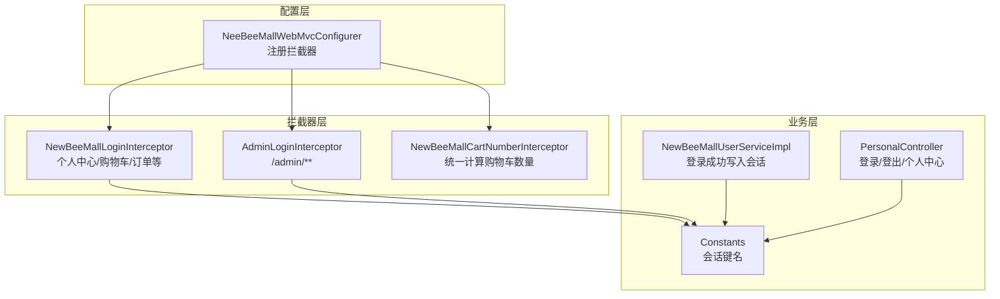
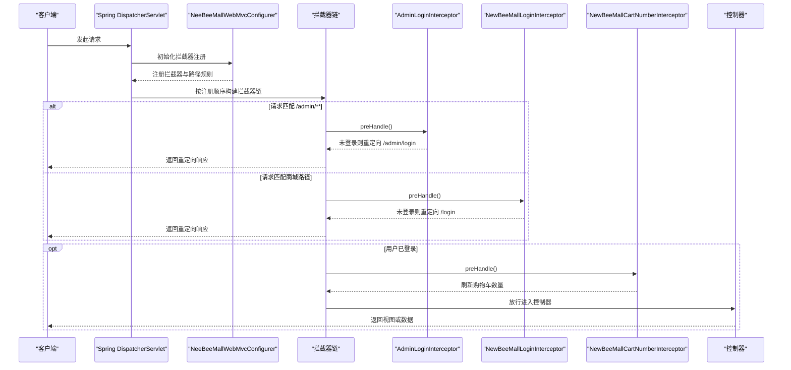
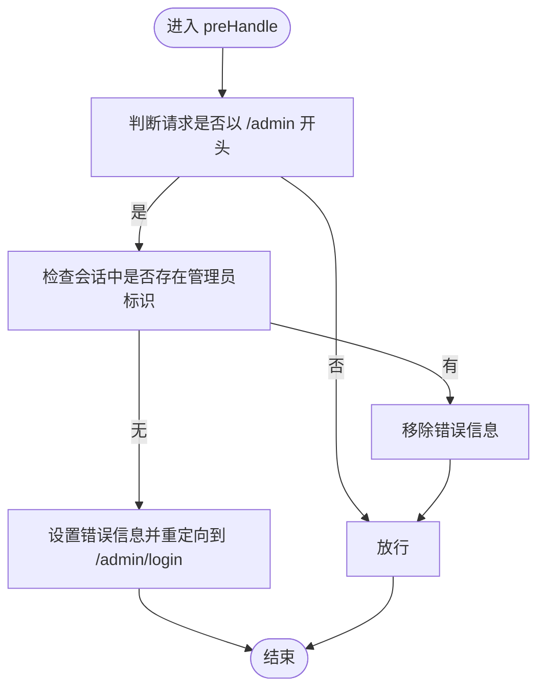
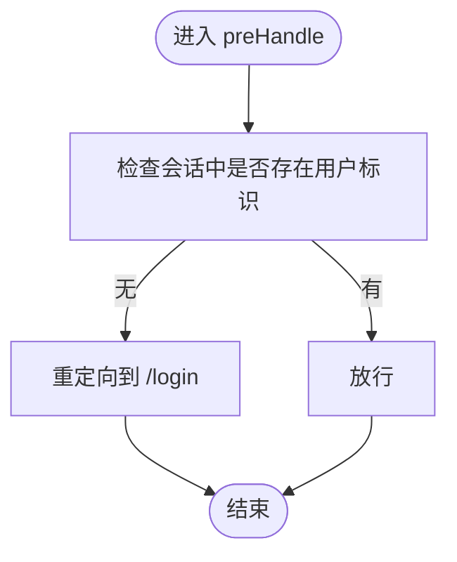
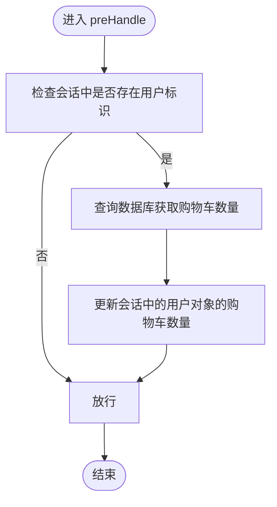
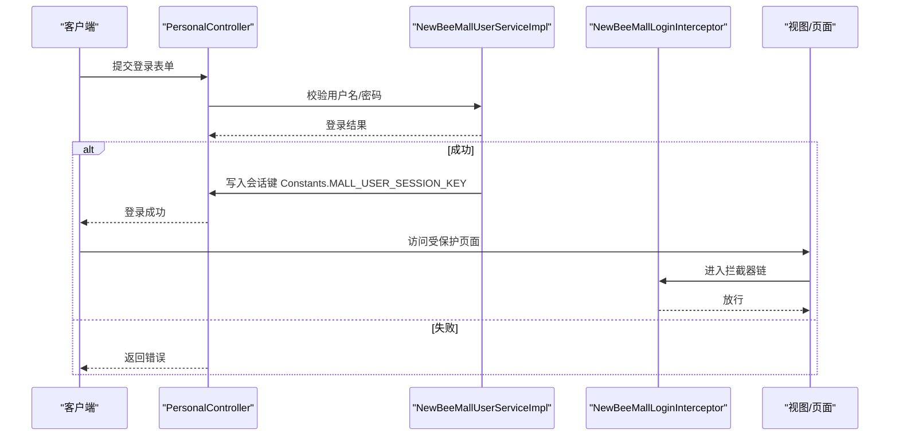
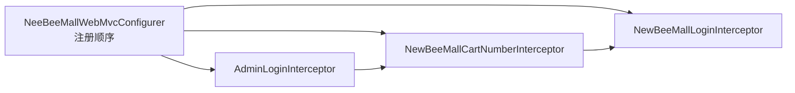

# 拦截器机制与权限控制

<cite>
**本文引用的文件**
- [NeeBeeMallWebMvcConfigurer.java](file://src/main/java/ltd/newbee/mall/config/NeeBeeMallWebMvcConfigurer.java)
- [AdminLoginInterceptor.java](file://src/main/java/ltd/newbee/mall/interceptor/AdminLoginInterceptor.java)
- [NewBeeMallLoginInterceptor.java](file://src/main/java/ltd/newbee/mall/interceptor/NewBeeMallLoginInterceptor.java)
- [NewBeeMallCartNumberInterceptor.java](file://src/main/java/ltd/newbee/mall/interceptor/NewBeeMallCartNumberInterceptor.java)
- [Constants.java](file://src/main/java/ltd/newbee/mall/common/Constants.java)
- [PersonalController.java](file://src/main/java/ltd/newbee/mall/controller/mall/PersonalController.java)
- [NewBeeMallUserServiceImpl.java](file://src/main/java/ltd/newbee/mall/service/impl/NewBeeMallUserServiceImpl.java)
</cite>

## 目录
1. [引言](#引言)
2. [项目结构](#项目结构)
3. [核心组件](#核心组件)
4. [架构总览](#架构总览)
5. [详细组件分析](#详细组件分析)
6. [依赖关系分析](#依赖关系分析)
7. [性能考量](#性能考量)
8. [故障排查指南](#故障排查指南)
9. [结论](#结论)

## 引言
本文件围绕 newbee-mall 的拦截器体系展开，重点解析 NeeBeeMallWebMvcConfigurer 中如何注册 AdminLoginInterceptor、NewBeeMallLoginInterceptor 和 NewBeeMallCartNumberInterceptor 三个拦截器，并说明各自拦截路径与排除路径的配置策略。同时深入分析 AdminLoginInterceptor 如何拦截 /admin/** 并验证管理员登录状态，NewBeeMallLoginInterceptor 如何保护用户中心、购物车等个人操作页面；解释拦截器 preHandle 的执行逻辑及通过重定向实现未授权访问拦截的方式；最后讨论拦截器链的执行顺序及其对系统安全性的保障作用。

## 项目结构
newbee-mall 将拦截器相关代码集中于 config 与 interceptor 包中，并通过 Spring MVC 的 WebMvcConfigurer 接口进行统一注册与配置。关键文件如下：
- 配置类：NeeBeeMallWebMvcConfigurer.java
- 拦截器实现：
  - AdminLoginInterceptor.java
  - NewBeeMallLoginInterceptor.java
  - NewBeeMallCartNumberInterceptor.java
- 常量定义：Constants.java
- 控制器与服务示例：
  - PersonalController.java（个人中心、登录、登出等）
  - NewBeeMallUserServiceImpl.java（登录时写入会话）

图表来源
- [NeeBeeMallWebMvcConfigurer.java](file://src/main/java/ltd/newbee/mall/config/NeeBeeMallWebMvcConfigurer.java#L31-L60)
- [AdminLoginInterceptor.java](file://src/main/java/ltd/newbee/mall/interceptor/AdminLoginInterceptor.java#L26-L51)
- [NewBeeMallLoginInterceptor.java](file://src/main/java/ltd/newbee/mall/interceptor/NewBeeMallLoginInterceptor.java#L27-L49)
- [NewBeeMallCartNumberInterceptor.java](file://src/main/java/ltd/newbee/mall/interceptor/NewBeeMallCartNumberInterceptor.java#L30-L58)
- [Constants.java](file://src/main/java/ltd/newbee/mall/common/Constants.java#L36-L41)
- [PersonalController.java](file://src/main/java/ltd/newbee/mall/controller/mall/PersonalController.java#L41-L45)
- [NewBeeMallUserServiceImpl.java](file://src/main/java/ltd/newbee/mall/service/impl/NewBeeMallUserServiceImpl.java#L55-L74)

章节来源
- [NeeBeeMallWebMvcConfigurer.java](file://src/main/java/ltd/newbee/mall/config/NeeBeeMallWebMvcConfigurer.java#L31-L60)

## 核心组件
- AdminLoginInterceptor：负责后台管理端的登录校验，拦截 /admin/** 请求，排除登录页与静态资源。
- NewBeeMallLoginInterceptor：负责前台商城的登录校验，拦截个人中心、购物车、订单、支付等页面，排除注册、登录、登出等公开路径。
- NewBeeMallCartNumberInterceptor：在用户已登录时统一从数据库刷新购物车数量，确保前端显示一致。

章节来源
- [AdminLoginInterceptor.java](file://src/main/java/ltd/newbee/mall/interceptor/AdminLoginInterceptor.java#L26-L51)
- [NewBeeMallLoginInterceptor.java](file://src/main/java/ltd/newbee/mall/interceptor/NewBeeMallLoginInterceptor.java#L27-L49)
- [NewBeeMallCartNumberInterceptor.java](file://src/main/java/ltd/newbee/mall/interceptor/NewBeeMallCartNumberInterceptor.java#L30-L58)

## 架构总览
拦截器注册与生效流程如下：

图表来源
- [NeeBeeMallWebMvcConfigurer.java](file://src/main/java/ltd/newbee/mall/config/NeeBeeMallWebMvcConfigurer.java#L31-L60)
- [AdminLoginInterceptor.java](file://src/main/java/ltd/newbee/mall/interceptor/AdminLoginInterceptor.java#L29-L40)
- [NewBeeMallLoginInterceptor.java](file://src/main/java/ltd/newbee/mall/interceptor/NewBeeMallLoginInterceptor.java#L30-L38)
- [NewBeeMallCartNumberInterceptor.java](file://src/main/java/ltd/newbee/mall/interceptor/NewBeeMallCartNumberInterceptor.java#L36-L46)

## 详细组件分析

### AdminLoginInterceptor 分析
- 注册与拦截范围
  - 在 NeeBeeMallWebMvcConfigurer 中，AdminLoginInterceptor 被注册为拦截 /admin/** 的路径模式，并明确排除 /admin/login、/admin/dist/**、/admin/plugins/**。
- preHandle 执行逻辑
  - 当请求路径以 /admin 开头且会话中不存在管理员标识时，设置错误提示并重定向至后台登录页；否则移除错误提示并放行。
- 安全性作用
  - 保证后台管理端的所有受控页面均需登录后访问，避免未授权访问后台界面与功能。

图表来源
- [AdminLoginInterceptor.java](file://src/main/java/ltd/newbee/mall/interceptor/AdminLoginInterceptor.java#L29-L40)

章节来源
- [NeeBeeMallWebMvcConfigurer.java](file://src/main/java/ltd/newbee/mall/config/NeeBeeMallWebMvcConfigurer.java#L31-L37)
- [AdminLoginInterceptor.java](file://src/main/java/ltd/newbee/mall/interceptor/AdminLoginInterceptor.java#L29-L40)

### NewBeeMallLoginInterceptor 分析
- 注册与拦截范围
  - 在 NeeBeeMallWebMvcConfigurer 中，NewBeeMallLoginInterceptor 被注册为拦截商城侧的个人中心、购物车、订单、支付等路径，并排除 /admin/**、/register、/login、/logout。
- preHandle 执行逻辑
  - 若会话中不存在用户标识，则直接重定向到前台登录页；否则放行。
- 与会话键的关系
  - 使用 Constants.MALL_USER_SESSION_KEY 作为会话键名，登录成功时由服务层写入该键值。

图表来源
- [NewBeeMallLoginInterceptor.java](file://src/main/java/ltd/newbee/mall/interceptor/NewBeeMallLoginInterceptor.java#L30-L38)
- [Constants.java](file://src/main/java/ltd/newbee/mall/common/Constants.java#L36-L41)

章节来源
- [NeeBeeMallWebMvcConfigurer.java](file://src/main/java/ltd/newbee/mall/config/NeeBeeMallWebMvcConfigurer.java#L45-L60)
- [NewBeeMallLoginInterceptor.java](file://src/main/java/ltd/newbee/mall/interceptor/NewBeeMallLoginInterceptor.java#L30-L38)
- [Constants.java](file://src/main/java/ltd/newbee/mall/common/Constants.java#L36-L41)

### NewBeeMallCartNumberInterceptor 分析
- 注册与拦截范围
  - 在 NeeBeeMallWebMvcConfigurer 中，NewBeeMallCartNumberInterceptor 被注册为对非后台路径生效，并排除 /admin/**、/register、/login、/logout。
- preHandle 执行逻辑
  - 当用户处于登录状态时，从数据库查询其购物车项总数，更新会话中的用户对象的购物车数量字段，然后放行。
- 性能与一致性
  - 该拦截器在每次请求前刷新购物车数量，确保前端“我的购物车”、“头部购物车徽章”等处的数量与数据库一致。

图表来源
- [NewBeeMallCartNumberInterceptor.java](file://src/main/java/ltd/newbee/mall/interceptor/NewBeeMallCartNumberInterceptor.java#L36-L46)

章节来源
- [NeeBeeMallWebMvcConfigurer.java](file://src/main/java/ltd/newbee/mall/config/NeeBeeMallWebMvcConfigurer.java#L39-L43)
- [NewBeeMallCartNumberInterceptor.java](file://src/main/java/ltd/newbee/mall/interceptor/NewBeeMallCartNumberInterceptor.java#L36-L46)

### 登录流程与拦截器联动
- 登录成功写入会话
  - 登录成功后，服务层将用户 VO 写入会话键 Constants.MALL_USER_SESSION_KEY，后续拦截器据此判定登录状态。
- 登出清理会话
  - 登出时移除会话中的用户标识，使后续请求被拦截器重定向到登录页。

图表来源
- [NewBeeMallUserServiceImpl.java](file://src/main/java/ltd/newbee/mall/service/impl/NewBeeMallUserServiceImpl.java#L55-L74)
- [PersonalController.java](file://src/main/java/ltd/newbee/mall/controller/mall/PersonalController.java#L41-L45)
- [NewBeeMallLoginInterceptor.java](file://src/main/java/ltd/newbee/mall/interceptor/NewBeeMallLoginInterceptor.java#L30-L38)
- [Constants.java](file://src/main/java/ltd/newbee/mall/common/Constants.java#L36-L41)

章节来源
- [NewBeeMallUserServiceImpl.java](file://src/main/java/ltd/newbee/mall/service/impl/NewBeeMallUserServiceImpl.java#L55-L74)
- [PersonalController.java](file://src/main/java/ltd/newbee/mall/controller/mall/PersonalController.java#L41-L45)

## 依赖关系分析
- 组件耦合
  - NeeBeeMallWebMvcConfigurer 通过 @Autowired 注入三个拦截器，形成集中式注册点，降低分散配置风险。
  - AdminLoginInterceptor 与 NewBeeMallLoginInterceptor 共同依赖 Constants.MALL_USER_SESSION_KEY 作为会话键名，保持前后台登录态的一致性。
  - NewBeeMallCartNumberInterceptor 依赖 NewBeeMallShoppingCartItemMapper 查询购物车数量，属于业务读取型拦截器。
- 排除路径设计
  - 后台排除 /admin/login、/admin/dist/**、/admin/plugins/**，避免登录页与静态资源被二次拦截。
  - 商城侧排除 /admin/**、/register、/login、/logout，确保公开页面可自由访问。
- 拦截器链顺序
  - Spring MVC 按注册顺序构建拦截器链。由于 NeeBeeMallWebMvcConfigurer 中先注册 AdminLoginInterceptor，再注册 NewBeeMallCartNumberInterceptor，最后注册 NewBeeMallLoginInterceptor，因此链路顺序为：AdminLoginInterceptor -> NewBeeMallCartNumberInterceptor -> NewBeeMallLoginInterceptor。
  - 对于 /admin/** 请求，AdminLoginInterceptor 优先执行并可能提前重定向，从而避免后续拦截器与控制器的执行。
  - 对于商城路径，NewBeeMallLoginInterceptor 优先执行，未登录将重定向；已登录则继续执行 NewBeeMallCartNumberInterceptor，刷新购物车数量后再进入控制器。

图表来源
- [NeeBeeMallWebMvcConfigurer.java](file://src/main/java/ltd/newbee/mall/config/NeeBeeMallWebMvcConfigurer.java#L31-L60)

章节来源
- [NeeBeeMallWebMvcConfigurer.java](file://src/main/java/ltd/newbee/mall/config/NeeBeeMallWebMvcConfigurer.java#L31-L60)

## 性能考量
- 数据库查询开销
  - NewBeeMallCartNumberInterceptor 在每次请求前查询购物车数量，建议结合缓存策略或按需刷新，避免高频请求导致数据库压力。
- 会话读写成本
  - 拦截器链中频繁读取/写入会话键，应避免在 preHandle 中执行耗时操作，确保拦截器快速返回。
- 路径匹配复杂度
  - 路径模式较多时，Spring 的匹配算法会增加一定开销，建议保持路径模式简洁清晰，减少不必要的通配符组合。

## 故障排查指南
- 症状：访问后台页面被重定向到 /admin/login
  - 可能原因：会话中缺少管理员标识或会话过期。
  - 排查要点：确认登录流程是否正确写入管理员标识；检查会话有效期与浏览器 Cookie 设置。
- 症状：访问个人中心/购物车等页面被重定向到 /login
  - 可能原因：会话中缺少用户标识或会话过期。
  - 排查要点：确认登录成功后是否写入 Constants.MALL_USER_SESSION_KEY；检查登出逻辑是否正确移除该键。
- 症状：购物车数量不一致
  - 可能原因：拦截器未刷新或数据库查询异常。
  - 排查要点：确认 NewBeeMallCartNumberInterceptor 是否生效；检查 NewBeeMallShoppingCartItemMapper 的查询逻辑与权限。
- 症状：静态资源无法加载
  - 可能原因：后台静态资源路径被误拦截。
  - 排查要点：确认 NeeBeeMallWebMvcConfigurer 中对 /admin/dist/**、/admin/plugins/** 的排除配置是否正确。

章节来源
- [AdminLoginInterceptor.java](file://src/main/java/ltd/newbee/mall/interceptor/AdminLoginInterceptor.java#L29-L40)
- [NewBeeMallLoginInterceptor.java](file://src/main/java/ltd/newbee/mall/interceptor/NewBeeMallLoginInterceptor.java#L30-L38)
- [NewBeeMallCartNumberInterceptor.java](file://src/main/java/ltd/newbee/mall/interceptor/NewBeeMallCartNumberInterceptor.java#L36-L46)
- [NeeBeeMallWebMvcConfigurer.java](file://src/main/java/ltd/newbee/mall/config/NeeBeeMallWebMvcConfigurer.java#L31-L60)

## 结论
newbee-mall 的拦截器体系通过 NeeBeeMallWebMvcConfigurer 实现集中注册与路径配置，AdminLoginInterceptor 与 NewBeeMallLoginInterceptor 分别覆盖后台与前台的登录校验，NewBeeMallCartNumberInterceptor 则在用户登录状态下统一刷新购物车数量，确保前端展示一致性。拦截器链的执行顺序与排除路径设计共同构成了系统的安全边界：未登录用户会被重定向到相应登录页，后台静态资源不会被二次拦截，从而在保证安全性的同时兼顾了用户体验与性能。