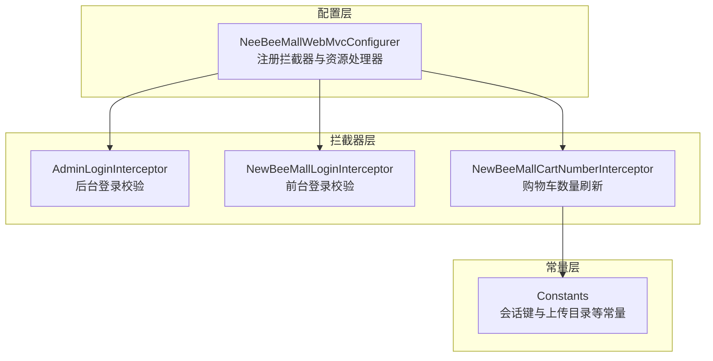
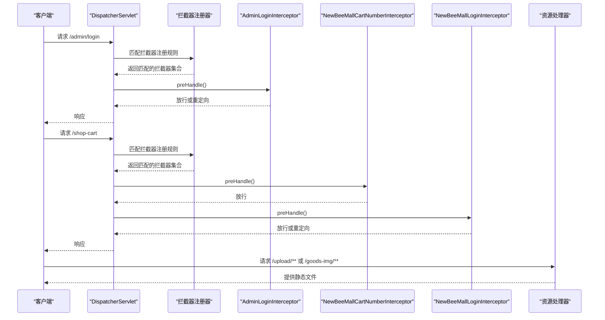
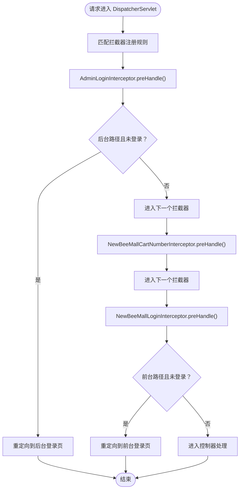
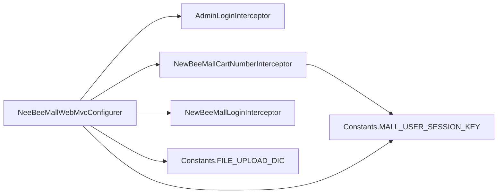

# 拦截器配置与注册机制

<cite>
**本文引用的文件**
- [NeeBeeMallWebMvcConfigurer.java](file://src/main/java/ltd/newbee/mall/config/NeeBeeMallWebMvcConfigurer.java)
- [AdminLoginInterceptor.java](file://src/main/java/ltd/newbee/mall/interceptor/AdminLoginInterceptor.java)
- [NewBeeMallLoginInterceptor.java](file://src/main/java/ltd/newbee/mall/interceptor/NewBeeMallLoginInterceptor.java)
- [NewBeeMallCartNumberInterceptor.java](file://src/main/java/ltd/newbee/mall/interceptor/NewBeeMallCartNumberInterceptor.java)
- [Constants.java](file://src/main/java/ltd/newbee/mall/common/Constants.java)
</cite>

## 目录
1. [引言](#引言)
2. [项目结构](#项目结构)
3. [核心组件](#核心组件)
4. [架构总览](#架构总览)
5. [详细组件分析](#详细组件分析)
6. [依赖关系分析](#依赖关系分析)
7. [性能考量](#性能考量)
8. [故障排查指南](#故障排查指南)
9. [结论](#结论)

## 引言
本文件围绕 NeeBeeMallWebMvcConfigurer 类如何通过实现 WebMvcConfigurer 接口完成拦截器的注册与配置展开深入解析。重点覆盖以下内容：
- 在 addInterceptors 方法中对三个拦截器的注册逻辑：AdminLoginInterceptor、NewBeeMallLoginInterceptor、NewBeeMallCartNumberInterceptor 的拦截路径与排除路径设置规则；
- 结合代码实例解释拦截器链的执行顺序及其优先级控制机制；
- 阐述资源处理器 addResourceHandlers 对静态资源访问的支持作用。

## 项目结构
本项目采用基于功能域的分层组织方式，拦截器相关代码位于 interceptor 包，Spring MVC 配置集中在 config 包，常量定义位于 common 包。下图展示与本主题直接相关的模块关系：

图表来源
- [NeeBeeMallWebMvcConfigurer.java](file://src/main/java/ltd/newbee/mall/config/NeeBeeMallWebMvcConfigurer.java#L31-L60)
- [AdminLoginInterceptor.java](file://src/main/java/ltd/newbee/mall/interceptor/AdminLoginInterceptor.java#L26-L51)
- [NewBeeMallLoginInterceptor.java](file://src/main/java/ltd/newbee/mall/interceptor/NewBeeMallLoginInterceptor.java#L27-L49)
- [NewBeeMallCartNumberInterceptor.java](file://src/main/java/ltd/newbee/mall/interceptor/NewBeeMallCartNumberInterceptor.java#L30-L58)
- [Constants.java](file://src/main/java/ltd/newbee/mall/common/Constants.java#L18-L48)

章节来源
- [NeeBeeMallWebMvcConfigurer.java](file://src/main/java/ltd/newbee/mall/config/NeeBeeMallWebMvcConfigurer.java#L21-L66)
- [Constants.java](file://src/main/java/ltd/newbee/mall/common/Constants.java#L18-L48)

## 核心组件
- NeeBeeMallWebMvcConfigurer：实现 WebMvcConfigurer 接口，负责在 Spring MVC 中注册拦截器与静态资源映射。
- AdminLoginInterceptor：后台登录校验拦截器，确保后台请求必须处于登录态。
- NewBeeMallLoginInterceptor：前台登录校验拦截器，确保商城相关请求必须处于登录态。
- NewBeeMallCartNumberInterceptor：购物车数量刷新拦截器，在用户登录状态下统一从数据库刷新购物车数量并回写到会话。
- Constants：提供会话键与文件上传目录等常量，供拦截器与资源处理器使用。

章节来源
- [NeeBeeMallWebMvcConfigurer.java](file://src/main/java/ltd/newbee/mall/config/NeeBeeMallWebMvcConfigurer.java#L21-L66)
- [AdminLoginInterceptor.java](file://src/main/java/ltd/newbee/mall/interceptor/AdminLoginInterceptor.java#L26-L51)
- [NewBeeMallLoginInterceptor.java](file://src/main/java/ltd/newbee/mall/interceptor/NewBeeMallLoginInterceptor.java#L27-L49)
- [NewBeeMallCartNumberInterceptor.java](file://src/main/java/ltd/newbee/mall/interceptor/NewBeeMallCartNumberInterceptor.java#L30-L58)
- [Constants.java](file://src/main/java/ltd/newbee/mall/common/Constants.java#L18-L48)

## 架构总览
下图展示了拦截器注册与执行的整体流程，以及资源处理器对静态资源访问的支持：

图表来源
- [NeeBeeMallWebMvcConfigurer.java](file://src/main/java/ltd/newbee/mall/config/NeeBeeMallWebMvcConfigurer.java#L31-L66)
- [AdminLoginInterceptor.java](file://src/main/java/ltd/newbee/mall/interceptor/AdminLoginInterceptor.java#L29-L40)
- [NewBeeMallCartNumberInterceptor.java](file://src/main/java/ltd/newbee/mall/interceptor/NewBeeMallCartNumberInterceptor.java#L36-L46)
- [NewBeeMallLoginInterceptor.java](file://src/main/java/ltd/newbee/mall/interceptor/NewBeeMallLoginInterceptor.java#L30-L38)

## 详细组件分析

### NeeBeeMallWebMvcConfigurer：拦截器注册与资源处理器
- 实现 WebMvcConfigurer 接口，通过 addInterceptors 注册三个拦截器，并通过 addResourceHandlers 提供静态资源访问支持。
- 注册顺序即拦截器链的执行顺序：先注册的先执行，后注册的后执行。
- 资源处理器将 /upload/** 与 /goods-img/** 映射到 Constants.FILE_UPLOAD_DIC 指定的本地文件目录，便于前端直接访问上传的图片资源。

章节来源
- [NeeBeeMallWebMvcConfigurer.java](file://src/main/java/ltd/newbee/mall/config/NeeBeeMallWebMvcConfigurer.java#L31-L66)
- [Constants.java](file://src/main/java/ltd/newbee/mall/common/Constants.java#L18-L21)

### AdminLoginInterceptor：后台登录拦截
- 功能：当请求路径以 /admin 开头且会话中不存在管理员登录信息时，重定向至后台登录页；否则放行。
- 关键点：仅对后台管理相关路径生效，排除后台静态资源与登录接口，避免误拦截。

章节来源
- [AdminLoginInterceptor.java](file://src/main/java/ltd/newbee/mall/interceptor/AdminLoginInterceptor.java#L26-L51)

### NewBeeMallCartNumberInterceptor：购物车数量刷新
- 功能：在用户登录状态下，从数据库查询当前用户的购物车数量，并更新会话中的用户对象，确保页面显示与数据库一致。
- 关键点：对非后台路径进行统一处理，排除注册、登录、登出等接口，避免重复刷新或误刷新。

章节来源
- [NewBeeMallCartNumberInterceptor.java](file://src/main/java/ltd/newbee/mall/interceptor/NewBeeMallCartNumberInterceptor.java#L30-L58)
- [Constants.java](file://src/main/java/ltd/newbee/mall/common/Constants.java#L36-L41)

### NewBeeMallLoginInterceptor：前台登录拦截
- 功能：当请求属于商城相关路径但会话中不存在普通用户登录信息时，重定向至登录页；否则放行。
- 关键点：排除后台路径与注册、登录、登出等接口，避免与后台拦截器冲突。

章节来源
- [NewBeeMallLoginInterceptor.java](file://src/main/java/ltd/newbee/mall/interceptor/NewBeeMallLoginInterceptor.java#L27-L49)
- [Constants.java](file://src/main/java/ltd/newbee/mall/common/Constants.java#L36-L41)

### 拦截器链执行顺序与优先级控制
- 注册顺序决定执行顺序：addInterceptors 中先注册 AdminLoginInterceptor，再注册 NewBeeMallCartNumberInterceptor，最后注册 NewBeeMallLoginInterceptor。因此执行顺序为：
  1) AdminLoginInterceptor
  2) NewBeeMallCartNumberInterceptor
  3) NewBeeMallLoginInterceptor
- 优先级控制机制：
  - 通过 addPathPatterns 与 excludePathPatterns 精确限定每个拦截器的生效范围，避免相互覆盖或冲突。
  - 对于后台路径，仅 AdminLoginInterceptor 生效；对于前台路径，NewBeeMallCartNumberInterceptor 与 NewBeeMallLoginInterceptor 共同生效。
  - 各拦截器内部的 preHandle 返回 true/false 决定是否继续后续拦截器或控制器处理。

图表来源
- [NeeBeeMallWebMvcConfigurer.java](file://src/main/java/ltd/newbee/mall/config/NeeBeeMallWebMvcConfigurer.java#L31-L60)
- [AdminLoginInterceptor.java](file://src/main/java/ltd/newbee/mall/interceptor/AdminLoginInterceptor.java#L29-L40)
- [NewBeeMallCartNumberInterceptor.java](file://src/main/java/ltd/newbee/mall/interceptor/NewBeeMallCartNumberInterceptor.java#L36-L46)
- [NewBeeMallLoginInterceptor.java](file://src/main/java/ltd/newbee/mall/interceptor/NewBeeMallLoginInterceptor.java#L30-L38)

### 资源处理器：静态资源访问支持
- 将 /upload/** 与 /goods-img/** 映射到 Constants.FILE_UPLOAD_DIC 指定的本地文件目录，使前端可直接通过 URL 访问上传的图片资源。
- 该配置独立于拦截器链，不参与拦截器执行顺序，但会影响请求路径匹配与处理流程。

章节来源
- [NeeBeeMallWebMvcConfigurer.java](file://src/main/java/ltd/newbee/mall/config/NeeBeeMallWebMvcConfigurer.java#L62-L66)
- [Constants.java](file://src/main/java/ltd/newbee/mall/common/Constants.java#L18-L21)

## 依赖关系分析
- 组件耦合与内聚：
  - NeeBeeMallWebMvcConfigurer 作为集中式配置入口，内聚了拦截器注册与静态资源映射，降低分散配置带来的维护成本。
  - 拦截器之间低耦合：AdminLoginInterceptor 仅关注后台登录态，NewBeeMallCartNumberInterceptor 仅关注购物车数量刷新，NewBeeMallLoginInterceptor 仅关注前台登录态。
- 外部依赖：
  - 拦截器依赖会话与数据库（购物车数量刷新），依赖 Constants 中的会话键与上传目录常量。
  - 资源处理器依赖 Constants.FILE_UPLOAD_DIC 指定的本地存储路径。

图表来源
- [NeeBeeMallWebMvcConfigurer.java](file://src/main/java/ltd/newbee/mall/config/NeeBeeMallWebMvcConfigurer.java#L31-L66)
- [AdminLoginInterceptor.java](file://src/main/java/ltd/newbee/mall/interceptor/AdminLoginInterceptor.java#L26-L51)
- [NewBeeMallCartNumberInterceptor.java](file://src/main/java/ltd/newbee/mall/interceptor/NewBeeMallCartNumberInterceptor.java#L30-L58)
- [NewBeeMallLoginInterceptor.java](file://src/main/java/ltd/newbee/mall/interceptor/NewBeeMallLoginInterceptor.java#L27-L49)
- [Constants.java](file://src/main/java/ltd/newbee/mall/common/Constants.java#L18-L48)

## 性能考量
- 拦截器链短路：任一拦截器返回 false 将中断后续执行，减少不必要的数据库查询与控制器调用。
- 数据库查询优化：NewBeeMallCartNumberInterceptor 仅在用户登录状态下查询购物车数量，避免对匿名用户的无谓开销。
- 资源处理器直出：静态资源由资源处理器直接提供，不经过控制器与拦截器链，提升响应速度。

## 故障排查指南
- 后台路径被错误拦截：
  - 检查 AdminLoginInterceptor 的排除规则是否覆盖了后台静态资源与登录接口。
  - 确认 /admin/** 是否正确排除了 /admin/login、/admin/dist/**、/admin/plugins/**。
- 前台登录跳转异常：
  - 检查 NewBeeMallLoginInterceptor 的排除规则是否覆盖了 /admin/**、/register、/login、/logout。
  - 确认会话键 Constants.MALL_USER_SESSION_KEY 是否正确设置与读取。
- 购物车数量不更新：
  - 检查 NewBeeMallCartNumberInterceptor 是否被正确注册并生效。
  - 确认会话中存在用户对象且数据库中购物车记录存在。
- 静态资源无法访问：
  - 检查资源处理器是否正确映射 /upload/** 与 /goods-img/** 到 Constants.FILE_UPLOAD_DIC。
  - 确认服务器文件系统权限允许读取上传目录。

章节来源
- [NeeBeeMallWebMvcConfigurer.java](file://src/main/java/ltd/newbee/mall/config/NeeBeeMallWebMvcConfigurer.java#L31-L66)
- [AdminLoginInterceptor.java](file://src/main/java/ltd/newbee/mall/interceptor/AdminLoginInterceptor.java#L29-L40)
- [NewBeeMallCartNumberInterceptor.java](file://src/main/java/ltd/newbee/mall/interceptor/NewBeeMallCartNumberInterceptor.java#L36-L46)
- [NewBeeMallLoginInterceptor.java](file://src/main/java/ltd/newbee/mall/interceptor/NewBeeMallLoginInterceptor.java#L30-L38)
- [Constants.java](file://src/main/java/ltd/newbee/mall/common/Constants.java#L18-L48)

## 结论
NeeBeeMallWebMvcConfigurer 通过 WebMvcConfigurer 接口集中管理拦截器注册与静态资源映射，利用精确的 addPathPatterns 与 excludePathPatterns 控制各拦截器的生效范围，形成清晰的执行顺序与优先级策略。AdminLoginInterceptor、NewBeeMallCartNumberInterceptor、NewBeeMallLoginInterceptor 分别承担后台登录、购物车数量刷新与前台登录校验职责，配合资源处理器实现高效的静态资源访问。该设计具备良好的可维护性与扩展性，便于后续新增拦截器或调整拦截规则。