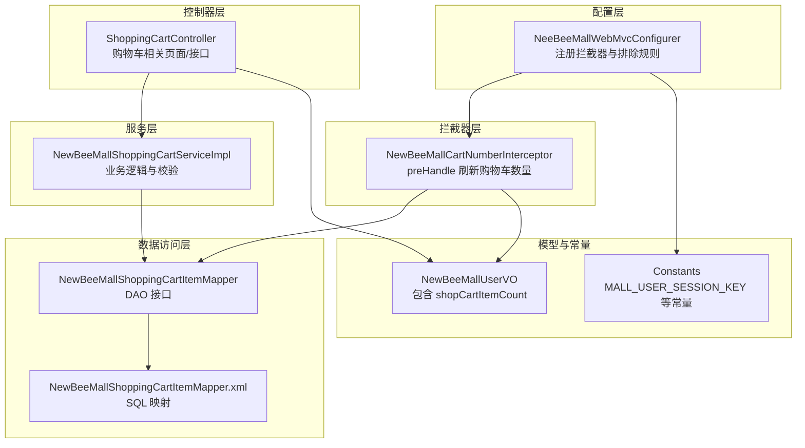
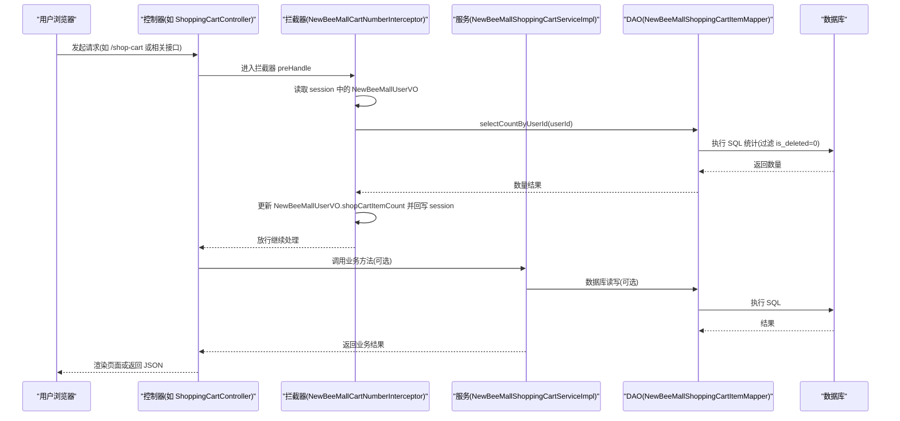
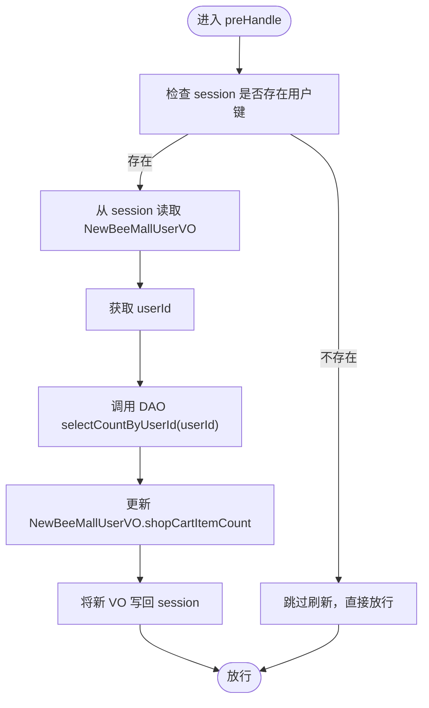
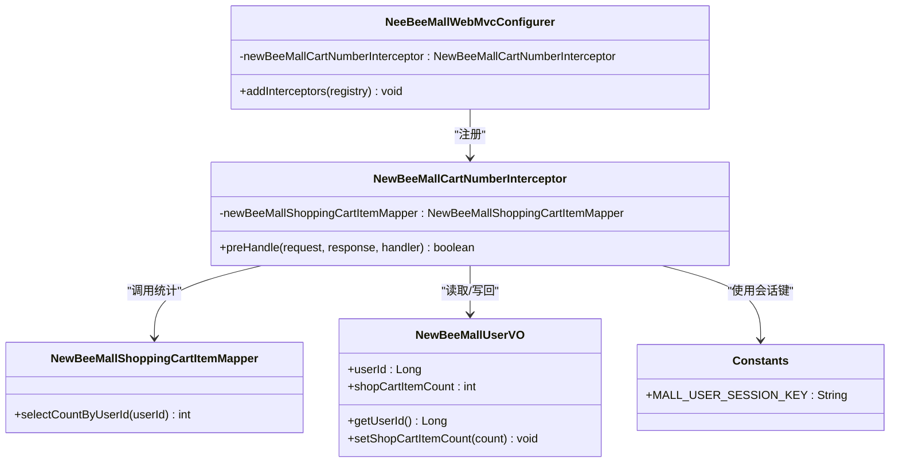

# 购物车数量同步拦截器

<cite>
**本文引用的文件**
- [NewBeeMallCartNumberInterceptor.java](file://src/main/java/ltd/newbee/mall/interceptor/NewBeeMallCartNumberInterceptor.java)
- [NeeBeeMallWebMvcConfigurer.java](file://src/main/java/ltd/newbee/mall/config/NeeBeeMallWebMvcConfigurer.java)
- [NewBeeMallShoppingCartItemMapper.java](file://src/main/java/ltd/newbee/mall/dao/NewBeeMallShoppingCartItemMapper.java)
- [NewBeeMallShoppingCartItemMapper.xml](file://src/main/resources/mapper/NewBeeMallShoppingCartItemMapper.xml)
- [NewBeeMallUserVO.java](file://src/main/java/ltd/newbee/mall/controller/vo/NewBeeMallUserVO.java)
- [Constants.java](file://src/main/java/ltd/newbee/mall/common/Constants.java)
- [ShoppingCartController.java](file://src/main/java/ltd/newbee/mall/controller/mall/ShoppingCartController.java)
- [NewBeeMallShoppingCartServiceImpl.java](file://src/main/java/ltd/newbee/mall/service/impl/NewBeeMallShoppingCartServiceImpl.java)
</cite>

## 目录
1. [引言](#引言)
2. [项目结构](#项目结构)
3. [核心组件](#核心组件)
4. [架构总览](#架构总览)
5. [详细组件分析](#详细组件分析)
6. [依赖关系分析](#依赖关系分析)
7. [性能考量](#性能考量)
8. [故障排查指南](#故障排查指南)
9. [结论](#结论)

## 引言
本文件围绕 NewBeeMallCartNumberInterceptor 拦截器展开，系统性阐述其设计目的、实现方式与运行机制。该拦截器在请求进入控制器之前，针对已登录用户，在 session 中动态刷新“购物车项数量”字段，确保前端展示与数据库真实状态保持一致，从而提升用户体验的一致性与准确性。文档同时给出关键流程的时序图与依赖关系图，帮助读者从整体到细节全面理解该机制。

## 项目结构
拦截器位于拦截器层，配置于 Web MVC 配置类中，与控制器、服务层、DAO 层协同工作；用户 VO 与常量定义贯穿会话与拦截器逻辑。

图表来源
- [NeeBeeMallWebMvcConfigurer.java](file://src/main/java/ltd/newbee/mall/config/NeeBeeMallWebMvcConfigurer.java#L31-L60)
- [NewBeeMallCartNumberInterceptor.java](file://src/main/java/ltd/newbee/mall/interceptor/NewBeeMallCartNumberInterceptor.java#L36-L46)
- [NewBeeMallShoppingCartItemMapper.java](file://src/main/java/ltd/newbee/mall/dao/NewBeeMallShoppingCartItemMapper.java#L16-L36)
- [NewBeeMallShoppingCartItemMapper.xml](file://src/main/resources/mapper/NewBeeMallShoppingCartItemMapper.xml#L36-L41)
- [NewBeeMallUserVO.java](file://src/main/java/ltd/newbee/mall/controller/vo/NewBeeMallUserVO.java#L25-L26)
- [Constants.java](file://src/main/java/ltd/newbee/mall/common/Constants.java#L38-L38)

章节来源
- [NeeBeeMallWebMvcConfigurer.java](file://src/main/java/ltd/newbee/mall/config/NeeBeeMallWebMvcConfigurer.java#L31-L60)
- [NewBeeMallCartNumberInterceptor.java](file://src/main/java/ltd/newbee/mall/interceptor/NewBeeMallCartNumberInterceptor.java#L36-L46)

## 核心组件
- 拦截器：在 preHandle 阶段读取 session 中的用户对象，调用 DAO 查询当前用户购物车项数量，并回写到 session 的 NewBeeMallUserVO 中，保证后续视图渲染与控制器逻辑使用的是最新值。
- 配置类：注册拦截器并设置排除路径，避免后台管理、注册、登录、登出等非必要路径重复刷新。
- DAO 与 SQL：提供按用户统计购物车项数量的方法，屏蔽底层删除标记与过滤逻辑。
- 用户 VO：承载 shopCartItemCount 字段，作为拦截器刷新的目标属性。
- 常量：提供会话键名，确保拦截器与控制器、服务层对同一会话键达成一致。

章节来源
- [NewBeeMallCartNumberInterceptor.java](file://src/main/java/ltd/newbee/mall/interceptor/NewBeeMallCartNumberInterceptor.java#L36-L46)
- [NeeBeeMallWebMvcConfigurer.java](file://src/main/java/ltd/newbee/mall/config/NeeBeeMallWebMvcConfigurer.java#L31-L60)
- [NewBeeMallShoppingCartItemMapper.java](file://src/main/java/ltd/newbee/mall/dao/NewBeeMallShoppingCartItemMapper.java#L29-L29)
- [NewBeeMallShoppingCartItemMapper.xml](file://src/main/resources/mapper/NewBeeMallShoppingCartItemMapper.xml#L36-L41)
- [NewBeeMallUserVO.java](file://src/main/java/ltd/newbee/mall/controller/vo/NewBeeMallUserVO.java#L25-L26)
- [Constants.java](file://src/main/java/ltd/newbee/mall/common/Constants.java#L38-L38)

## 架构总览
拦截器作为全局预处理点，贯穿商城前台页面与购物车相关接口，确保每次请求都能基于数据库真实状态更新会话中的购物车数量。配置类负责拦截范围与排除规则，DAO 提供稳定的数据访问能力，控制器与服务层各自承担业务职责，最终由拦截器完成一致性保障。

图表来源
- [NeeBeeMallWebMvcConfigurer.java](file://src/main/java/ltd/newbee/mall/config/NeeBeeMallWebMvcConfigurer.java#L31-L60)
- [NewBeeMallCartNumberInterceptor.java](file://src/main/java/ltd/newbee/mall/interceptor/NewBeeMallCartNumberInterceptor.java#L36-L46)
- [NewBeeMallShoppingCartItemMapper.java](file://src/main/java/ltd/newbee/mall/dao/NewBeeMallShoppingCartItemMapper.java#L29-L29)
- [NewBeeMallShoppingCartItemMapper.xml](file://src/main/resources/mapper/NewBeeMallShoppingCartItemMapper.xml#L36-L41)
- [ShoppingCartController.java](file://src/main/java/ltd/newbee/mall/controller/mall/ShoppingCartController.java#L36-L61)
- [NewBeeMallShoppingCartServiceImpl.java](file://src/main/java/ltd/newbee/mall/service/impl/NewBeeMallShoppingCartServiceImpl.java#L38-L64)

## 详细组件分析

### 拦截器设计目的与实现方式
- 设计目的
  - 解决“其他接口未同步更新 session 导致的购物车显示不一致”问题：当用户通过某些接口新增、修改或删除购物车项后，若未主动刷新 session 中的购物车数量，前端展示可能滞后。
  - 在 preHandle 阶段统一刷新，确保后续控制器、视图层读取到的都是最新值，提升一致性与准确性。
- 实现要点
  - 仅对已登录用户生效：检查 session 是否存在指定键。
  - 读取用户 ID：从 NewBeeMallUserVO 获取 userId。
  - 调用 DAO 统计：selectCountByUserId 计算当前用户购物车项数量。
  - 回写 session：更新 NewBeeMallUserVO.shopCartItemCount 并重新放入 session。
  - 返回放行：preHandle 返回 true，继续后续处理。

图表来源
- [NewBeeMallCartNumberInterceptor.java](file://src/main/java/ltd/newbee/mall/interceptor/NewBeeMallCartNumberInterceptor.java#L36-L46)
- [NewBeeMallShoppingCartItemMapper.java](file://src/main/java/ltd/newbee/mall/dao/NewBeeMallShoppingCartItemMapper.java#L29-L29)
- [NewBeeMallUserVO.java](file://src/main/java/ltd/newbee/mall/controller/vo/NewBeeMallUserVO.java#L25-L26)
- [Constants.java](file://src/main/java/ltd/newbee/mall/common/Constants.java#L38-L38)

章节来源
- [NewBeeMallCartNumberInterceptor.java](file://src/main/java/ltd/newbee/mall/interceptor/NewBeeMallCartNumberInterceptor.java#L36-L46)

### 配置与拦截范围
- 注册拦截器：在 WebMvcConfigurer 中注册 NewBeeMallCartNumberInterceptor。
- 排除路径：排除后台管理、注册、登录、登出等路径，避免对非业务请求进行不必要的刷新。
- 包含路径：对购物车相关页面与下单流程等关键路径生效，确保用户感知一致。

章节来源
- [NeeBeeMallWebMvcConfigurer.java](file://src/main/java/ltd/newbee/mall/config/NeeBeeMallWebMvcConfigurer.java#L31-L60)

### DAO 与 SQL 行为
- DAO 方法：selectCountByUserId 接收用户 ID，返回整型数量。
- SQL 映射：统计时过滤 is_deleted=0，确保软删除不影响数量统计。
- 与其他接口的关系：ShoppingCartController 与 NewBeeMallShoppingCartServiceImpl 在业务层面进行增删改查，但拦截器负责“最终一致性”的兜底刷新。

章节来源
- [NewBeeMallShoppingCartItemMapper.java](file://src/main/java/ltd/newbee/mall/dao/NewBeeMallShoppingCartItemMapper.java#L29-L29)
- [NewBeeMallShoppingCartItemMapper.xml](file://src/main/resources/mapper/NewBeeMallShoppingCartItemMapper.xml#L36-L41)

### 用户 VO 与会话键
- NewBeeMallUserVO：包含 shopCartItemCount 字段，拦截器直接更新该字段。
- Constants.MALL_USER_SESSION_KEY：统一的会话键名，确保拦截器与控制器、服务层一致。

章节来源
- [NewBeeMallUserVO.java](file://src/main/java/ltd/newbee/mall/controller/vo/NewBeeMallUserVO.java#L25-L26)
- [Constants.java](file://src/main/java/ltd/newbee/mall/common/Constants.java#L38-L38)

### 控制器与服务层协作
- 控制器：如 ShoppingCartController 的页面与接口，依赖会话中的用户信息与购物车数据。
- 服务层：NewBeeMallShoppingCartServiceImpl 在业务层面进行增删改查与参数校验，拦截器在会话层提供“最终一致性”。

章节来源
- [ShoppingCartController.java](file://src/main/java/ltd/newbee/mall/controller/mall/ShoppingCartController.java#L36-L61)
- [NewBeeMallShoppingCartServiceImpl.java](file://src/main/java/ltd/newbee/mall/service/impl/NewBeeMallShoppingCartServiceImpl.java#L38-L64)

## 依赖关系分析
拦截器与各模块之间的依赖关系如下：

图表来源
- [NewBeeMallCartNumberInterceptor.java](file://src/main/java/ltd/newbee/mall/interceptor/NewBeeMallCartNumberInterceptor.java#L33-L46)
- [NeeBeeMallWebMvcConfigurer.java](file://src/main/java/ltd/newbee/mall/config/NeeBeeMallWebMvcConfigurer.java#L21-L30)
- [NewBeeMallShoppingCartItemMapper.java](file://src/main/java/ltd/newbee/mall/dao/NewBeeMallShoppingCartItemMapper.java#L16-L36)
- [NewBeeMallUserVO.java](file://src/main/java/ltd/newbee/mall/controller/vo/NewBeeMallUserVO.java#L13-L74)
- [Constants.java](file://src/main/java/ltd/newbee/mall/common/Constants.java#L38-L38)

## 性能考量
- 访问频度：拦截器对每个请求都会执行一次数据库统计，建议结合实际流量评估开销。
- 缓存策略：可在拦截器层引入短期缓存（如基于 userId 的 LRU 缓存）降低频繁查询压力，注意缓存失效与并发一致性。
- SQL 优化：统计语句已过滤 is_deleted=0，建议在 user_id 上建立索引以提升查询效率。
- 会话写回：每次 preHandle 都会回写 session，应避免在高频请求中产生不必要的序列化/反序列化成本。

## 故障排查指南
- 现象：购物车数量不一致
  - 检查拦截器是否被正确注册与生效（确认排除路径是否覆盖了目标页面）。
  - 检查 session 中是否存在 MALL_USER_SESSION_KEY 键。
  - 检查 DAO 的 selectCountByUserId 是否返回预期值（确认 is_deleted 过滤逻辑）。
- 现象：拦截器未执行
  - 确认请求路径未被排除（如 /admin/**、/login、/logout 等）。
  - 确认拦截器注册顺序与优先级未被覆盖。
- 现象：数量异常为 0
  - 检查用户是否已登录且 session 中存在用户对象。
  - 检查数据库中是否存在有效购物车项（is_deleted=0）。
- 现象：性能下降
  - 评估拦截器频率与 DAO 查询成本，考虑引入缓存或索引优化。

章节来源
- [NeeBeeMallWebMvcConfigurer.java](file://src/main/java/ltd/newbee/mall/config/NeeBeeMallWebMvcConfigurer.java#L31-L60)
- [NewBeeMallCartNumberInterceptor.java](file://src/main/java/ltd/newbee/mall/interceptor/NewBeeMallCartNumberInterceptor.java#L36-L46)
- [NewBeeMallShoppingCartItemMapper.xml](file://src/main/resources/mapper/NewBeeMallShoppingCartItemMapper.xml#L36-L41)

## 结论
NewBeeMallCartNumberInterceptor 通过在 preHandle 阶段对已登录用户的购物车数量进行“最终一致性”刷新，有效解决了因部分接口未同步更新 session 导致的购物车显示不一致问题。配合 WebMvc 配置的拦截范围控制与 DAO 的稳定统计能力，该机制在保证用户体验一致性的同时，具备良好的可维护性与扩展性。建议在高并发场景下结合缓存与索引策略进一步优化性能。