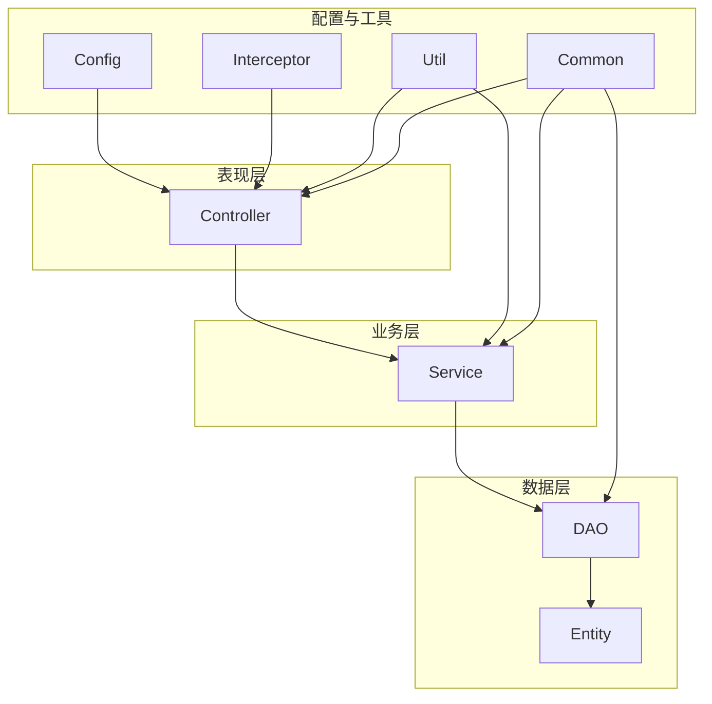
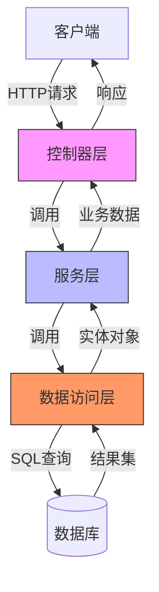
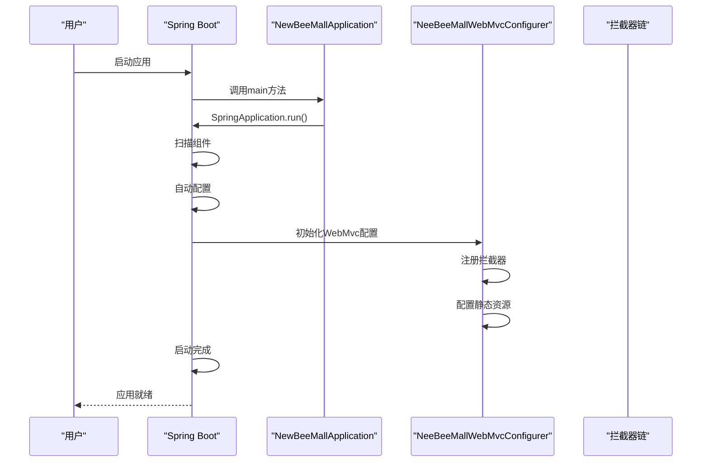
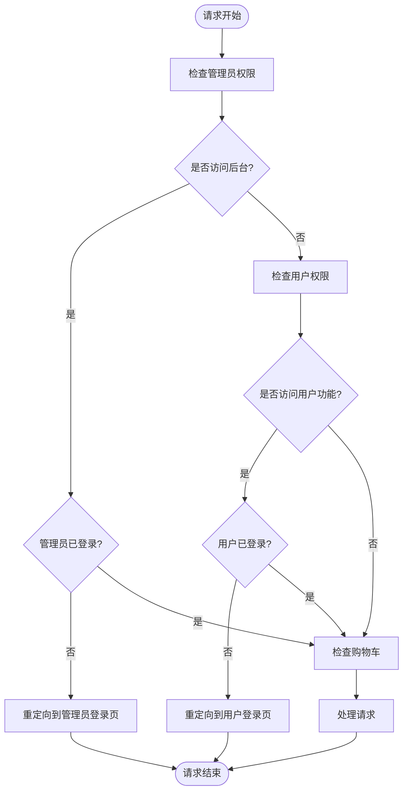
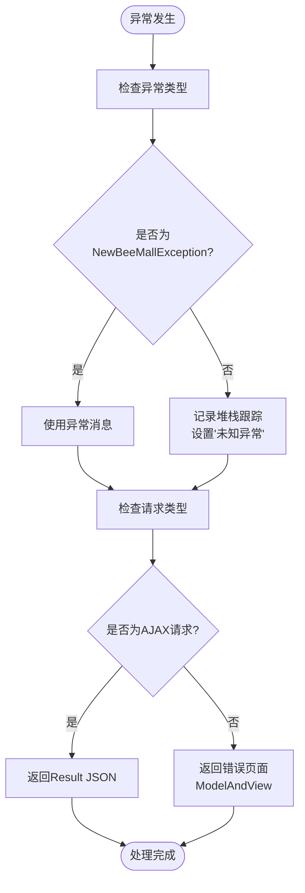
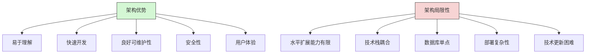
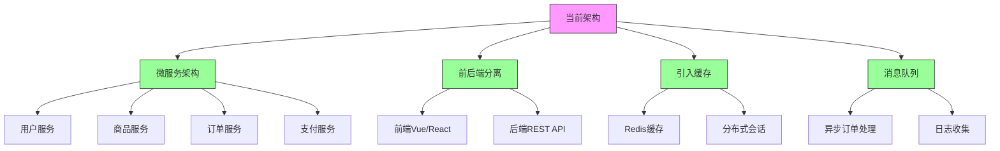

# 系统架构与设计模式

<cite>
**本文档引用的文件**   
- [NewBeeMallApplication.java](file://src/main/java/ltd/newbee/mall/NewBeeMallApplication.java)
- [NeeBeeMallWebMvcConfigurer.java](file://src/main/java/ltd/newbee/mall/config/NeeBeeMallWebMvcConfigurer.java)
- [AdminLoginInterceptor.java](file://src/main/java/ltd/newbee/mall/interceptor/AdminLoginInterceptor.java)
- [NewBeeMallLoginInterceptor.java](file://src/main/java/ltd/newbee/mall/interceptor/NewBeeMallLoginInterceptor.java)
- [NewBeeMallExceptionHandler.java](file://src/main/java/ltd/newbee/mall/controller/common/NewBeeMallExceptionHandler.java)
- [Result.java](file://src/main/java/ltd/newbee/mall/util/Result.java)
- [ResultGenerator.java](file://src/main/java/ltd/newbee/mall/util/ResultGenerator.java)
- [NewBeeMallGoodsService.java](file://src/main/java/ltd/newbee/mall/service/NewBeeMallGoodsService.java)
- [NewBeeMallGoodsServiceImpl.java](file://src/main/java/ltd/newbee/mall/service/impl/NewBeeMallGoodsServiceImpl.java)
- [GoodsController.java](file://src/main/java/ltd/newbee/mall/controller/mall/GoodsController.java)
- [NewBeeMallGoodsMapper.java](file://src/main/java/ltd/newbee/mall/dao/NewBeeMallGoodsMapper.java)
- [Constants.java](file://src/main/java/ltd/newbee/mall/common/Constants.java)
- [pom.xml](file://pom.xml)
</cite>

## 目录
1. [项目结构](#项目结构)
2. [核心架构组件](#核心架构组件)
3. [MVC分层架构设计](#mvc分层架构设计)
4. [应用启动与配置](#应用启动与配置)
5. [拦截器链与权限控制](#拦截器链与权限控制)
6. [统一结果返回结构](#统一结果返回结构)
7. [异常处理机制](#异常处理机制)
8. [架构优势与局限性](#架构优势与局限性)
9. [演进方向建议](#演进方向建议)

## 项目结构

新蜂商城（newbee-mall）采用标准的Spring Boot项目结构，遵循MVC分层架构设计。项目主要分为以下几个核心目录：

- **src/main/java/ltd/newbee/mall/**：Java源代码主目录
  - **common/**：通用常量和枚举类
  - **config/**：Spring配置类
  - **controller/**：MVC架构中的控制器层，分为admin（后台管理）和mall（前台商城）
  - **dao/**：数据访问对象接口
  - **entity/**：实体类，对应数据库表结构
  - **interceptor/**：拦截器实现
  - **service/**：业务逻辑层接口及实现
  - **util/**：工具类
- **src/main/resources/**：资源文件目录
  - **mapper/**：MyBatis的XML映射文件
  - **static/**：静态资源文件（CSS、JS、图片等）
  - **templates/**：Thymeleaf模板文件
  - **application.properties**：应用配置文件



**图源**
- [NewBeeMallApplication.java](file://src/main/java/ltd/newbee/mall/NewBeeMallApplication.java)
- [NeeBeeMallWebMvcConfigurer.java](file://src/main/java/ltd/newbee/mall/config/NeeBeeMallWebMvcConfigurer.java)

**本节来源**
- [NewBeeMallApplication.java](file://src/main/java/ltd/newbee/mall/NewBeeMallApplication.java)
- [pom.xml](file://pom.xml)

## 核心架构组件

新蜂商城的核心架构组件包括Spring Boot应用启动器、MVC配置器、拦截器、异常处理器和统一结果返回结构。这些组件共同构成了系统的骨架，确保了应用的稳定运行和良好的用户体验。

系统基于Spring Boot 2.7.5版本构建，通过`@SpringBootApplication`注解实现自动配置，简化了应用的启动和配置过程。项目使用MyBatis作为持久层框架，通过`@MapperScan`注解扫描DAO接口，实现了数据库操作的自动化。

```mermaid
classDiagram
class NewBeeMallApplication {
+main(String[] args) void
}
class NeeBeeMallWebMvcConfigurer {
+addInterceptors(InterceptorRegistry) void
+addResourceHandlers(ResourceHandlerRegistry) void
}
class NewBeeMallExceptionHandler {
+handleException(Exception, HttpServletRequest) Object
}
class Result<T> {
-resultCode int
-message String
-data T
+getResultCode() int
+setMessage(String) void
+getData() T
}
NewBeeMallApplication --> NeeBeeMallWebMvcConfigurer : "使用"
NewBeeMallApplication --> NewBeeMallExceptionHandler : "使用"
NewBeeMallApplication --> Result : "返回"
NeeBeeMallWebMvcConfigurer --> AdminLoginInterceptor : "注入"
NeeBeeMallWebMvcConfigurer --> NewBeeMallLoginInterceptor : "注入"
```

**图源**
- [NewBeeMallApplication.java](file://src/main/java/ltd/newbee/mall/NewBeeMallApplication.java)
- [NeeBeeMallWebMvcConfigurer.java](file://src/main/java/ltd/newbee/mall/config/NeeBeeMallWebMvcConfigurer.java)
- [NewBeeMallExceptionHandler.java](file://src/main/java/ltd/newbee/mall/controller/common/NewBeeMallExceptionHandler.java)
- [Result.java](file://src/main/java/ltd/newbee/mall/util/Result.java)

**本节来源**
- [NewBeeMallApplication.java](file://src/main/java/ltd/newbee/mall/NewBeeMallApplication.java)
- [pom.xml](file://pom.xml)

## MVC分层架构设计

新蜂商城严格遵循MVC（Model-View-Controller）分层架构设计，将应用划分为三个主要层次：控制器层（Controller）、服务层（Service）和数据访问层（DAO）。这种分层设计实现了关注点分离，提高了代码的可维护性和可测试性。

### 控制器层（Controller）
控制器层位于`src/main/java/ltd/newbee/mall/controller/`目录下，负责处理HTTP请求和响应。系统分为两个主要控制器包：
- **admin/**：后台管理控制器，处理管理员相关的请求
- **mall/**：前台商城控制器，处理用户相关的请求

控制器通过`@Controller`或`@RestController`注解标识，使用`@RequestMapping`、`@GetMapping`、`@PostMapping`等注解映射URL路径。

### 服务层（Service）
服务层位于`src/main/java/ltd/newbee/mall/service/`目录下，包含业务逻辑的接口定义和实现。接口定义在`service/`包中，实现类位于`service/impl/`包中，通过`@Service`注解标识。

服务层负责处理核心业务逻辑，如商品管理、订单处理、用户认证等，并协调多个DAO操作。

### 数据访问层（DAO）
数据访问层位于`src/main/java/ltd/newbee/mall/dao/`目录下，包含与数据库交互的接口。这些接口通过MyBatis框架实现，使用`@Mapper`注解标识。

DAO层负责执行具体的数据库操作，如增删改查，将数据库记录映射为Java实体对象。



**图源**
- [GoodsController.java](file://src/main/java/ltd/newbee/mall/controller/mall/GoodsController.java)
- [NewBeeMallGoodsService.java](file://src/main/java/ltd/newbee/mall/service/NewBeeMallGoodsService.java)
- [NewBeeMallGoodsServiceImpl.java](file://src/main/java/ltd/newbee/mall/service/impl/NewBeeMallGoodsServiceImpl.java)
- [NewBeeMallGoodsMapper.java](file://src/main/java/ltd/newbee/mall/dao/NewBeeMallGoodsMapper.java)

**本节来源**
- [GoodsController.java](file://src/main/java/ltd/newbee/mall/controller/mall/GoodsController.java)
- [NewBeeMallGoodsService.java](file://src/main/java/ltd/newbee/mall/service/NewBeeMallGoodsService.java)
- [NewBeeMallGoodsMapper.java](file://src/main/java/ltd/newbee/mall/dao/NewBeeMallGoodsMapper.java)

## 应用启动与配置

新蜂商城的应用启动和配置由`NewBeeMallApplication`类和`NeeBeeMallWebMvcConfigurer`类共同完成，实现了Spring Boot应用的自动化配置和自定义配置。

### 应用启动
`NewBeeMallApplication`类是Spring Boot应用的入口点，通过`main`方法启动应用。该类使用了两个关键注解：
- `@SpringBootApplication`：这是一个组合注解，包含了`@Configuration`、`@EnableAutoConfiguration`和`@ComponentScan`，实现了Spring Boot的自动配置和组件扫描。
- `@MapperScan("ltd.newbee.mall.dao")`：指定MyBatis的Mapper接口扫描路径，自动注册DAO接口为Spring Bean。

```java
@SpringBootApplication
@MapperScan("ltd.newbee.mall.dao")
public class NewBeeMallApplication {
    public static void main(String[] args) {
        SpringApplication.run(NewBeeMallApplication.class, args);
    }
}
```

### MVC配置
`NeeBeeMallWebMvcConfigurer`类实现了`WebMvcConfigurer`接口，用于自定义Spring MVC的行为。该类主要配置了拦截器和静态资源处理。

**拦截器配置**：通过`addInterceptors`方法注册了三个拦截器：
1. `AdminLoginInterceptor`：后台管理登录拦截器，拦截`/admin/**`路径
2. `NewBeeMallLoginInterceptor`：前台商城登录拦截器，保护用户相关功能
3. `NewBeeMallCartNumberInterceptor`：购物车数量拦截器，统一处理购物车数量

**静态资源处理**：通过`addResourceHandlers`方法配置了文件上传目录的静态资源访问，将`/upload/**`和`/goods-img/**`路径映射到本地文件系统。



**图源**
- [NewBeeMallApplication.java](file://src/main/java/ltd/newbee/mall/NewBeeMallApplication.java)
- [NeeBeeMallWebMvcConfigurer.java](file://src/main/java/ltd/newbee/mall/config/NeeBeeMallWebMvcConfigurer.java)

**本节来源**
- [NewBeeMallApplication.java](file://src/main/java/ltd/newbee/mall/NewBeeMallApplication.java#L1-L28)
- [NeeBeeMallWebMvcConfigurer.java](file://src/main/java/ltd/newbee/mall/config/NeeBeeMallWebMvcConfigurer.java#L1-L67)

## 拦截器链与权限控制

新蜂商城通过拦截器链实现了多层次的权限控制，确保了系统的安全性和用户体验。拦截器链由`NeeBeeMallWebMvcConfigurer`配置，包含三个主要拦截器：`AdminLoginInterceptor`、`NewBeeMallLoginInterceptor`和`NewBeeMallCartNumberInterceptor`。

### 拦截器执行顺序
根据`NeeBeeMallWebMvcConfigurer`中的配置，拦截器的执行顺序如下：

1. **AdminLoginInterceptor**：首先执行，专门处理后台管理系统的权限验证
   - 拦截路径：`/admin/**`
   - 排除路径：`/admin/login`、`/admin/dist/**`、`/admin/plugins/**`
   - 功能：检查管理员是否登录，未登录则重定向到登录页面

2. **NewBeeMallCartNumberInterceptor**：其次执行，处理购物车相关的业务逻辑
   - 排除路径：`/admin/**`、`/register`、`/login`、`/logout`
   - 功能：统一处理购物车中的商品数量

3. **NewBeeMallLoginInterceptor**：最后执行，处理前台商城的用户权限验证
   - 拦截路径：商品详情、购物车、订单、个人中心等用户功能
   - 排除路径：`/admin/**`、`/register`、`/login`、`/logout`
   - 功能：检查普通用户是否登录，未登录则重定向到登录页面

### 权限控制实现
`AdminLoginInterceptor`和`NewBeeMallLoginInterceptor`都实现了`HandlerInterceptor`接口，重写了`preHandle`方法，在请求处理前进行权限检查。



**图源**
- [NeeBeeMallWebMvcConfigurer.java](file://src/main/java/ltd/newbee/mall/config/NeeBeeMallWebMvcConfigurer.java)
- [AdminLoginInterceptor.java](file://src/main/java/ltd/newbee/mall/interceptor/AdminLoginInterceptor.java)
- [NewBeeMallLoginInterceptor.java](file://src/main/java/ltd/newbee/mall/interceptor/NewBeeMallLoginInterceptor.java)

**本节来源**
- [NeeBeeMallWebMvcConfigurer.java](file://src/main/java/ltd/newbee/mall/config/NeeBeeMallWebMvcConfigurer.java#L31-L59)
- [AdminLoginInterceptor.java](file://src/main/java/ltd/newbee/mall/interceptor/AdminLoginInterceptor.java#L29-L39)
- [NewBeeMallLoginInterceptor.java](file://src/main/java/ltd/newbee/mall/interceptor/NewBeeMallLoginInterceptor.java#L31-L37)

## 统一结果返回结构

新蜂商城通过`Result`类实现了统一的结果返回结构，为前后端交互提供了标准化的数据格式。这种设计模式提高了API的可预测性和易用性，简化了前端对响应数据的处理。

### Result类设计
`Result<T>`是一个泛型类，包含三个核心属性：
- **resultCode**：结果码，用于表示请求的处理状态（如200表示成功，500表示服务器错误）
- **message**：消息文本，提供关于请求结果的描述信息
- **data**：泛型数据，包含实际的业务数据

```java
public class Result<T> implements Serializable {
    private static final long serialVersionUID = 1L;
    private int resultCode;
    private String message;
    private T data;
    
    // getter和setter方法
}
```

### 使用方式
系统通过`ResultGenerator`工具类简化了`Result`对象的创建，提供了多种静态工厂方法：
- `genSuccessResult()`：生成成功的响应结果
- `genSuccessResult(String message)`：生成带自定义消息的成功结果
- `genSuccessResult(Object data)`：生成包含数据的成功结果
- `genFailResult(String message)`：生成失败的响应结果

这种设计确保了所有API接口返回的数据格式一致，前端可以统一处理响应，提高了开发效率和系统稳定性。

```mermaid
classDiagram
class Result<T> {
-resultCode int
-message String
-data T
+getResultCode() int
+setMessage(String) void
+getData() T
+setData(T) void
}
class ResultGenerator {
+DEFAULT_SUCCESS_MESSAGE String
+DEFAULT_FAIL_MESSAGE String
+RESULT_CODE_SUCCESS int
+RESULT_CODE_SERVER_ERROR int
+genSuccessResult() Result
+genSuccessResult(String) Result
+genSuccessResult(Object) Result
+genFailResult(String) Result
}
class GoodsController {
+searchPage(Map, HttpServletRequest) String
+detailPage(Long, HttpServletRequest) String
}
ResultGenerator --> Result : "创建"
GoodsController --> Result : "返回"
ResultGenerator --> GoodsController : "提供"
```

**图源**
- [Result.java](file://src/main/java/ltd/newbee/mall/util/Result.java)
- [ResultGenerator.java](file://src/main/java/ltd/newbee/mall/util/ResultGenerator.java)
- [GoodsController.java](file://src/main/java/ltd/newbee/mall/controller/mall/GoodsController.java)

**本节来源**
- [Result.java](file://src/main/java/ltd/newbee/mall/util/Result.java#L1-L58)
- [ResultGenerator.java](file://src/main/java/ltd/newbee/mall/util/ResultGenerator.java#L1-L59)

## 异常处理机制

新蜂商城通过`NewBeeMallExceptionHandler`类实现了全局异常处理机制，能够捕获并处理应用中的各种异常，为用户提供友好的错误提示。

### 全局异常捕获
`NewBeeMallExceptionHandler`类使用`@RestControllerAdvice`注解，使其成为全局的异常处理器。该类通过`@ExceptionHandler(Exception.class)`注解捕获所有类型的异常。

```java
@RestControllerAdvice
public class NewBeeMallExceptionHandler {
    @ExceptionHandler(Exception.class)
    public Object handleException(Exception e, HttpServletRequest req) {
        // 异常处理逻辑
    }
}
```

### 异常处理逻辑
异常处理机制根据异常类型和请求类型返回不同的响应：

1. **自定义异常处理**：如果异常是`NewBeeMallException`类型，则直接使用异常消息作为响应消息
2. **未知异常处理**：对于其他类型的异常，记录堆栈跟踪并返回"未知异常"消息

3. **响应格式判断**：根据请求头判断是AJAX请求还是普通页面请求：
   - **AJAX请求**：返回JSON格式的`Result`对象
   - **普通页面请求**：返回错误页面的`ModelAndView`



**图源**
- [NewBeeMallExceptionHandler.java](file://src/main/java/ltd/newbee/mall/controller/common/NewBeeMallExceptionHandler.java)
- [Result.java](file://src/main/java/ltd/newbee/mall/util/Result.java)

**本节来源**
- [NewBeeMallExceptionHandler.java](file://src/main/java/ltd/newbee/mall/controller/common/NewBeeMallExceptionHandler.java#L25-L54)

## 架构优势与局限性

新蜂商城的MVC分层架构设计具有明显的优点，同时也存在一些潜在的局限性。

### 架构优势
1. **易于理解**：MVC分层架构清晰，各层职责明确，新开发者可以快速理解系统结构
2. **快速开发**：Spring Boot的自动配置和MyBatis的简化数据库操作，大大提高了开发效率
3. **良好的可维护性**：分层设计实现了关注点分离，便于代码维护和修改
4. **安全性**：通过拦截器链实现了多层次的权限控制，保障了系统的安全
5. **用户体验**：统一的结果返回结构和全局异常处理，提供了良好的前后端交互体验

### 潜在局限性
1. **水平扩展能力有限**：单体应用架构在高并发场景下扩展性较差，难以实现细粒度的水平扩展
2. **技术栈耦合**：前端使用Thymeleaf模板引擎，前后端耦合度较高，不利于独立开发和部署
3. **数据库单点**：所有服务共享同一个数据库，存在单点故障风险
4. **部署复杂性**：随着功能增加，单体应用的部署和回滚变得复杂
5. **技术更新困难**：整体架构升级需要考虑所有模块的兼容性，技术栈更新成本较高



**图源**
- [NewBeeMallApplication.java](file://src/main/java/ltd/newbee/mall/NewBeeMallApplication.java)
- [NeeBeeMallWebMvcConfigurer.java](file://src/main/java/ltd/newbee/mall/config/NeeBeeMallWebMvcConfigurer.java)

**本节来源**
- [NewBeeMallApplication.java](file://src/main/java/ltd/newbee/mall/NewBeeMallApplication.java)
- [pom.xml](file://pom.xml)

## 演进方向建议

针对当前架构的局限性，提出以下可能的演进方向：

### 微服务拆分
将单体应用拆分为多个微服务，每个服务负责特定的业务领域：
- **用户服务**：负责用户认证、权限管理
- **商品服务**：负责商品信息管理
- **订单服务**：负责订单处理
- **支付服务**：负责支付流程
- **库存服务**：负责库存管理

### 前后端分离
采用前后端分离架构，前端使用Vue.js或React等现代前端框架，后端提供RESTful API：
- 前端独立部署，提高用户体验
- 后端专注于API提供，提高开发效率
- 支持多端访问（Web、移动端）

### 引入缓存机制
在现有架构中引入Redis等缓存技术，提高系统性能：
- 缓存热点数据，减少数据库压力
- 实现分布式会话管理
- 提高系统响应速度

### 消息队列
引入RabbitMQ或Kafka等消息队列，实现异步处理和系统解耦：
- 订单处理异步化
- 日志收集
- 系统间通信



**图源**
- [NewBeeMallApplication.java](file://src/main/java/ltd/newbee/mall/NewBeeMallApplication.java)
- [pom.xml](file://pom.xml)

**本节来源**
- [NewBeeMallApplication.java](file://src/main/java/ltd/newbee/mall/NewBeeMallApplication.java)
- [pom.xml](file://pom.xml)