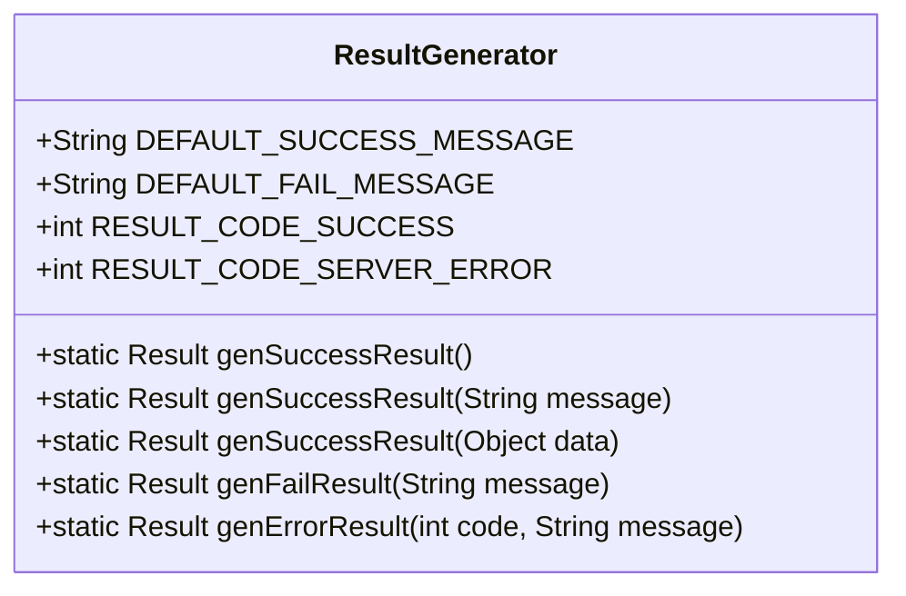
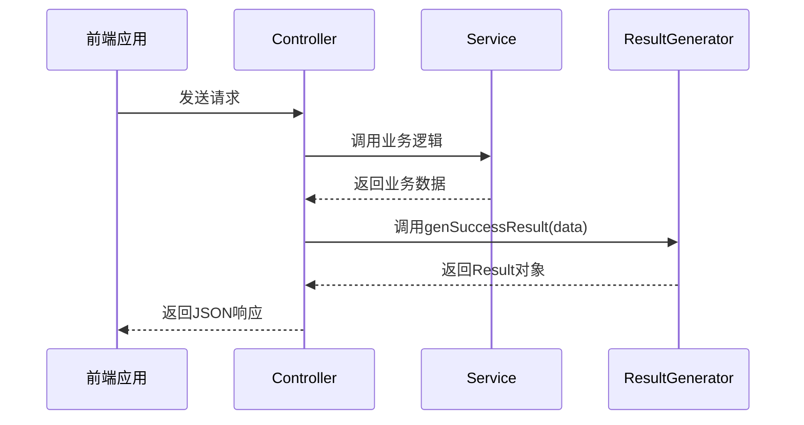

# 统一结果返回结构

<cite>
**本文档引用的文件**
- [Result.java](file://src/main/java/ltd/newbee/mall/util/Result.java)
- [ResultGenerator.java](file://src/main/java/ltd/newbee/mall/util/ResultGenerator.java)
- [NewBeeMallGoodsController.java](file://src/main/java/ltd/newbee/mall/controller/admin/NewBeeMallGoodsController.java)
- [UploadController.java](file://src/main/java/ltd/newbee/mall/controller/common/UploadController.java)
- [ServiceResultEnum.java](file://src/main/java/ltd/newbee/mall/common/ServiceResultEnum.java)
</cite>

## 目录
1. [引言](#引言)
2. [Result类设计与核心字段](#result类设计与核心字段)
3. [ResultGenerator工具类](#resultgenerator工具类)
4. [统一返回结构的优势](#统一返回结构的优势)
5. [在Controller中的实际应用](#在controller中的实际应用)
6. [错误处理与异常响应](#错误处理与异常响应)
7. [前后端交互语义](#前后端交互语义)
8. [总结](#总结)

## 引言
newbee-mall项目采用统一的结果返回结构来规范前后端之间的数据交互。通过定义标准的响应格式，系统能够确保所有API接口返回一致的数据结构，从而提升前端处理响应的效率和可靠性。这种设计模式不仅简化了前端的错误处理逻辑，还增强了系统的可维护性和可扩展性。

**本节引用文件**
- [Result.java](file://src/main/java/ltd/newbee/mall/util/Result.java)
- [ResultGenerator.java](file://src/main/java/ltd/newbee/mall/util/ResultGenerator.java)

## Result类设计与核心字段
`Result<T>`类是newbee-mall中统一结果返回结构的核心实现，位于`ltd.newbee.mall.util`包中。该类采用泛型设计，允许携带任意类型的数据，同时包含三个关键字段：`resultCode`、`message`和`data`。

### 核心字段语义
- **resultCode**: 整数类型的响应码，用于表示请求的处理状态。例如200表示成功，500表示服务器错误。
- **message**: 字符串类型的消息描述，提供关于请求结果的可读性信息，无论是成功还是失败情况。
- **data**: 泛型类型的承载数据，用于传输业务数据，如商品列表、用户信息等。

这三个字段共同构成了标准化的API响应体，使得前端可以基于固定的结构进行解析和处理。

```mermaid
classDiagram
class Result<T> {
+int resultCode
+String message
+T data
+Result()
+Result(int resultCode, String message)
+int getResultCode()
+void setResultCode(int resultCode)
+String getMessage()
+void setMessage(String message)
+T getData()
+void setData(T data)
}
```

**图示来源**
- [Result.java](file://src/main/java/ltd/newbee/mall/util/Result.java#L11-L57)

**本节引用文件**
- [Result.java](file://src/main/java/ltd/newbee/mall/util/Result.java)

## ResultGenerator工具类
`ResultGenerator`是一个静态工具类，提供了多种便捷方法来生成标准化的响应结果，极大地简化了控制器层的代码编写。

### 核心方法
- **genSuccessResult()**: 生成一个表示成功的响应，使用默认消息"SUCCESS"。
- **genSuccessResult(String message)**: 生成带有自定义成功消息的响应。
- **genSuccessResult(Object data)**: 生成包含业务数据的成功响应。
- **genFailResult(String message)**: 生成表示失败的响应，包含错误消息。
- **genErrorResult(int code, String message)**: 生成指定响应码和消息的错误响应。

这些静态方法封装了`Result`对象的创建过程，开发者无需手动设置响应码和消息，只需关注业务逻辑即可。



**图示来源**
- [ResultGenerator.java](file://src/main/java/ltd/newbee/mall/util/ResultGenerator.java#L13-L58)

**本节引用文件**
- [ResultGenerator.java](file://src/main/java/ltd/newbee/mall/util/ResultGenerator.java)

## 统一返回结构的优势
采用统一的结果返回结构为newbee-mall系统带来了诸多优势：

### 提升前端开发效率
前端可以基于固定的JSON结构编写通用的响应处理逻辑，无需为每个接口单独处理不同的响应格式。例如，前端可以统一检查`resultCode`是否为200来判断请求是否成功。

### 增强系统可维护性
当需要修改响应格式时，只需调整`Result`类和`ResultGenerator`工具类，而无需修改各个控制器的返回逻辑，实现了关注点分离。

### 规范API设计
统一的返回结构使得API文档更加清晰和一致，降低了新开发者的学习成本，也便于自动化测试和文档生成。

### 便于错误追踪
标准化的错误码和消息格式有助于快速定位问题，特别是在日志分析和监控系统中，可以轻松识别和分类不同类型的错误。

**本节引用文件**
- [Result.java](file://src/main/java/ltd/newbee/mall/util/Result.java)
- [ResultGenerator.java](file://src/main/java/ltd/newbee/mall/util/ResultGenerator.java)

## 在Controller中的实际应用
在实际的控制器实现中，`ResultGenerator`被广泛用于生成RESTful API的响应。以商品管理控制器为例，展示了如何使用该工具类。

### 商品列表接口示例
在`NewBeeMallGoodsController`的`list`方法中，通过`ResultGenerator.genSuccessResult()`方法返回分页的商品数据：

```java
@RequestMapping(value = "/goods/list", method = RequestMethod.GET)
@ResponseBody
public Result list(@RequestParam Map<String, Object> params) {
    if (ObjectUtils.isEmpty(params.get("page")) || ObjectUtils.isEmpty(params.get("limit"))) {
        return ResultGenerator.genFailResult("参数异常！");
    }
    PageQueryUtil pageUtil = new PageQueryUtil(params);
    return ResultGenerator.genSuccessResult(newBeeMallGoodsService.getNewBeeMallGoodsPage(pageUtil));
}
```

此方法展示了典型的使用模式：先进行参数校验，若失败则返回错误响应；若成功则调用服务层获取数据，并通过`genSuccessResult`方法包装数据返回。

### 文件上传接口示例
在`UploadController`中，文件上传成功后返回包含文件访问URL的成功响应：

```java
Result resultSuccess = ResultGenerator.genSuccessResult();
resultSuccess.setData(fileUrl);
return resultSuccess;
```

这体现了`Result`类的灵活性，`data`字段可以承载单个值、对象或集合。



**图示来源**
- [NewBeeMallGoodsController.java](file://src/main/java/ltd/newbee/mall/controller/admin/NewBeeMallGoodsController.java#L137-L143)
- [UploadController.java](file://src/main/java/ltd/newbee/mall/controller/common/UploadController.java#L74-L76)

**本节引用文件**
- [NewBeeMallGoodsController.java](file://src/main/java/ltd/newbee/mall/controller/admin/NewBeeMallGoodsController.java)
- [UploadController.java](file://src/main/java/ltd/newbee/mall/controller/common/UploadController.java)

## 错误处理与异常响应
统一结果返回结构同样适用于错误处理场景。当业务逻辑出现异常时，系统通过`ResultGenerator.genFailResult()`方法返回标准化的错误响应。

### 参数校验错误
在控制器中进行参数校验时，若发现无效参数，立即返回失败响应：

```java
if (ObjectUtils.isEmpty(params.get("page"))) {
    return ResultGenerator.genFailResult("参数异常！");
}
```

### 业务逻辑错误
当服务层返回特定的错误码时，控制器将其转换为相应的响应：

```java
String result = newBeeMallGoodsService.saveNewBeeMallGoods(newBeeMallGoods);
if (ServiceResultEnum.SUCCESS.getResult().equals(result)) {
    return ResultGenerator.genSuccessResult();
} else {
    return ResultGenerator.genFailResult(result);
}
```

这种模式确保了所有错误都通过统一的渠道返回，前端可以一致地处理各种错误情况。

**本节引用文件**
- [NewBeeMallGoodsController.java](file://src/main/java/ltd/newbee/mall/controller/admin/NewBeeMallGoodsController.java)
- [ServiceResultEnum.java](file://src/main/java/ltd/newbee/mall/common/ServiceResultEnum.java)

## 前后端交互语义
统一结果返回结构定义了清晰的前后端交互语义：

### 成功响应语义
当`resultCode`为200时，表示请求成功处理，前端应从`data`字段提取业务数据进行展示或处理。

### 失败响应语义
当`resultCode`非200时，表示请求处理失败，前端应显示`message`字段中的错误信息给用户，提示问题原因。

### 数据承载语义
`data`字段的类型和结构由具体接口定义，可以是单个对象、对象列表、分页结果或其他复杂数据结构，但始终包装在统一的响应框架内。

这种语义约定使得前后端团队可以独立开发，只要遵循相同的接口规范，就能确保系统的整体协调性。

**本节引用文件**
- [Result.java](file://src/main/java/ltd/newbee/mall/util/Result.java)
- [ResultGenerator.java](file://src/main/java/ltd/newbee/mall/util/ResultGenerator.java)

## 总结
newbee-mall通过`Result`类和`ResultGenerator`工具类实现了统一的结果返回结构，这一设计模式有效规范了API的响应格式。三个核心字段`resultCode`、`message`和`data`分别承担状态标识、消息描述和数据承载的职责，形成了清晰的分层语义。`ResultGenerator`提供的静态方法简化了响应的创建过程，提高了开发效率。这种统一的返回结构不仅提升了前后端协作的效率，还增强了系统的可维护性和可扩展性，是现代Web应用开发中的最佳实践之一。