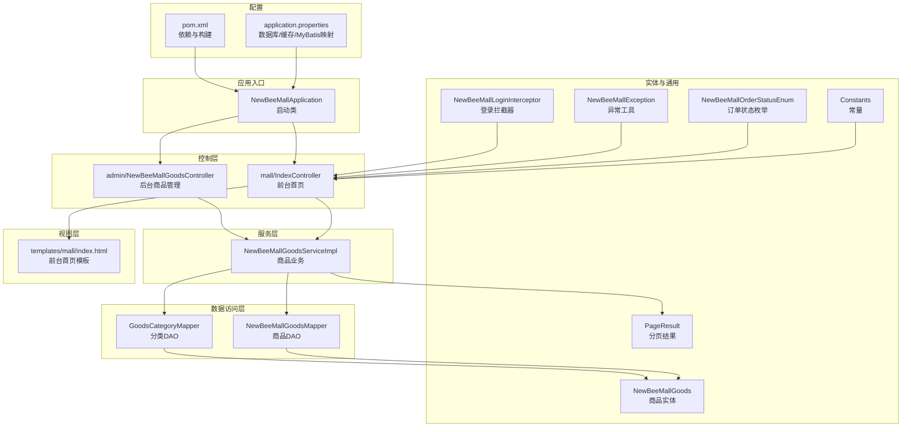
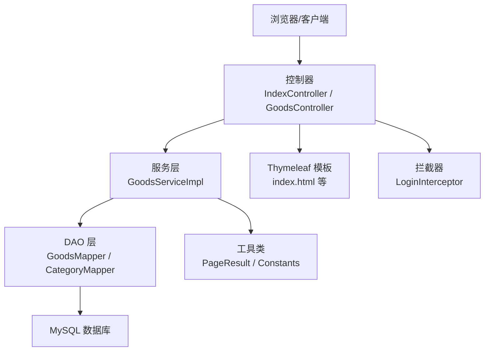
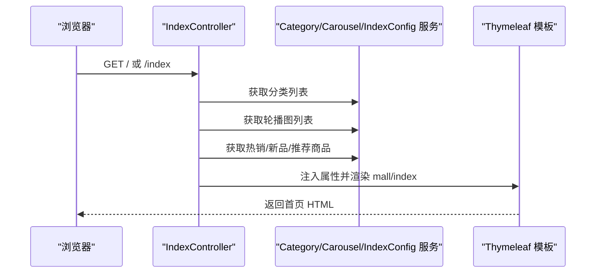
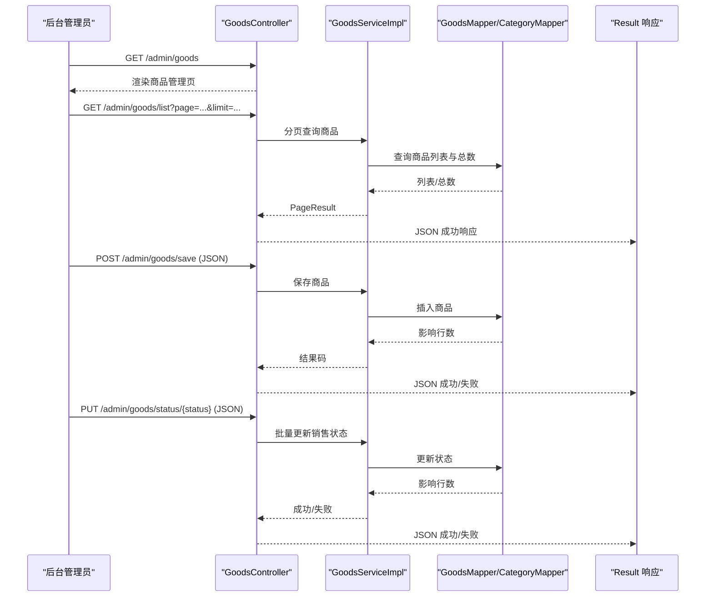
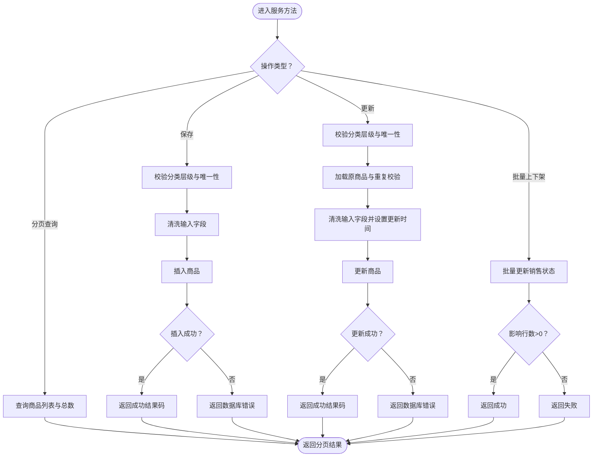
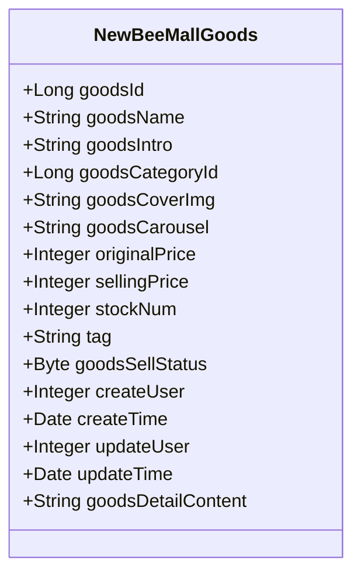
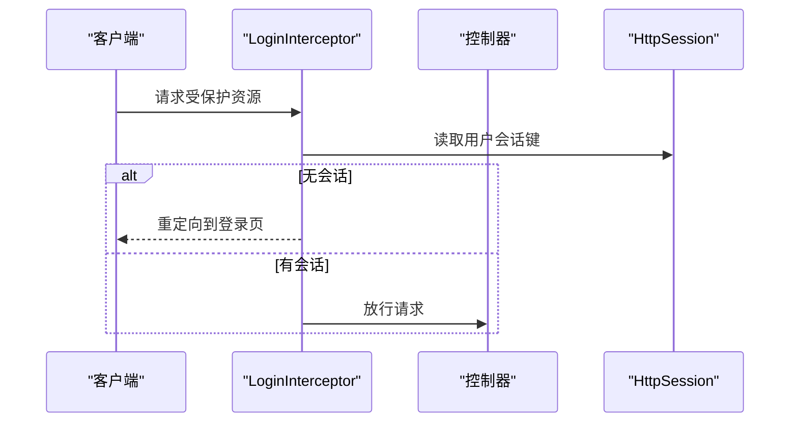
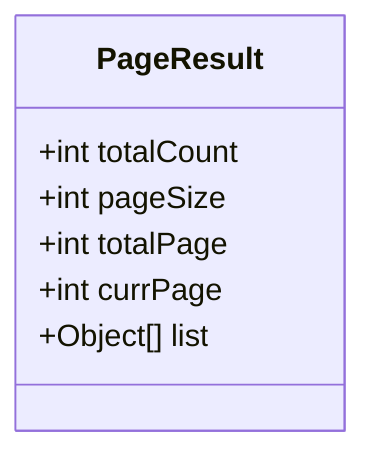
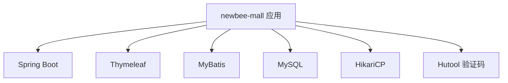

# 项目概述

<cite>
**本文引用的文件**
- [README.md](file://README.md)
- [NewBeeMallApplication.java](file://src/main/java/ltd/newbee/mall/NewBeeMallApplication.java)
- [pom.xml](file://pom.xml)
- [application.properties](file://src/main/resources/application.properties)
- [IndexController.java](file://src/main/java/ltd/newbee/mall/controller/mall/IndexController.java)
- [NewBeeMallGoodsController.java](file://src/main/java/ltd/newbee/mall/controller/admin/NewBeeMallGoodsController.java)
- [NewBeeMallGoodsServiceImpl.java](file://src/main/java/ltd/newbee/mall/service/impl/NewBeeMallGoodsServiceImpl.java)
- [NewBeeMallGoods.java](file://src/main/java/ltd/newbee/mall/entity/NewBeeMallGoods.java)
- [Constants.java](file://src/main/java/ltd/newbee/mall/common/Constants.java)
- [NewBeeMallOrderStatusEnum.java](file://src/main/java/ltd/newbee/mall/common/NewBeeMallOrderStatusEnum.java)
- [NewBeeMallException.java](file://src/main/java/ltd/newbee/mall/common/NewBeeMallException.java)
- [NewBeeMallLoginInterceptor.java](file://src/main/java/ltd/newbee/mall/interceptor/NewBeeMallLoginInterceptor.java)
- [PageResult.java](file://src/main/java/ltd/newbee/mall/util/PageResult.java)
- [index.html](file://src/main/resources/templates/mall/index.html)
</cite>

## 目录
1. [引言](#引言)
2. [项目结构](#项目结构)
3. [核心组件](#核心组件)
4. [架构总览](#架构总览)
5. [详细组件分析](#详细组件分析)
6. [依赖分析](#依赖分析)
7. [性能考虑](#性能考虑)
8. [故障排查指南](#故障排查指南)
9. [结论](#结论)
10. [附录](#附录)

## 引言
newbee-mall 是一套基于 Spring Boot 的全栈电商项目，采用 MVC 架构与 Thymeleaf 模板引擎，前后端不分离。项目分为前台商城与后台管理两大模块，覆盖首页门户、商品分类、轮播图、推荐配置、商品搜索与展示、购物车、订单结算与流程、个人订单管理、会员中心、后台数据面板、轮播图管理、商品管理、订单管理、会员管理、分类管理等功能。项目适合初学者快速上手，也具备企业级项目的复杂度与完整性，便于深入学习 Spring Boot 生态与电商业务流程。

**章节来源**
- [README.md](file://README.md#L1-L120)

## 项目结构
项目采用标准的 Maven + Spring Boot 结构，按功能域划分包：
- controller：前台与后台控制器，分别位于 mall 与 admin 子包
- service：业务接口与实现，按领域拆分
- dao：MyBatis Mapper 接口
- entity：持久化实体类
- util：工具类（分页、结果封装、加密、校验等）
- common：常量、枚举、异常等通用能力
- interceptor：拦截器（登录拦截、购物车数量拦截等）
- resources：静态资源、模板、SQL 脚本、配置文件
- templates：Thymeleaf 模板页面（前台 mall 与后台 admin）

**图表来源**
- [NewBeeMallApplication.java](file://src/main/java/ltd/newbee/mall/NewBeeMallApplication.java#L1-L28)
- [IndexController.java](file://src/main/java/ltd/newbee/mall/controller/mall/IndexController.java#L1-L58)
- [NewBeeMallGoodsController.java](file://src/main/java/ltd/newbee/mall/controller/admin/NewBeeMallGoodsController.java#L1-L228)
- [NewBeeMallGoodsServiceImpl.java](file://src/main/java/ltd/newbee/mall/service/impl/NewBeeMallGoodsServiceImpl.java#L1-L139)
- [NewBeeMallGoods.java](file://src/main/java/ltd/newbee/mall/entity/NewBeeMallGoods.java#L1-L202)
- [Constants.java](file://src/main/java/ltd/newbee/mall/common/Constants.java#L1-L48)
- [NewBeeMallOrderStatusEnum.java](file://src/main/java/ltd/newbee/mall/common/NewBeeMallOrderStatusEnum.java#L1-L64)
- [NewBeeMallException.java](file://src/main/java/ltd/newbee/mall/common/NewBeeMallException.java#L1-L30)
- [NewBeeMallLoginInterceptor.java](file://src/main/java/ltd/newbee/mall/interceptor/NewBeeMallLoginInterceptor.java#L1-L49)
- [PageResult.java](file://src/main/java/ltd/newbee/mall/util/PageResult.java#L1-L84)
- [index.html](file://src/main/resources/templates/mall/index.html#L1-L200)

**章节来源**
- [pom.xml](file://pom.xml#L1-L83)
- [application.properties](file://src/main/resources/application.properties#L1-L22)

## 核心组件
- 应用启动类：扫描 Mapper 包，启动 Spring Boot 应用
- 控制器：前台首页控制器负责加载首页数据；后台商品控制器负责商品增删改查与状态变更
- 服务层：商品业务实现，封装分页查询、保存/更新、批量上下架等
- 数据访问层：MyBatis Mapper，对应实体表进行 CRUD
- 实体与通用：商品实体、分页结果、常量、订单状态枚举、异常工具
- 视图层：Thymeleaf 模板渲染首页与后台页面
- 拦截器：统一登录拦截，保障会话安全

**章节来源**
- [NewBeeMallApplication.java](file://src/main/java/ltd/newbee/mall/NewBeeMallApplication.java#L1-L28)
- [IndexController.java](file://src/main/java/ltd/newbee/mall/controller/mall/IndexController.java#L1-L58)
- [NewBeeMallGoodsController.java](file://src/main/java/ltd/newbee/mall/controller/admin/NewBeeMallGoodsController.java#L1-L228)
- [NewBeeMallGoodsServiceImpl.java](file://src/main/java/ltd/newbee/mall/service/impl/NewBeeMallGoodsServiceImpl.java#L1-L139)
- [NewBeeMallGoods.java](file://src/main/java/ltd/newbee/mall/entity/NewBeeMallGoods.java#L1-L202)
- [Constants.java](file://src/main/java/ltd/newbee/mall/common/Constants.java#L1-L48)
- [NewBeeMallOrderStatusEnum.java](file://src/main/java/ltd/newbee/mall/common/NewBeeMallOrderStatusEnum.java#L1-L64)
- [NewBeeMallException.java](file://src/main/java/ltd/newbee/mall/common/NewBeeMallException.java#L1-L30)
- [NewBeeMallLoginInterceptor.java](file://src/main/java/ltd/newbee/mall/interceptor/NewBeeMallLoginInterceptor.java#L1-L49)
- [PageResult.java](file://src/main/java/ltd/newbee/mall/util/PageResult.java#L1-L84)
- [index.html](file://src/main/resources/templates/mall/index.html#L1-L200)

## 架构总览
项目采用经典的三层架构（MVC）：
- 表现层（Controller）：接收请求，调用服务，组装视图或响应数据
- 业务层（Service）：编排领域逻辑，处理参数校验与业务规则
- 数据访问层（DAO/MyBatis）：执行 SQL，映射结果到实体
- 视图层（Thymeleaf）：模板渲染 HTML 页面
- 通用层（Common/Util）：常量、枚举、异常、工具类

**图表来源**
- [IndexController.java](file://src/main/java/ltd/newbee/mall/controller/mall/IndexController.java#L1-L58)
- [NewBeeMallGoodsController.java](file://src/main/java/ltd/newbee/mall/controller/admin/NewBeeMallGoodsController.java#L1-L228)
- [NewBeeMallGoodsServiceImpl.java](file://src/main/java/ltd/newbee/mall/service/impl/NewBeeMallGoodsServiceImpl.java#L1-L139)
- [NewBeeMallGoods.java](file://src/main/java/ltd/newbee/mall/entity/NewBeeMallGoods.java#L1-L202)
- [Constants.java](file://src/main/java/ltd/newbee/mall/common/Constants.java#L1-L48)
- [NewBeeMallLoginInterceptor.java](file://src/main/java/ltd/newbee/mall/interceptor/NewBeeMallLoginInterceptor.java#L1-L49)
- [index.html](file://src/main/resources/templates/mall/index.html#L1-L200)

## 详细组件分析

### 前台首页控制器（IndexController）
职责：
- 加载首页所需数据：分类、轮播图、热销/新品/推荐商品
- 将数据注入请求作用域，渲染 mall/index 模板
- 使用常量与枚举控制首页展示数量与状态

**图表来源**
- [IndexController.java](file://src/main/java/ltd/newbee/mall/controller/mall/IndexController.java#L1-L58)
- [Constants.java](file://src/main/java/ltd/newbee/mall/common/Constants.java#L1-L48)
- [index.html](file://src/main/resources/templates/mall/index.html#L1-L200)

**章节来源**
- [IndexController.java](file://src/main/java/ltd/newbee/mall/controller/mall/IndexController.java#L1-L58)
- [Constants.java](file://src/main/java/ltd/newbee/mall/common/Constants.java#L1-L48)
- [index.html](file://src/main/resources/templates/mall/index.html#L1-L200)

### 后台商品管理控制器（NewBeeMallGoodsController）
职责：
- 提供商品管理页面与编辑页面
- 提供商品列表分页查询、新增、修改、详情、批量上下架等接口
- 通过分类服务实现三级联动数据准备

**图表来源**
- [NewBeeMallGoodsController.java](file://src/main/java/ltd/newbee/mall/controller/admin/NewBeeMallGoodsController.java#L1-L228)
- [NewBeeMallGoodsServiceImpl.java](file://src/main/java/ltd/newbee/mall/service/impl/NewBeeMallGoodsServiceImpl.java#L1-L139)

**章节来源**
- [NewBeeMallGoodsController.java](file://src/main/java/ltd/newbee/mall/controller/admin/NewBeeMallGoodsController.java#L1-L228)
- [NewBeeMallGoodsServiceImpl.java](file://src/main/java/ltd/newbee/mall/service/impl/NewBeeMallGoodsServiceImpl.java#L1-L139)

### 商品服务实现（NewBeeMallGoodsServiceImpl）
职责：
- 分页查询商品列表与总数
- 保存/更新商品：校验分类层级、去重、清理输入
- 批量更新销售状态
- 搜索分页：转换 VO 并截断过长文本

**图表来源**
- [NewBeeMallGoodsServiceImpl.java](file://src/main/java/ltd/newbee/mall/service/impl/NewBeeMallGoodsServiceImpl.java#L1-L139)

**章节来源**
- [NewBeeMallGoodsServiceImpl.java](file://src/main/java/ltd/newbee/mall/service/impl/NewBeeMallGoodsServiceImpl.java#L1-L139)

### 商品实体（NewBeeMallGoods）
职责：
- 定义商品字段与基本 setter/getter
- 包含价格、库存、封面图、轮播图、标签、销售状态、创建/更新时间等

**图表来源**
- [NewBeeMallGoods.java](file://src/main/java/ltd/newbee/mall/entity/NewBeeMallGoods.java#L1-L202)

**章节来源**
- [NewBeeMallGoods.java](file://src/main/java/ltd/newbee/mall/entity/NewBeeMallGoods.java#L1-L202)

### 登录拦截器（NewBeeMallLoginInterceptor）
职责：
- 拦截未登录请求，重定向到登录页
- 保证后台管理与会员中心的安全访问

**图表来源**
- [NewBeeMallLoginInterceptor.java](file://src/main/java/ltd/newbee/mall/interceptor/NewBeeMallLoginInterceptor.java#L1-L49)
- [Constants.java](file://src/main/java/ltd/newbee/mall/common/Constants.java#L1-L48)

**章节来源**
- [NewBeeMallLoginInterceptor.java](file://src/main/java/ltd/newbee/mall/interceptor/NewBeeMallLoginInterceptor.java#L1-L49)
- [Constants.java](file://src/main/java/ltd/newbee/mall/common/Constants.java#L1-L48)

### 分页结果（PageResult）
职责：
- 封装分页数据：列表、总记录数、每页大小、当前页、总页数
- 用于服务层向控制器返回分页结果

**图表来源**
- [PageResult.java](file://src/main/java/ltd/newbee/mall/util/PageResult.java#L1-L84)

**章节来源**
- [PageResult.java](file://src/main/java/ltd/newbee/mall/util/PageResult.java#L1-L84)

## 依赖分析
- 核心框架：Spring Boot、Thymeleaf、MyBatis
- 数据库：MySQL + HikariCP 连接池
- 工具：Hutool 验证码、分页与结果封装
- 项目版本：Spring Boot 2.7.5（支持多分支版本）

**图表来源**
- [pom.xml](file://pom.xml#L1-L83)
- [application.properties](file://src/main/resources/application.properties#L1-L22)

**章节来源**
- [pom.xml](file://pom.xml#L1-L83)
- [application.properties](file://src/main/resources/application.properties#L1-L22)

## 性能考虑
- 数据库连接池：合理配置最小空闲、最大连接、超时等参数，避免连接泄漏与抖动
- 分页查询：使用 PageQueryUtil 限制每页条数，避免一次性加载大量数据
- 模板渲染：开启生产环境缓存（生产环境可启用 Thymeleaf 缓存），减少模板解析开销
- 图片与静态资源：CDN 与压缩策略可进一步优化首屏加载
- 业务幂等：保存/更新商品时的唯一性校验与输入清洗，降低脏数据带来的查询成本

[本节为通用指导，不直接分析具体文件]

## 故障排查指南
- 启动失败：检查 application.properties 中数据库连接参数是否正确
- 页面空白：确认 Thymeleaf 模板路径与控制器返回视图名一致
- 登录拦截：未登录被重定向到登录页，检查会话键与拦截器配置
- 异常抛出：服务层通过 NewBeeMallException.fail 抛出异常，可在全局异常处理器中统一处理
- 订单状态：使用 NewBeeMallOrderStatusEnum 维护状态机，避免魔法值

**章节来源**
- [application.properties](file://src/main/resources/application.properties#L1-L22)
- [NewBeeMallLoginInterceptor.java](file://src/main/java/ltd/newbee/mall/interceptor/NewBeeMallLoginInterceptor.java#L1-L49)
- [NewBeeMallException.java](file://src/main/java/ltd/newbee/mall/common/NewBeeMallException.java#L1-L30)
- [NewBeeMallOrderStatusEnum.java](file://src/main/java/ltd/newbee/mall/common/NewBeeMallOrderStatusEnum.java#L1-L64)

## 结论
newbee-mall 以 Spring Boot 为核心，采用 MVC 与 Thymeleaf 的传统方案，构建了功能完备的电商前后台系统。其清晰的分层结构、完善的业务流程与丰富的页面展示，使其成为学习 Spring Boot 与电商实战的理想项目。对于初学者，建议从控制器与模板入手，逐步理解服务与数据访问层；对于高级开发者，可在此基础上扩展缓存、消息队列、分布式事务与微服务化。

[本节为总结性内容，不直接分析具体文件]

## 附录
- 项目特性与适用场景：面向新手友好、企业级实践、技术栈新颖、可作为简历项目
- 在线演示与系列项目：包含 Vue 前后端分离版本、微服务版本等生态
- 页面展示：首页、搜索、购物车、订单结算、后台管理等页面截图

**章节来源**
- [README.md](file://README.md#L1-L207)